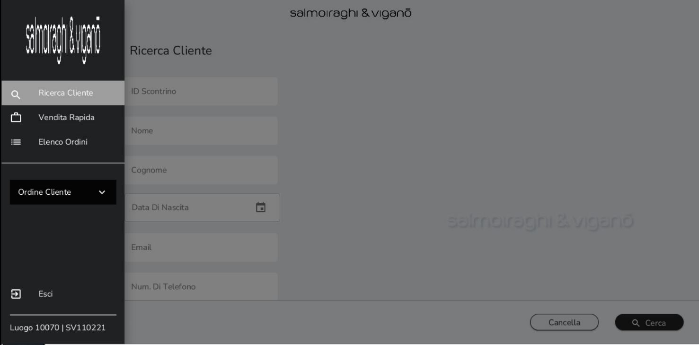
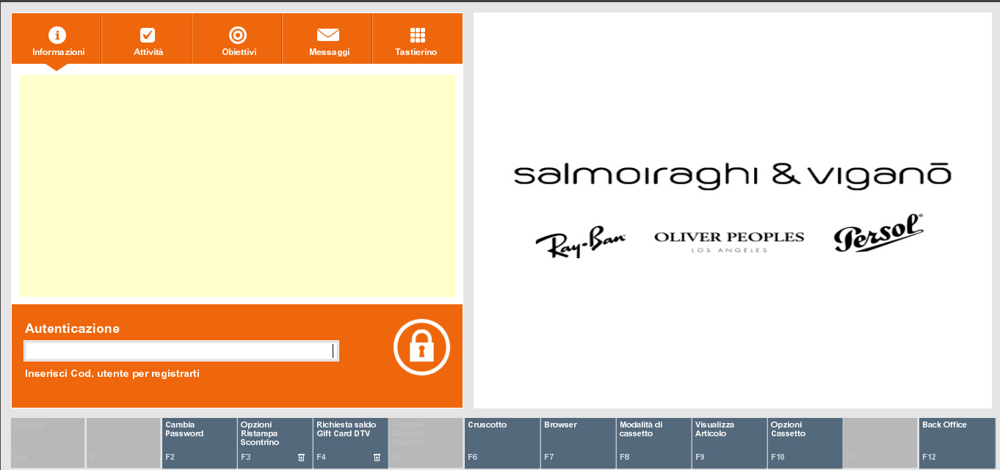
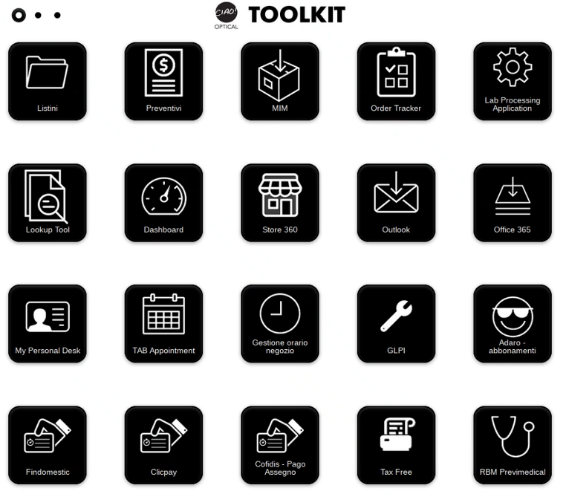
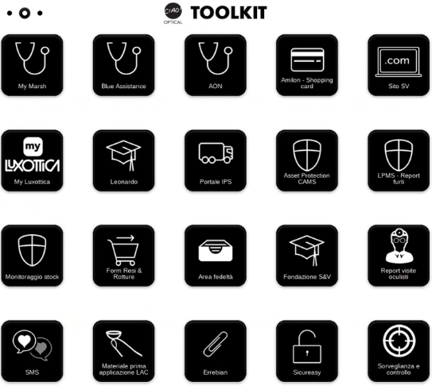
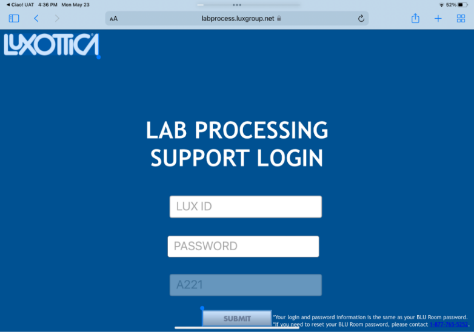
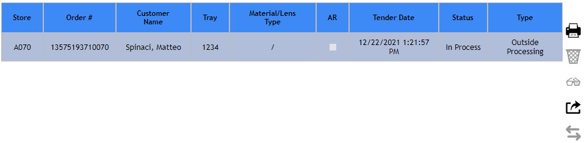
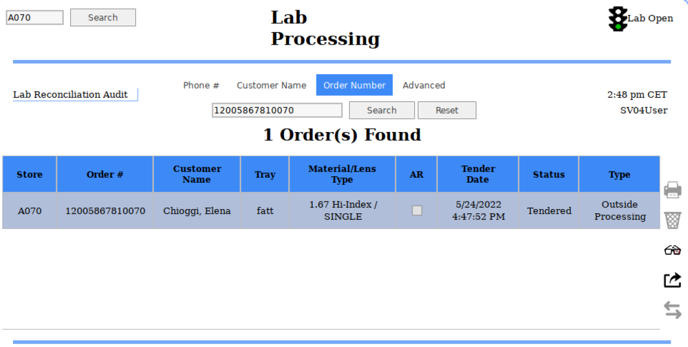
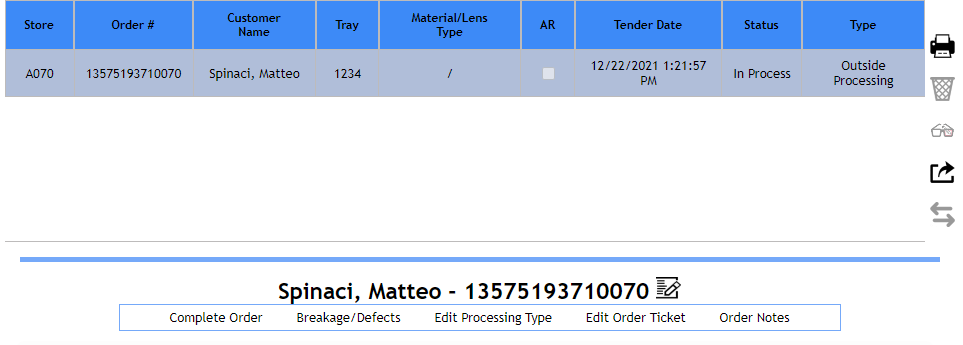
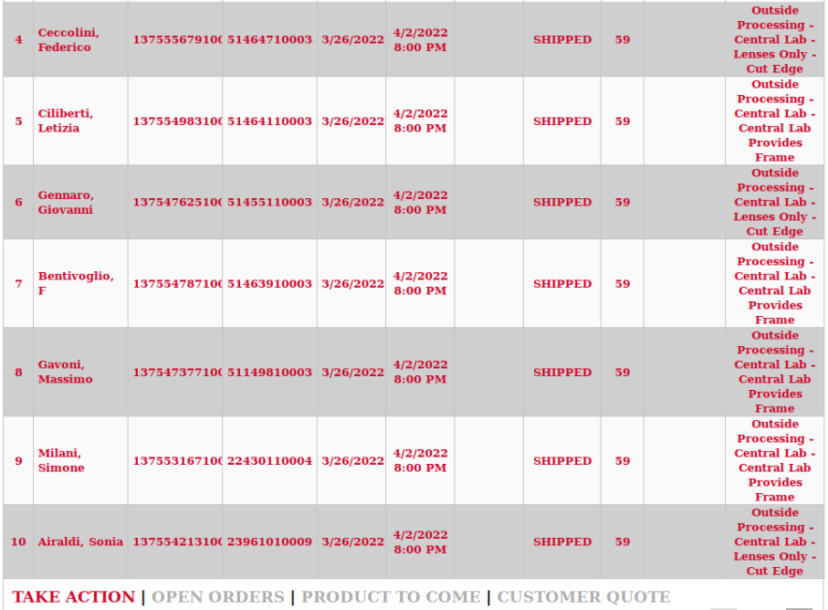

# Sistema di cassa e applicativi correlati

## Ciao! Optical

[Ciao! Optical]{.underline} è il nuovo sistema di cassa per i negozi
del Retail Italia in sostituzione del gestionale Acuitas. Tale sistema
presenta alcune caratteristiche peculiari.

A differenza di Acuitas è utilizzabile sia su computer (con sistema
operativo Linux) che su IPad in versione applicazione.

Ciao! Optical è strutturato in due sezioni principali distinguibili
anche attraverso una differente interfaccia utente:

-   Customer Order, la sezione del gestionale utilizzabile per la
    presa ordine, l'inserimento delle anagrafiche clienti e le
    prescrizioni oculistiche.

Accedendo a Customer Order si visualizzano tre pagine:

-   *Ricerca Cliente*, la prima pagina proposta dal sistema utilizzabile
    per ricercare un cliente esistente o per procedere alla creazione di
    una nuova anagrafica

-   *Vendita Rapida*, da dove è possibile effettuare una vendita veloce
    senza registrare l'anagrafica del cliente

-   *Elenco Ordini*, pagina che contiene tre differenti liste di
    raccolta degli ordini attivi registrati sul negozio:

    -   *Attivo*: elenco di tutti gli ordini creati dal negozio per i
        quali non è stata presa una caparra e che non sono ancora stati
        consegnati al cliente. Questi ordini rimangono salvati per tre
        giorni in questa lista. Questa lista è utile per salvare ordini
        creati ma non ancora confermati dal cliente e che potrebbero
        evolversi entro i prossimi tre giorni in ordini per cui dover
        prendere una caparra o procedere direttamente alla vendita.

    -   *Archivio*: elenco di tutti gli ordini che passati i 3 giorni si
        spostano dall' elenco attivo e rimangono in questa lista per i
        successivi 27 giorni.

    -   *Caparra*: elenco di tutti gli ordini per i quali è stata presa
        una caparra e che devono essere consegnati ai clienti.

Gli ordini che figurano in stato "Pronto" sono ordini per cui si è
arrivati allo step di completamento dell'ordine e sono pronti per essere
pagati o per ricevere caparra. Gli ordini "In corso" sono ordini per cui
il flusso di vendita è stato interrotto e che sono stati salvati nella
lista attivo.

-   XStore, la sezione del gestionale dedicata ai pagamenti delle
    transazioni e alla gestione della cassa.

> 
>
> Attraverso questa sezione sono gestiti i processi di apertura e
> chiusura delle postazioni di cassa e del negozio, la stampa e ristampa
> di scontrini e fatture e la conclusione delle vendite attraverso tutti
> i metodi di pagamento attivi.

Le credenziali d'accesso per il sistema corrispondono alle credenziali
personali attualmente utilizzate per MIM

## Tool kit

Il [Tool Kit]{.underline} è uno strumento che raccoglie i link
necessari per accedere a tutte le piattaforme e gli applicativi utili
per le diverse attività svolte in negozio.

Per accedere ad uno di essi è necessario cliccare sull'icona di
riferimento. Per visionare tutte le icone disponibili è possibile
passare alla seconda e alla terza pagina del Tool Kit cliccando sul
secondo/terzo pallino nero come mostrato nelle immagini sottostanti.

 

Questo strumento raccoglie tutte le icone attualmente presenti sul
desktop dei computer e le pagine salvate come preferiti all'interno
della pagina iniziale del browser Internet.

Oltre gli applicativi già di conoscenza del negozio, ne sono stati
aggiunti due nuovi:

-   [Look Up Tool]{.underline}, strumento dedicato alla consultazione
    dello storico vendite di tre anni presente su Acuitas. Su Ciao
    Optical! infatti sono state importate tutte le anagrafiche cliente e
    i dati delle prescrizioni. Le vendite invece sono disponibili su
    questo strumento.

-   [Listini&Sconti]{.underline}, archivio di tutti i listini (offerta
    commerciale occhiale completo, assicurazioni e abbonamenti)
    disponibili in formato PDF e consultabili direttamente da web senza
    doverli scaricare in locale sul computer.

## LPA 

La piattaforma [LPA -- Lab Processing Application]{.underline} è
dedicata alla parte finale del processo di inserimento ordini verso il
laboratorio di Sedico. È possibile accedere alla piattaforma attraverso
il Tool Kit, selezionando Lab Processing Application.

Attraverso di essa è possibile gestire diversi processi: trasmettere gli
ordini a Sedico, modificare la tipologia di job type (complete pair,
lens only, frame to come), inserire tracciature per le lavorazioni lens
only, effettuare il processo di ispezione al ricevimento dei work order
e gestire i remake post-vendita.

Le credenziali d'accesso per il sistema corrispondono alle credenziali
personali attualmente utilizzate per Ciao.

Una volta effettuato l'accesso a LPA, la schermata propone un elenco in
ordine cronologico di tutti gli ordini attualmente in gestione sul
negozio, ossia tutti gli ordini inseriti a livello di Customer Order ma,
non ancora trasmessi a Sedico.

Per procedere alla trasmissione, selezionare l'ordine di interesse nella
schermata principale se immediatamente visibile o, in alternativa,
ricercarlo attraverso il campo *Order Number*.

Il numero di ordine che si vede su LPA è lo stesso di quello
visualizzato su Order Tracker e che visualizza il Lab

Una volta selezionato l'ordine, cliccare
sull'icona in corrispondenza della barra delle azioni sulla destra. Lo
status dell'ordine passerà da Tendered a Trasmitted.

Da questo momento in poi monitorare l'ordine attraverso Order Tracker.

Alcuni possibili status in cui un ordine si può trovare su LPA sono i
seguenti:

Pending Cancel, Ready, Received, Remote Order Complete, Shipped, Staged,
Surfacing. Ma i principali sono:

-   Tendered, quando l'ordine è stato completato su Customer Order

-   Trasmitted, quando l'ordine è stato trasmesso al laboratorio di
    Sedico

Inoltre, su LPA è possibile anche eseguire le azioni riportate di
seguito cliccando sulle seguenti icone:

È inoltre possibile, sempre dalla stessa schermata, effettuare diverse
azioni:

A.  Complete Order: Per completare l'ordine, procedendo con l'ispezione.

B.  Breakage/Defects: Segnalare rotture o difetti ed eventualmente
    sostituire UPC.

C.  Edit processing type: per modificare il tipo di lavorazione.
    Cliccando su *Change Lab* posso vedere il tipo di ordine, inoltre
    cliccando *Edit Lab* (Outside Porcessing per Sedico) e in Job Type è
    possibile cambiare la tipologia di ordine (da Frame to Come a Lens
    Only, per esempio). In questa sezione è possibile, inoltre, eseguire
    anche la tracciatura.

D.  Edit Order Ticket: in Change OPC per modificare le misure della
    montatura; modificare lo spessore delle lenti e le misurazioni del
    cliente specifico.

## Order tracker

La piattaforma [Order Tracker]{.underline} rimane lo strumento
dedicato al controllo e monitoraggio della lavorazione degli ordini e
del loro flusso di consegna. È possibile accedere alla piattaforma
attraverso il Tool Kit, selezionando Order Tracker.

Tra le novità che derivano dall'adozione di Ciao! Optical come nuovo
sistema di cassa ci sono alcune migliorie che riguardo Order Tracker:

-   Quando un WO viene consegnato al cliente e scontrinato in cassa, **il
    record dell'ordine ad esso riferito viene in automatico identificato
    come consegnato** e si cancella dalla lista degli ordini
    ancora in gestione presente in Order Tracker.

 **Di conseguenza non si rende più necessario effettuare la procedura manuale per indicare che è un ordine è stato consegnato (DISPENSED) perché questo processo è automatico.**

-   Nella sezione PRODUCT TO COME è possibile monitorare anche gli
    ordini di lenti a contatto indirizzati al negozio.

-   Tutti gli [ordini effettuati con Smart Shopper]{.underline} sono
    monitorabili in Order Tracker. In particolare:

    -   Ordini di sola montatura (*occhiale da sole o montatura da
        vista*) à l'ordine è visibile nella sezione PRODUCT TO COME di
        Order Tracker. È possibile controllare l'ordine fino al momento
        in cui viene dato in gestione al corriere.

    -   Ordini di occhiali completi la cui montatura è stata selezionata
        da Smart Shopper (nuova funzionalità disponibile grazie a Ciao!
        Optical) à l'ordine è visibile nella sezione OPEN ORDERS come
        avviene attualmente per tutti i work order.
