# Operazioni di apertura e di chiusura

## Apertura negozio e postazioni

Con Ciao Optical! è necessario procedere in primo luogo all'apertura del
Negozio e successivamente all'apertura di ogni Cassa. Le casse sono
identificabili con ciascuna delle diverse postazioni da cui viene
utilizzato il sistema. Non solo quindi i pc di cassa ma anche tutti i pc
da banchetto e gli iPad.

L'operazione di apertura di un negozio è da effettuarsi da un pc fisso
di cassa per procedere ad aprire il Negozio. Questa operazione serve per
definire la data fiscale del giorno. La barra evidenziata permette di
identificare lo status del Negozio (sezione centrale della barra) e
della Postazione di cassa in utilizzo (sezione destra della barra): il
colore rosso indica chiuso, il colore verde indica aperto.

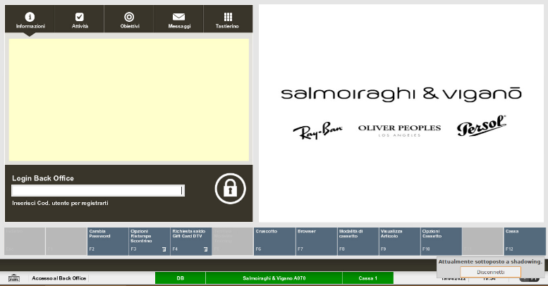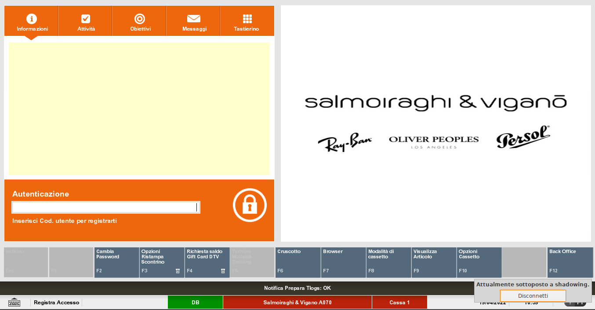

Effettuare l'accesso alla sezione *Back Office* inserendo le proprie
credenziali. Il colore della schermata di XStore da arancione diventa
nera per indicare l'accesso avvenuto alla sezione di back office.

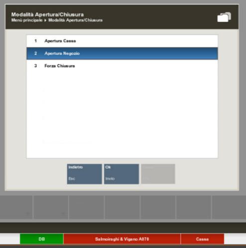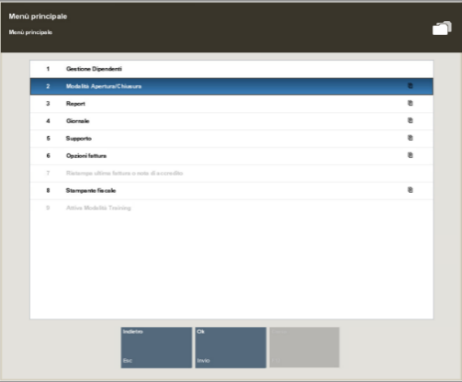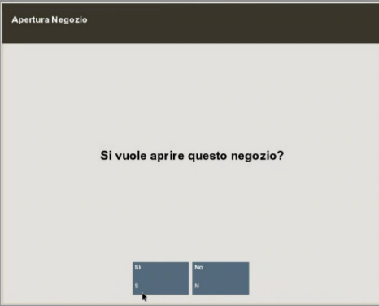Selezionare la *Modalità
Apertura/Chiusura* e successivamente *Apertura* *Negozio*. Dopo aver
aperto il negozio, la barra centrale si colora di verde, ad indicare che
lo stato del negozio è passato su aperto.

Selezionando *Sì*, viene mostrata la data lavorativa del giorno ed
eventuali messaggi lasciati dai colleghi il giorno precedente in fase di
chiusura.

A seguire procedere ad aprire la cassa selezionando *Apertura* *Cassa* e
scegliere *Ok*. Selezionare *Si* per confermare l'apertura.

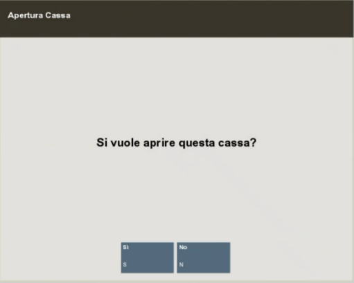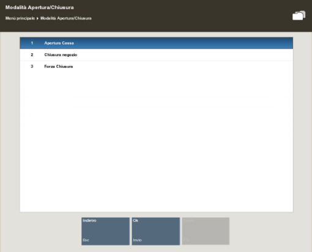

Selezionare sempre *Ok* per questo pop-up. Solo nel caso in cui una o
più delle ultime tre voci (Scartati, Non trovati o Sconosciuto)
riportino valori diversi da 0, contattare l'Helpdesk Toshiba per
supporto. In ogni caso è possibile procedere.

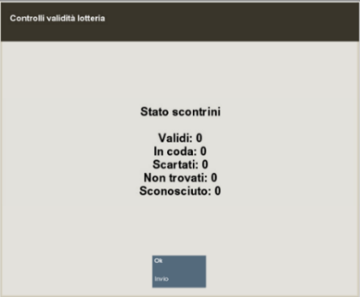

Procedere quindi al conteggio dei contanti presenti nel fondo cassa. Per
ogni taglio di contanti è possibile immettere la quantità corretta
inserendo la numerica nella barra e selezionando *Invio*.

Al termine del conteggio selezionare *Terminato Conteggio*.

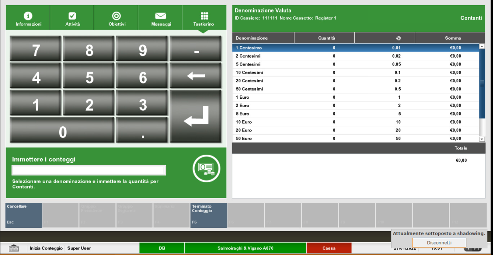

Replicare l'operazione di apertura Cassa per tutte le postazioni
presenti in negozio. Per le postazioni con cassetto è richiesto il
conteggio del fondo cassa, per tutte le altre (come, ad esempio, per gli
iPad o per i pc da banchetto) nonostante venga mostrata la schermata del
conteggio, non è necessario effettuarlo poiché non abbinate a un
cassetto contanti e quindi procedere direttamente a selezionare
*Terminato Conteggio*.

Se il conteggio inserito non risulta uguale all'ammontare lasciato in
chiusura di cassa il giorno prima, si visualizza il messaggio sotto
riportato.

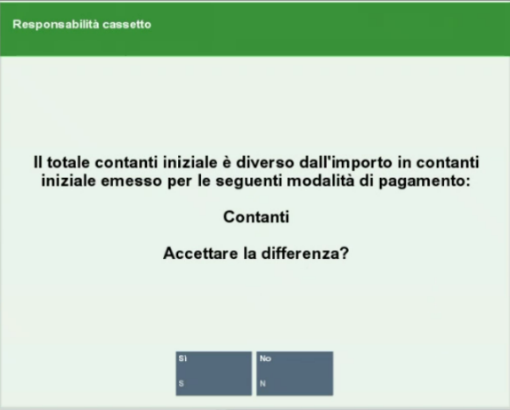

Cliccando su Si, bisogna fornire una motivazione per lo sbilanciamento.

Cliccare su *OK*.

## Chiusura postazioni e negozio

Per chiudere il negozio come primo passaggio è necessario chiudere tutte
le postazioni di vendita. Per farlo, accedere a Back Office e
selezionare *Modalità Apertura/Chiusura* e successivamente *Chiusura
cassa.* Ripetere il procedimento per tutte le postazioni (iPad
compresi).

Selezionare *Si* per confermare la chiusura della cassa.

Nel caso in cui non fosse possibile chiudere una cassa (e di conseguenza
il negozio) per problemi tecnici è possibile effettuare la chiusura di
tutte le casse tramite il comando *Forza chiusura*. Quest'azione è da
effettuare solamente in casi estremi.

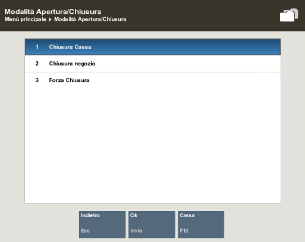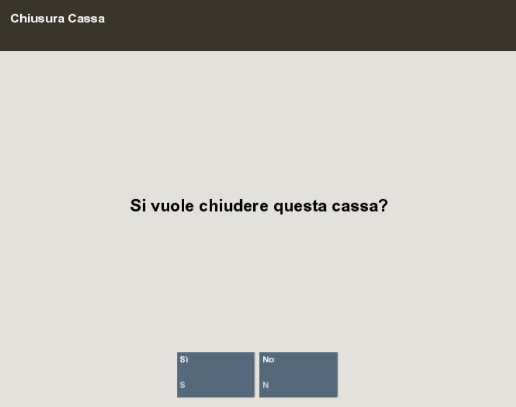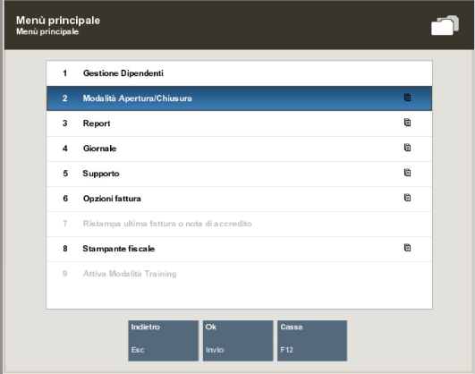

La schermata successiva proposta dal sistema è uno specchietto che
confronta quanto registrato dalla stampante fiscale (colonna Totale
Stampante) con quanto inserito attraverso il sistema di cassa (colonna
Totale Cassetti). Nel caso in cui:

-   il Totale Stampante sia inferiore al Totale Cassetti, procedere a
    registrare le vendite mancanti sulla stampante fiscale.

   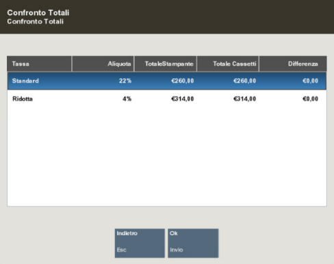
   
-   Il Totale Cassetti sia inferiore al
    Totale Stampante, procedere a registrare le transazioni mancanti,
    sul sistema di cassa, usando la funzione di vendita manuale da
    XStore.

Dopo aver premuto *Ok*, il sistema propone la schermata per effettuare
il conteggio dei contanti. Procedere al conteggio del cassetto nel caso
in cui la postazione di cassa interessata ne sia provvista, altrimenti
cliccare su *Sommario*.

Immettere la quantità di pezzi per ciascun taglio di denaro proposto
selezionando il taglio interessato e inserendo nella barra la quantità.
Al termine del conteggio, cliccare *Sommario*.

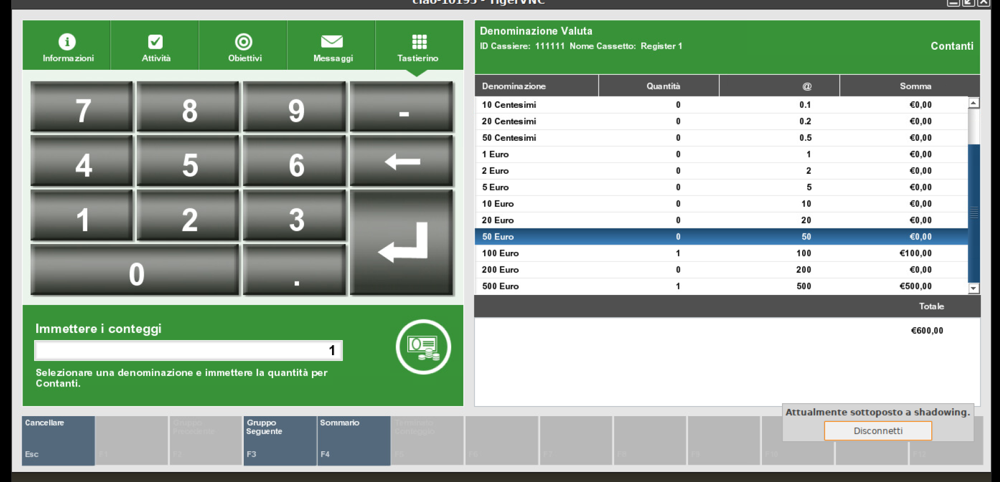

La schermata del Sommario propone l'elenco di tutti i metodi di
pagamento con un confronto tra la Somma Dichiarata e la Somma Sistema.
Per la voce Contanti la somma dichiarata corrisponde a quanto
precedentemente inserito al termine del conteggio dei contanti. Per
tutte le altre voci il denaro riportato corrisponde a quanto presente
nella colonna Somma Sistema.

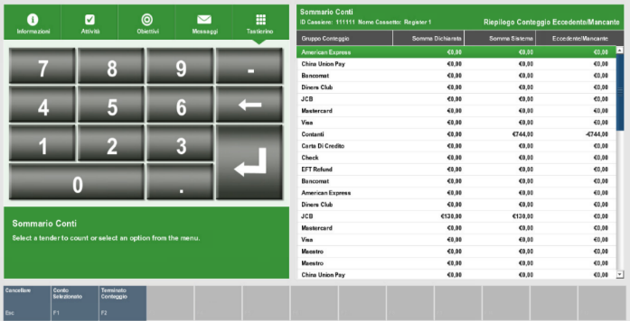

Nel caso in cui, vi sia la necessità di modificare una di queste voci,
selezionarla dall'elenco, cliccare *Conto selezionato*, immettere il
valore corretto.

Cliccare *Sommario* per ritornare alla pagina precedente.

Una volta terminata l'attività, selezionare *Terminato Conteggio.*

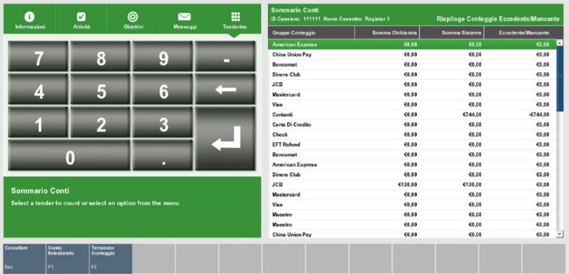

Nel caso in cui il sistema registri una discrepanza, è possibile
accettarla o tornare alla schermata precedente per modificare i
conteggi. Nel caso di accettazione è richiesto di selezionare una
causale come giustificativo e di immettere una nota. Se il conteggio
inserito non risulta uguale all'ammontare lasciato in chiusura di cassa
il giorno prima, si visualizza il messaggio sotto riportato. 

Cliccando su Si, bisogna fornire una motivazione per lo sbilanciamento
come in figura:

-   Errore pagamento: nel caso in cui la sera in chiusura ci sia un
    ammanco o un'eccedenza cassa a causa di un errato resto contante.

-   Crossover: nel caso in cui ci sia un'uscita in una modalità e
    un'entrata di pari valore in una diversa modalità di pagamento.

-   Differenza corrispettivi: nel caso in cui durante la giornata ci
    siano stati dei problemi con la cassa fiscale, scontrini bloccati,
    errati, doppi per cui la sera il totale corrispettivi su Ciao! non
    corrisponde alla strisciata di chiusura cassa.

-   Altro: altre differenze causate da motivi diversi (ad esempio resi
    con metodi di pagamento diversi da cash per i quali il cliente non
    viene rimborsato in store, tipicamente Adaro/RBM)

> Cliccare su *OK*.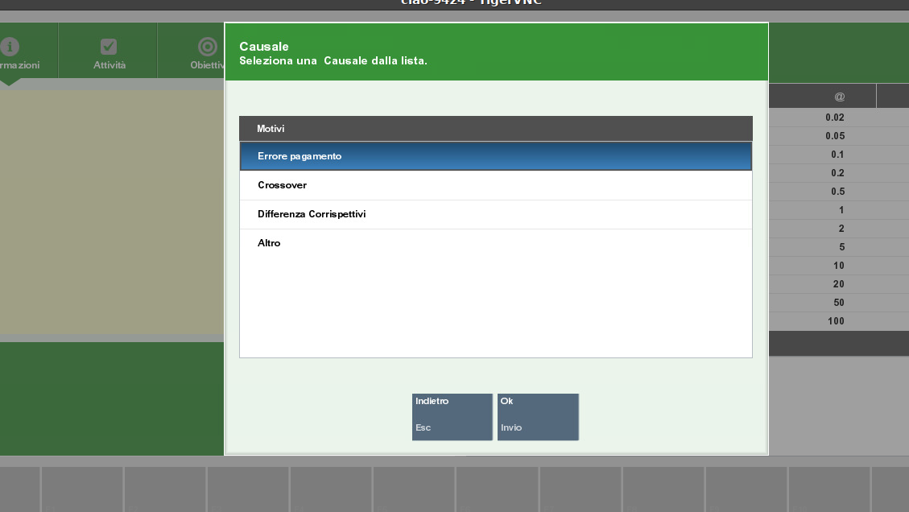

Come ultimo step, Il sistema ti propone l'importo da versare in
Cassaforte, tale valore sarà dato dal totale dei contanti contati meno
il fondo cassa fisso a 300€. <u>In quanto NON sarà più possibile
modificare il valore del fondo cassa.</u>

Suggeriamo quindi di far sì che i 300€ siano composti da più tagli
diversi possibili, in modo da poter gestire il contante agevolmente la
mattina seguente. Versare quindi in cassaforte quanto proposto dal
sistema. In particolare, potrete inserire tutti i tagli in banconote in
una busta come già procedura attuale e inserire invece le monete in un
sacchetto che conserverete in cassaforte.

Ad esempio: totale contanti presenti in cassetto a fine giornata pari a
536,50€ Il sistema proporrà automaticamente di versare in cassaforte
236,50€. Accettare il valore, <u>lasciare nel cassetto 300€, e spostare in
cassaforte i 236,50€.</u>

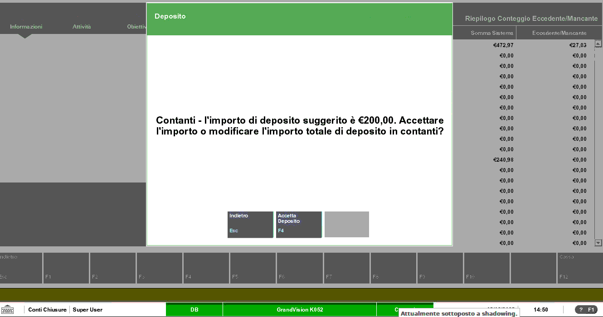

Una volta effettuata la chiusura di cassa, la barra in basso
corrispondente alla cassa diventa rossa.

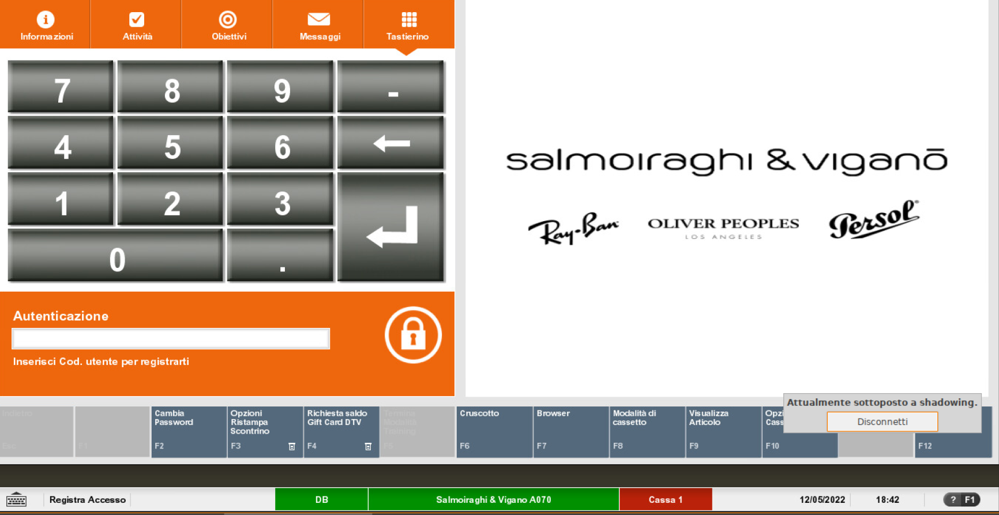

A seguire procedere alla chiusura del negozio selezionando *Chiusura
Negozio*.

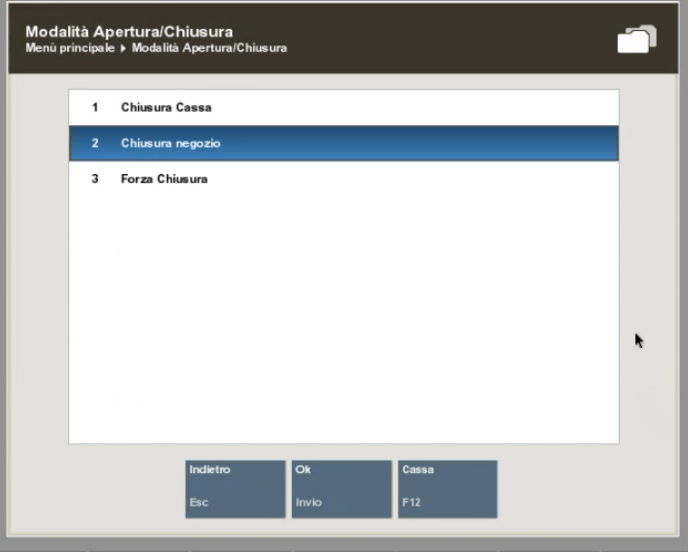

Scegliere *Si* e lasciare un messaggio di chiusura (visualizzabile
all'apertura di negozio il giorno successivo).

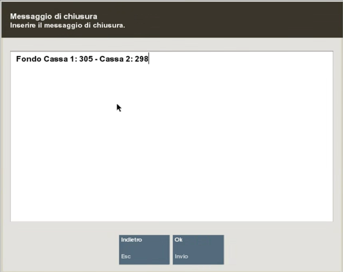

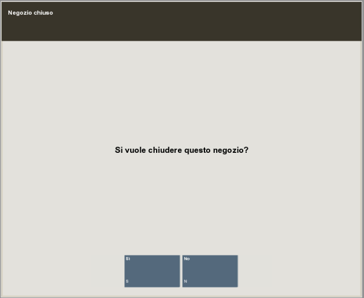

Si consiglia di scrivere all'interno del messaggio di chiusura negozio,
per ogni cassa, l'importo di Fondo Cassa precedentemente inserito.

Come visto per la cassa, la barra del negozio diventa rossa indicando
che il negozio è stato chiuso.

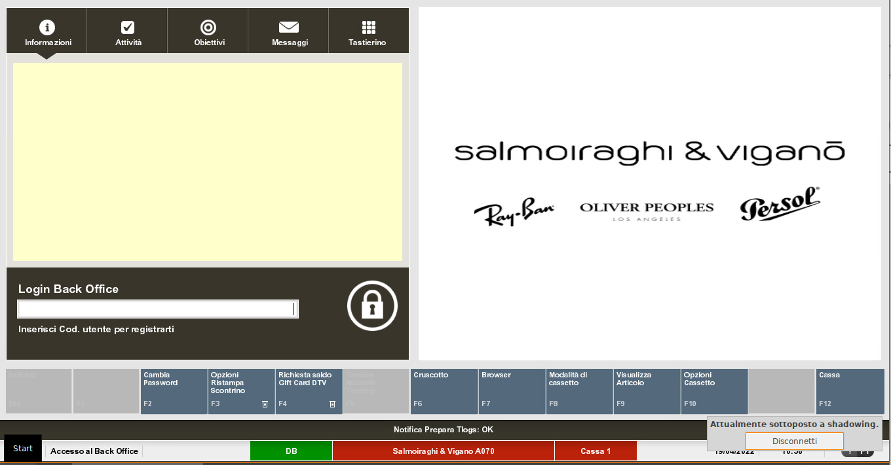
