# Gestione anagrafica cliente

Il flusso di raccolta anagrafica cliente su Ciao! Optical condotto
attraverso l'iPad ha la funzionalità aggiuntiva di poter far firmare al
cliente i moduli privacy direttamente da iPad, evitandone quindi la
stampa e il conseguente archivio cartaceo.

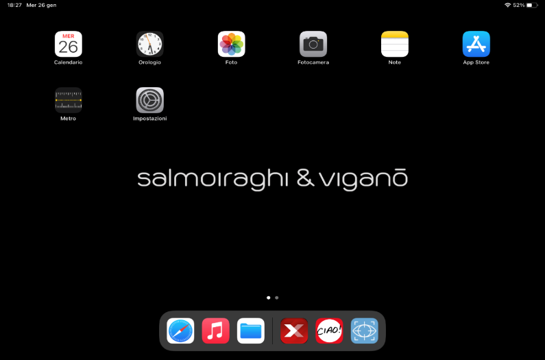

Per questo motivo si consiglia di eseguire tale processo utilizzando
l'iPad. L'iPad va tenuto orizzontalmente per permettere la corretta
visualizzazione della schermata di Ciao! Optical.

Per avviare Ciao! Optical da iPad, cliccare [l'icona dell'app
XStore]{.underline} rossa nel riquadro in figura (NON l'icona Ciao!)

## Ricerca cliente esistente

Dopo aver eseguito l'accesso, cliccare sull'icona del lucchetto, la
schermata che si apre è quella relativa alla ricerca cliente.

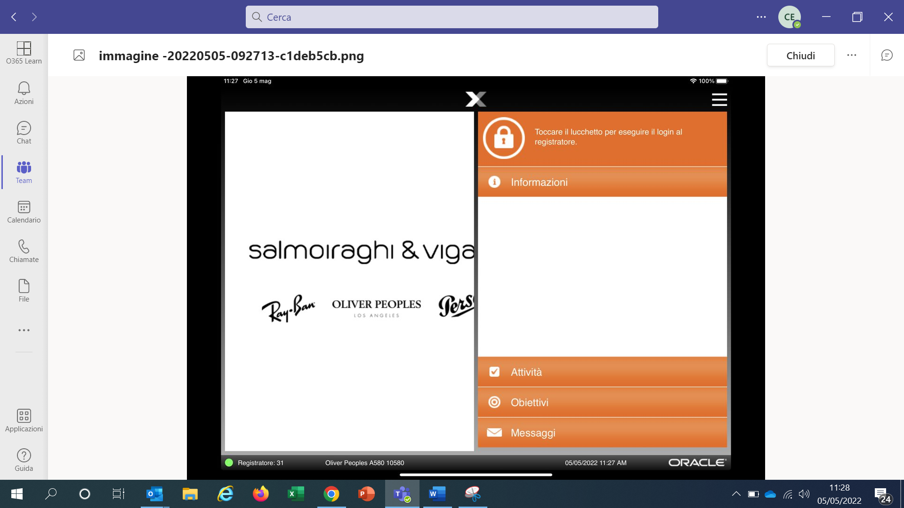

È possibile accedere a questa pagina anche cliccando sull'icona del menù
in basso a sinistra e successivamente su *Ricerca Cliente*.

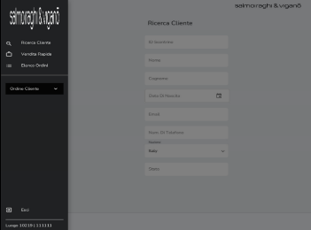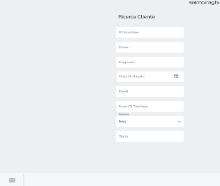

Per dare avvio alla ricerca, è necessario inserire almeno uno di
questi campi:

-   [ID Scontrino]{.underline} (barcode presente sullo scontrino fiscale
    scansionabile con il lettore ottico o con fotocamera iPad cliccando
    su *Cattura ID scontrino*).

-   [Nome + Cognome]{.underline} (almeno le prime 2 lettere del cognome
    e la prima lettera del nome)

-   [Indirizzo e-mail]{.underline}

-   [Numero di telefono cellulare]{.underline} (almeno le prime 7 cifre)

*Il database vendite e clienti di Ciao! è condiviso tra tutti i negozi
della rete Salmoiraghi & Viganò e i Monobrand. Non è possibile visionare
o ricercare vendite effettuate su negozi in franchising*

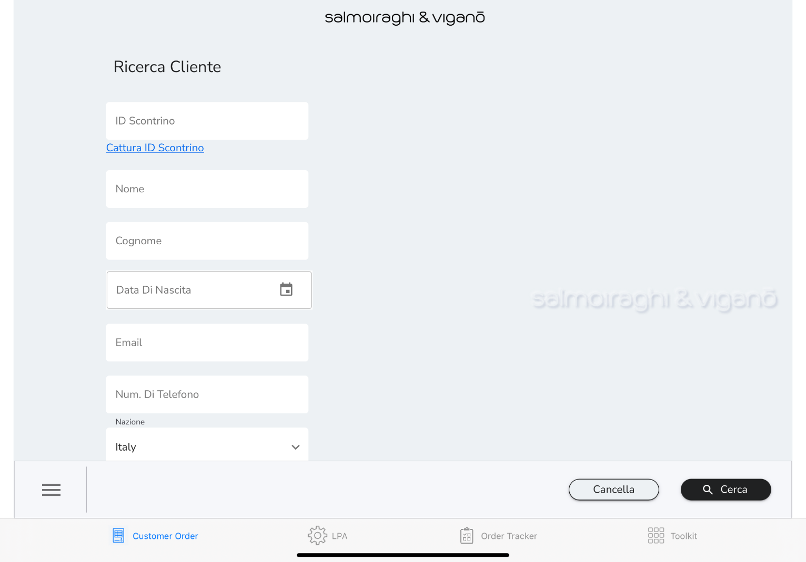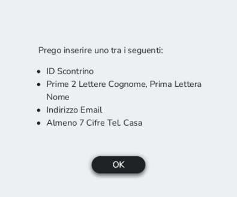

Cliccare su *Cerca* per visualizzare i risultati della ricerca.

Nel caso in cui le informazioni inserite non fossero sufficienti ad
avviare la ricerca, compare un messaggio d'errore invitando a compilare
i campi con almeno uno dei dati di cui sopra.

Cliccare su *Cancella* per cancellare tutte le informazioni inserite e
avviare una nuova ricerca. I risultati della ricerca vengono mostrati
con il dettaglio del nome, cognome, e-mail e numero di telefono
cellulare.

Sulla sinistra è possibile aggiungere ulteriori criteri di ricerca
(questa attività è utile per restringere il campo nel caso in cui la
ricerca abbia restituito molti risultati).

Nel caso in cui fosse necessario visualizzare più informazioni è
possibile espandere i risultati della ricerca cliccando sui *3 puntini
azzurri* sulla destra per vedere codice postale e data di nascita del
cliente.

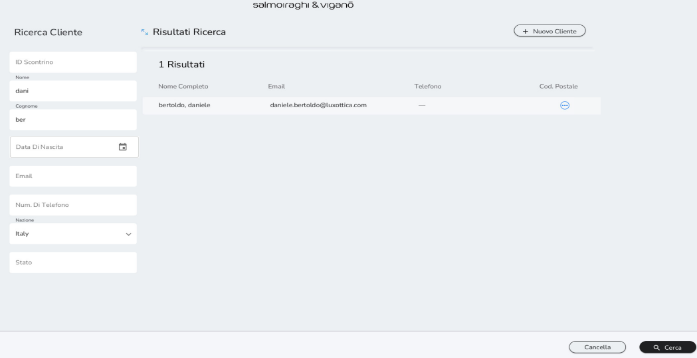

Cliccare sull' icona *+* per duplicare l'anagrafica. Questo
passaggio è utile nel caso in cui si volesse creare l'anagrafica di
persone appartenenti allo stesso nucleo familiare partendo
dall'anagrafica già esistente di uno di essi. Sarà infatti più veloce
creare l'anagrafica cambiando solo i dati non comuni (dati comuni
possono essere, ad esempio, la residenza ed il cognome).

Per i passaggi necessari per la creazione di un nuovo cliente *(vedere
capitolo 3.2)*.

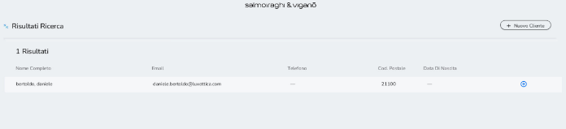

Dopo aver individuato il profilo d'interesse all'interno della lista
proposta, cliccare sul nome per accedere alla scheda anagrafica. Il
*Profilo Cliente* riassume tutti i dati relativi al cliente (anagrafici
e medici).

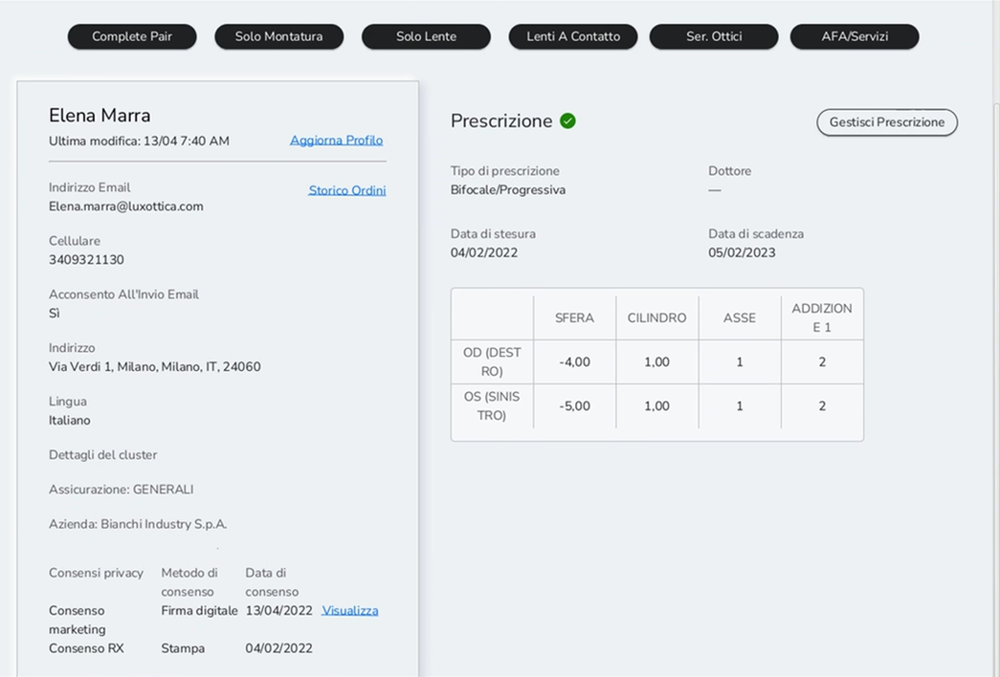

È possibile visionare le metodologie di contatto accordate dal cliente
attraverso i consensi privacy nelle voci espresse tra i dati anagrafici
del cliente sotto

*Acconsento All'invio E-mail* e / o *Acconsento All'invio di SMS*. In
alternativa selezionare *Visualizza* nel box dedicato ai consensi
privacy per vedere il documento sottoscritto dal cliente.

Nel caso in cui si volesse modificare e/o visualizzare i flag dei
consensi è possibile accedere alla sezione *Aggiorna Profilo*.

Se la lista proposta non restituisce i risultati desiderati, è possibile
creare un nuovo cliente selezionando *+Nuovo cliente*.

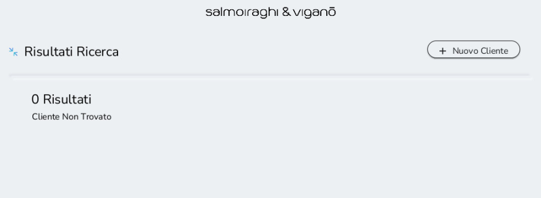

Il passaggio dalla *Ricerca Cliente* è pensato per evitare la
duplicazione di anagrafiche, per cui la creazione di un nuovo cliente
può avvenire soltanto dopo averlo ricercato e non averlo trovato.

Inoltre, si consiglia di controllare sempre che sia presente
l\'informazione dell\'assicurazione, del codice fiscale e i flag dei
consensi per le anagrafiche preesistenti (importate da Acuitas).

## Creazione nuovo cliente

Dopo aver cliccato su *+Nuovo cliente*, inserire le informazioni del
cliente nella scheda *Aggiungi Cliente*:

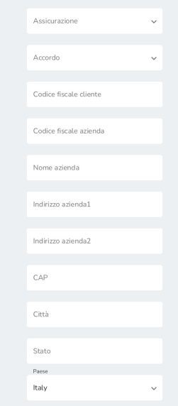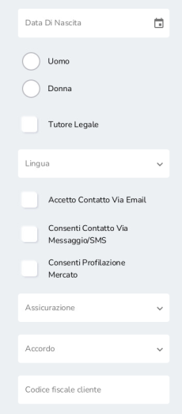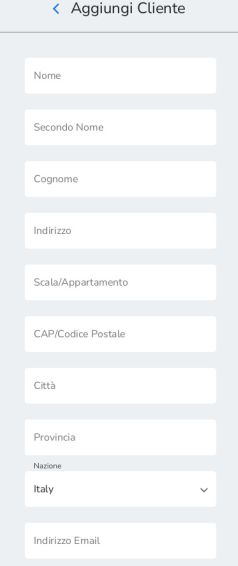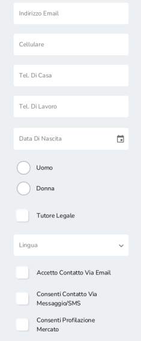

Le informazioni minime obbligatorie per poter creare un profilo
cliente sono:

A.  Nome + Cognome

B.  Indirizzo e-mail (nel caso in cui il cliente non ne disponesse,
    inserire [sempre]{.underline} questo indirizzo e-mail fittizio:
    <fittizio@luxottica.com> -- e assicurarsi di raccogliere almeno un
    contatto alternativo per comunicare con il cliente)

C.  Assicurazione (da compilare per tutti i clienti. Nel caso in cui vi
    fosse un cliente senza assicurazione o con assicurazione non gestita
    da noi selezionare i campi NO ASSICURAZIONE o ALTRA ASSICURAZIONE)

Si consiglia comunque di aggiungere alle informazioni obbligatorie i
dati di:

-   Numero di cellulare

-   Codice fiscale (specialmente per prodotto vista)

-   Residenza (utilizzati per la fattura, se inseriti in anagrafica
    vengono recuperati automaticamente all'emissione della fattura senza
    il bisogno di inserirli)

Tra le informazioni è possibile anche inserire il riferimento di un
tutore legale. Cliccare su *Tutore legale* e poi su *Continua* per
accedere alla pagina dove inserire le informazioni richieste per il
tutore legale:

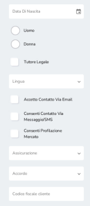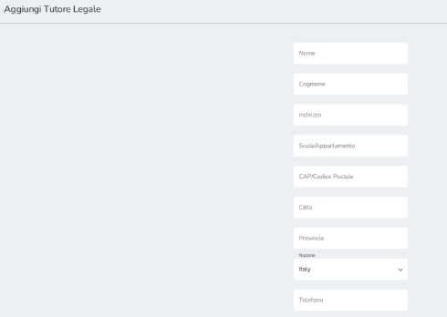

Nel caso in cui venga aggiunto un tutore legale, inserire la mail del
tutore legale sia nell'anagrafica del cliente sia in quella del tutore
legale, in questo modo la mail di conferma per il trattamento dei dati
personali è inviata alla mail del tutore.

Per salvare l'anagrafica cliccare su *Aggiungi cliente.*

## Raccolta consensi marketing

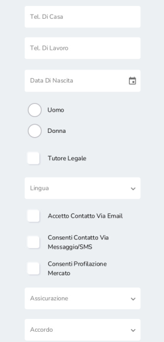La raccolta dei consensi marketing è
sempre richiesta durante la creazione di un nuovo cliente. Inoltre, è
necessario raccogliere nuovamente i consensi nel caso di modifica di
almeno uno dei flag di profilazione marketing o ricezione di
comunicazioni (via e-mail o SMS). *Nel caso in cui venisse flaggato il
consenso relativo alla ricezione di SMS, anche il numero di telefono
diventa un dato obbligatorio da inserire per la creazione del cliente.*

A seconda dello strumento utilizzato è possibile raccogliere i consensi
attraverso diverse modalità. Cliccare su *Più opzioni* per visualizzarle
tutte.

A.  *Modalità preferibile* - Firma digitale del documento (*opzione
    disponibile solo su iPad*). Selezionare *Firma qui* per accede ad
    una sezione riportante l'informativa privacy e la casella dove
    firmare. I consensi sono già precompilati in base a quelli
    selezionati nella creazione cliente

> 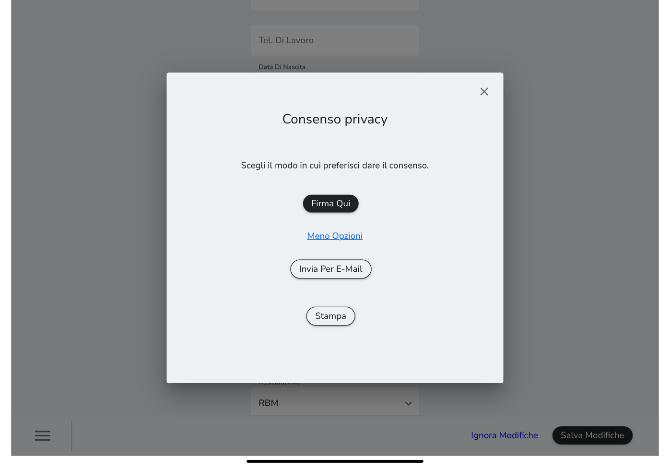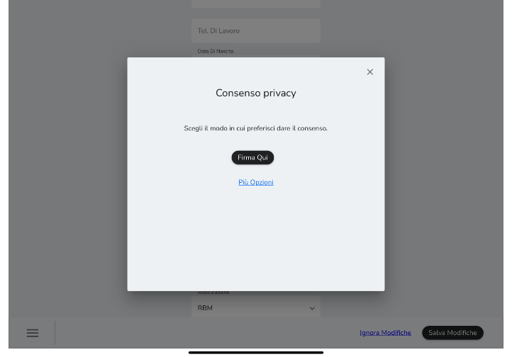

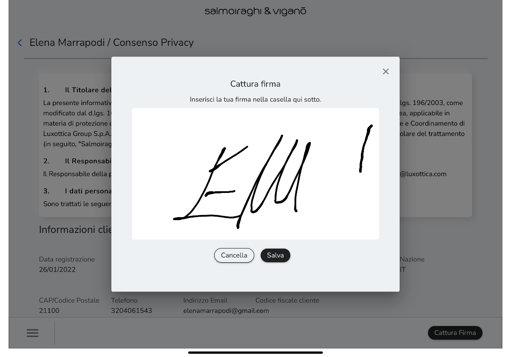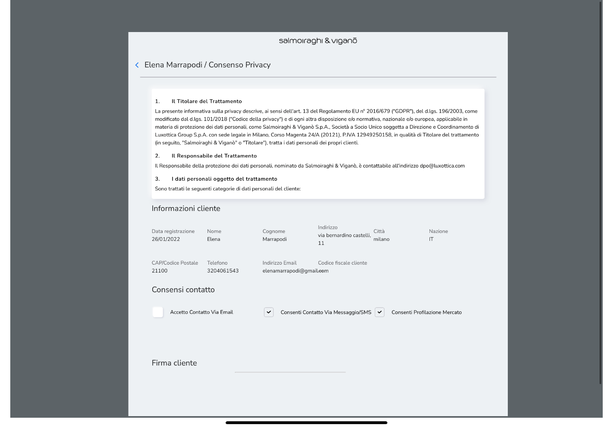

È possibile poi condividere l'informativa privacy con stampa cartacea o
e-mail, cliccando rispettivamente su *Stampa* o su *e-mail* (il cliente
riceve una e-mail con l'informativa privacy firmata in allegato). È
inoltre possibile selezionare *Salva e Ritorna* per salvare
l'informativa privacy firmata senza condividerla.

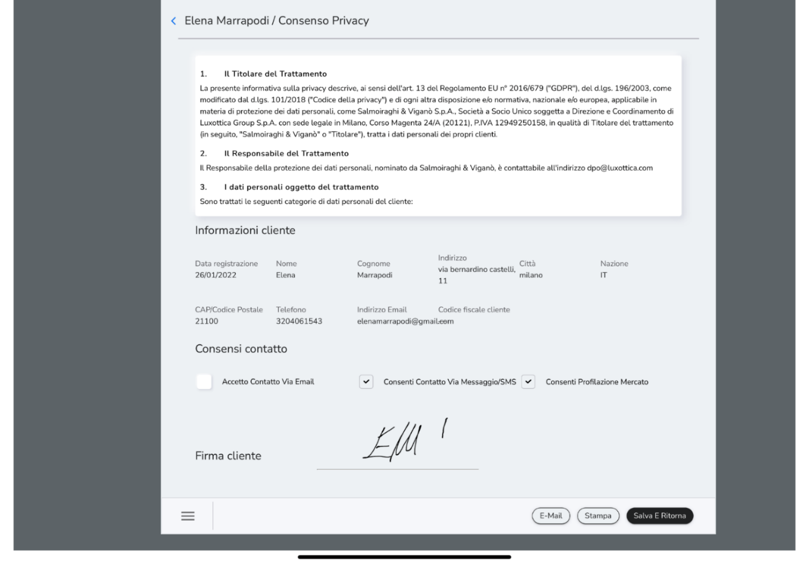

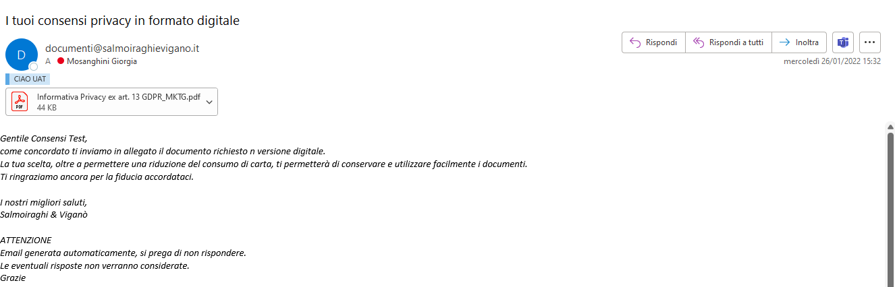

B.  Invio di una e-mail al cliente per la presa consenso.
    All'interno dell'e-mail è presente un tasto che, se selezionato,
    vale come conferma per i consensi. L'invio avviene dopo
    l'inserimento di un check up o di un flusso di vendita/ordine*.* È
    preferibile assicurarsi che il cliente rilasci il consenso
    recuperando insieme la mail prima che il cliente esca dallo store.

C.  Modalità non preferibile -- Stampa del documento e firma su
    carta. Nel caso in cui non sia disponibile un iPad e il cliente non
    abbia un indirizzo e-mail valido, sarà possibile acquisire il
    consenso tramite firma dell'informativa in formato cartaceo
    cliccando su *Stampa.*

[Solo in questo ultimo caso è necessario archiviare la copia
dell'informativa cartacea firmata dal cliente e conservarla per 10 anni
in negozio.]{.underline} Per tutte le altre modalità di raccolta del
consenso l'informativa viene salvata all'interno del sistema. È sempre
possibile verificare la modalità di raccolta del consenso all'interno
del *Profilo Cliente*.

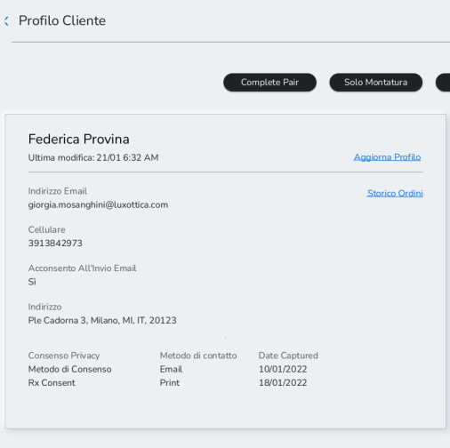
