# Gestione dati prescrizione e visite

## Creazione lista ottici interni

Il sistema Ciao! Optical prevede una lista unica contenente sia i
nominativi dei Medici oculisti esterni che quelli degli Ottici interni.

Questa lista è soggetta a revisione mensile da parte dei team di sede
per recepire tutti gli eventuali cambiamenti degli staff di negozio in
termini di Ottici interni e inserire / modificare le informazioni in
merito ai Medici oculisti esterni.

Per poter facilitare la selezione nel campo *Nome* degli Ottici interni
in fase di inserimento check-up o prima applicazione LAC, è possibile
configurare una sotto lista di ottici interni specifica del negozio.
Questa attività è svolta dallo Store Manager il primo giorno di
installazione del nuovo sistema di cassa e ogni volta che vi sono
aggiornamenti dello staff.

Per creare la lista interna di negozio è necessario accedere alla
sezione *Cerca* *Ottico.* Vi sono due modalità per accedervi:

-   Accedendo ad un *Profilo* *Cliente*, cliccando su *Gestisci*
    *Prescrizione* -\> *Gestisci lista ottici*.

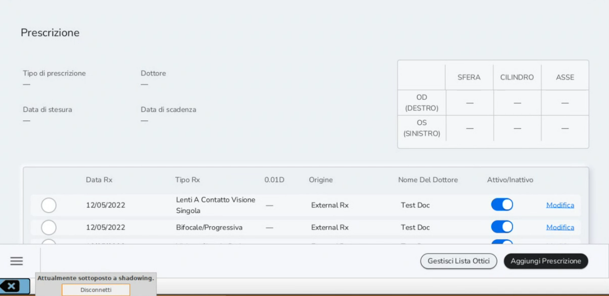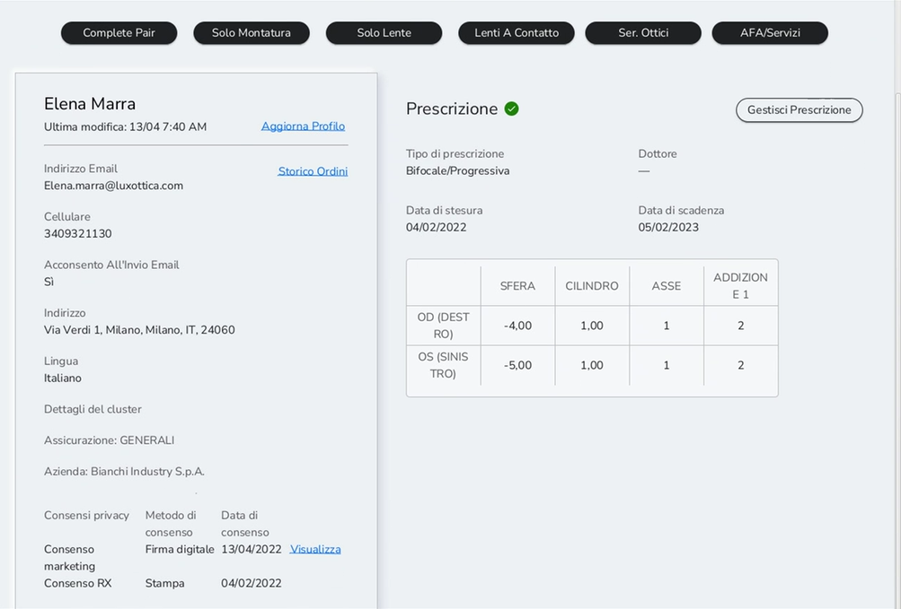

-   Accedendo ad un *Profilo* *Cliente,* cliccando su *Servizi Ottici*
    -\> *Gestisci Lista Ottici.*

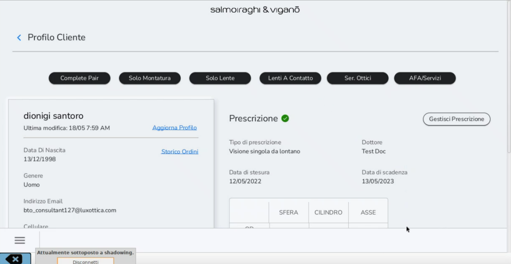

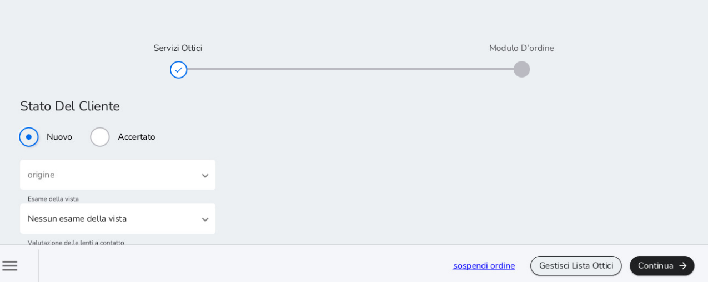

Nella sezione *Cerca* *Ottico,* ricercare il nominativo dell'Ottico
interno da inserire nella sotto lista e flaggare in sua corrispondenza
come mostrato in figura. È possibile aggiungere altri ottici alla lista
interna utilizzando sempre i campi sulla sinistra e cliccando su
*Cerca*.

Per ricercare ottici interni inserire in *Cognome e Nome* il cognome e
il nome dell'ottico, mentre in *Posizione* inserire Ottico Interno come
da esempio. Selezionare il record di interesse, cliccando su di esso e
poi flaggare il tab per settare la persona come interna.

Il terzo campo *Tipo di dottore*, NON VA COMPILATO.

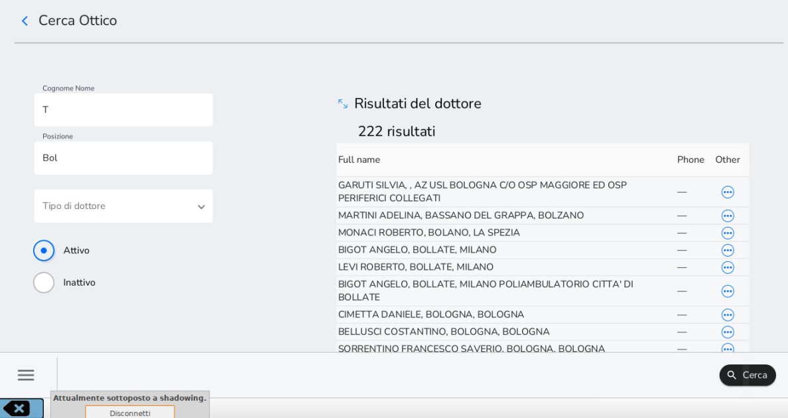

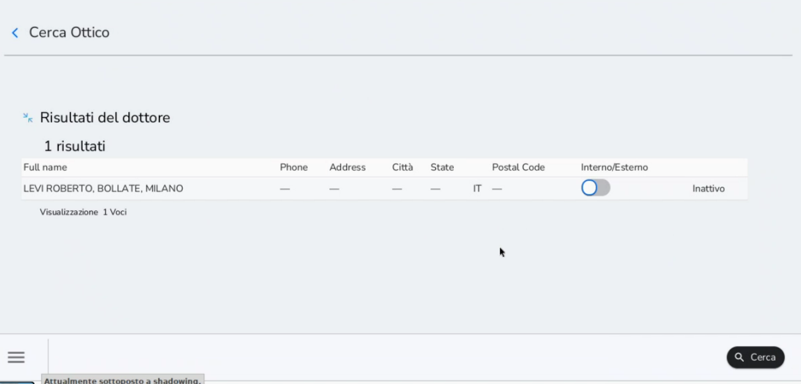

## Registrazione Check-up -- Ricetta -- Prima applicazione LAC

Il flusso di registrazione check-up, ricetta o prima applicazione LAC su
Ciao! Optical condotto attraverso l'iPad è la modalità consigliata.

Per inserire i dati di una ricetta, un check-up o di una prima
applicazione LAC il processo da seguire è il seguente:

1.  Registrazione degli stessi a sistema attraverso la sezione
    *Ser.Ottici*

2.  Inserimento dei dati del check-up, della ricetta o della prima
    applicazione LAC nell'anagrafica del cliente attraverso *Gestione
    Prescrizioni*

Per registrare un check-up o una ricetta accedere alla sezione *Profilo*
*Cliente* e selezionare in alto il tasto *Ser.Ottici*.

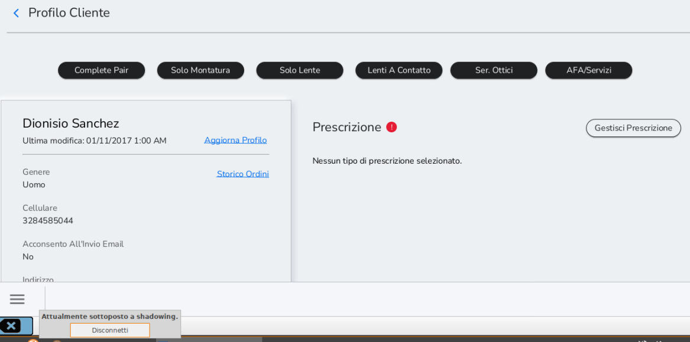

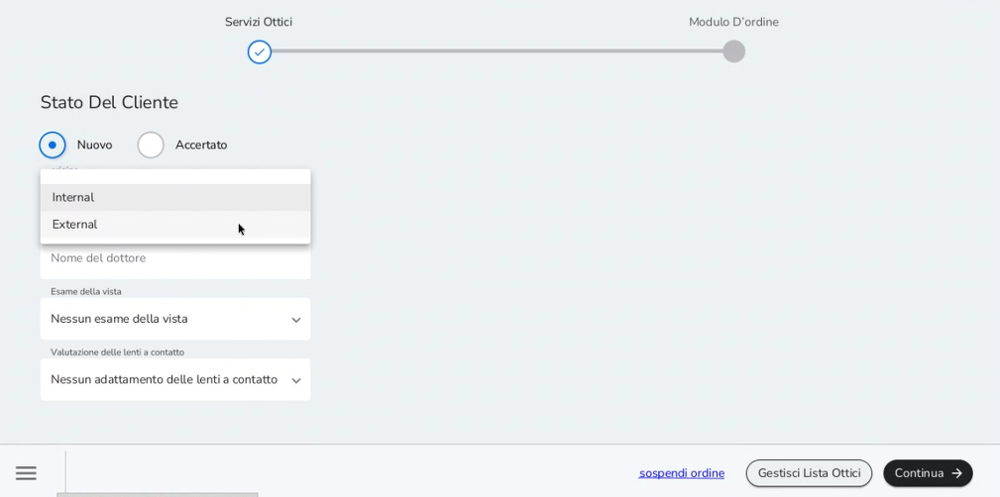

Compilare i dati richiesti:

-   Stato del Cliente: indicare se il paziente è nuovo o meno (il
    riferimento è al cliente come paziente. Se non è la prima volta che
    il cliente effettua un check-up, ed è quindi già paziente per
    Salmoiraghi&Viganò, selezionare *Accertato*)

-   Origine: Esterno (ricetta di medico oculista esterno); Interno
    (controllo effettuato da ottico interno)

-   Esame della vista: indicare se si sta registrando una ricetta
    esterna o un check-up interno

-   Valutazione delle lenti a contatto: selezionare Prima applicazione
    LAC per registrare una Prima Applicazione LAC. In questo caso sarà
    necessario selezionare anche la voce di Check-up nel campo Esame
    della vista.

Solo dopo aver selezionato l'origine, sarà possibile inserire il nome
dell'ottico interno o del medico oculista esterno nel campo *Nome*
digitandone il valore. Dopo aver digitato le prime lettere il sistema
propone una lista ristretta da cui selezionare.

Se il medico oculista è già presente nella lista, è sufficiente
selezionarne il nominativo per procedere nel flusso di vendita. Alcuni
medici oculisti potrebbero essere presenti due volte nell'elenco. Quando
il nome è associato a una città si fa riferimento allo studio privato,
il secondo, invece, fa riferimento allo studio in cui opera.

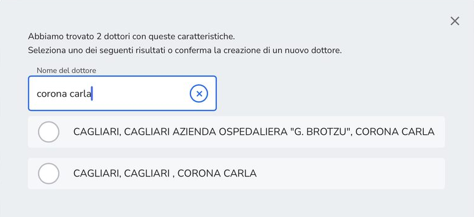

Per quanto riguarda la lista di Medici Oculisti esterni potrebbe esservi
la necessità di segnalare una ricetta di Medico oculista non presente
nella lista unica. In questo caso, in fase di registrazione della
ricetta selezionare il valore nuovo medico oculista.

In un secondo momento aprire un ticket GLPI categoria Sviluppo Business
02. Classe Medica segnalando la presenza di un nuovo medico oculista con
relativi dettagli. Con l'aggiornamento della lista il nominativo sarà
visibile e sarà possibile aggiornare di conseguenza la prescrizione
d'interesse.

Una volta completati i campi non cliccare *Continua* ma selezionare la
voce in basso a destra Aggiungi
prescrizione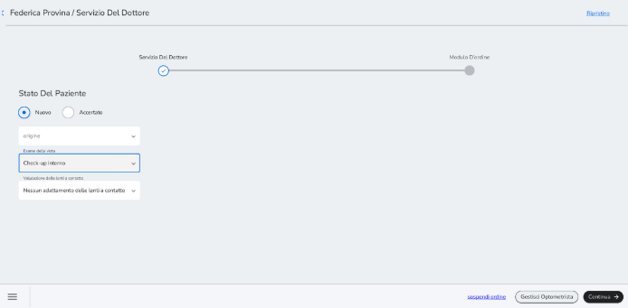
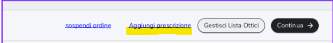

Una volta completati i campi non cliccare *Continua* ma selezionare la
voce in basso a destra Aggiungi prescrizione

Cliccando su questo tasto il sistema vi riporta direttamente nella
schermata per l\'inserimento della prescrizione. Il dato di origine e il
nome dell\'ottico/ medico oculista <u>verranno riportati
automaticamente</u> senza che vengano reinseriti.

In più sempre in questa schermata potrete <u>aggiungere anche un\'altra
prescrizione,</u> premendo il tasto *Aggiungere Altro*, che
apre una nuova schermate di prescrizione.

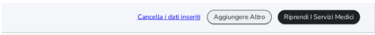

*Per esempio, questo metodo potrebbe essere molto utile per un cliente
progressivo per il quale vogliate creare più di una prescrizione
(progressiva da lontano e da vicino)*

Una volta terminata la creazione delle prescrizioni che desiderate,
premere sul tasto *Riprendi servizi medici*, per tornare alla
schermata iniziale. Da qui procedete con continua alla fase di emissione
di scontrino a zero cliccando su *Procedi al pagamento*.

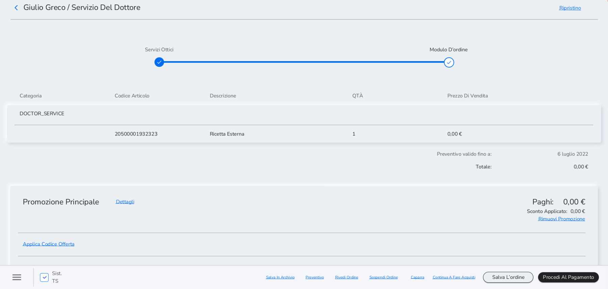

Cliccare su *Transazione completata* per concludere la registrazione. Di
conseguenza, cliccando su *Stampa* la scontrinatrice fiscale emette un
documento gestionale riportante un servizio a valore 0. <u>Questo
documento gestionale non è da consegnare al cliente</u>.

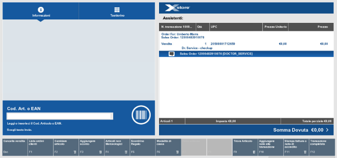

Da iPad il flusso segue quanto riportato sopra. L'unica differenza è la
posizione del tasto *Transazione Completata*: una volta su Xstore,
cliccare sull'icona di menù in alto a destra e successivamente su
*Transazione Completata*

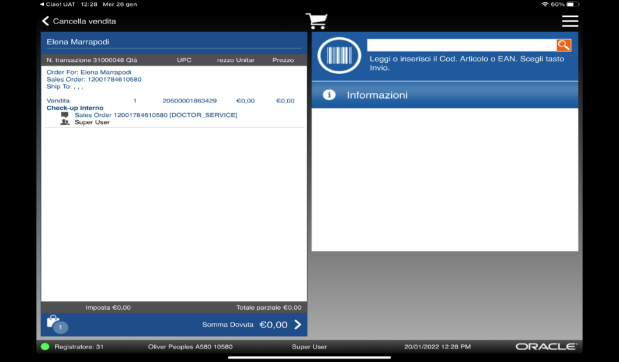

## Inserimento dati Check-up -- Ricetta -- Prima applicazione LAC

Per procedere al secondo step del processo, che prevede l'inserimento
dei dati medici nell'anagrafica del cliente, accedere al *Profilo*
*Cliente*, cliccare su *Gestisci Prescrizioni* e successivamente su
*Aggiungi prescrizione.*

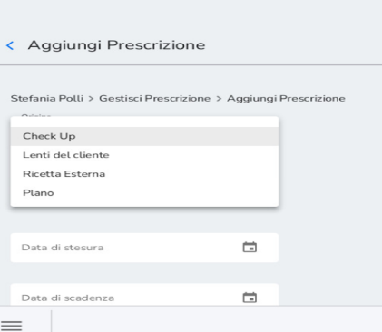

Il primo campo da compilare è l'origine. Ci sono quattro opzioni:

-   Check up

-   Lenti del cliente

-   Ricetta esterna

-   Plano

Successivamente compilare anche i seguenti campi:

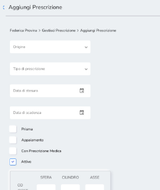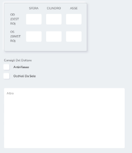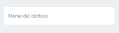
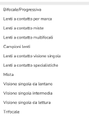

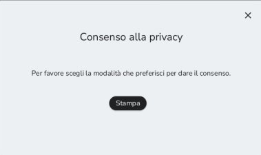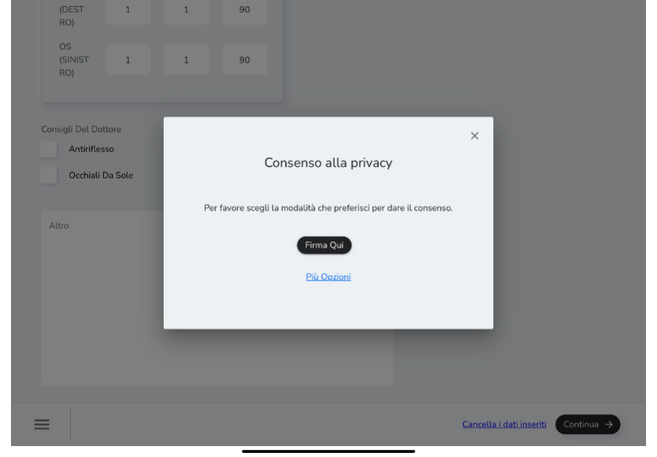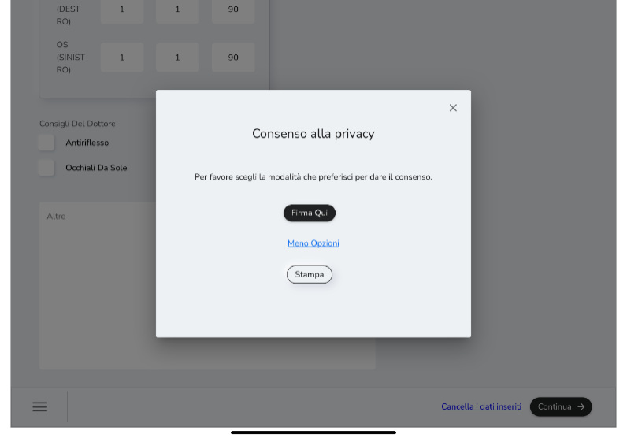

Cliccare su *Continua* per attivare la
raccolta dei consensi medici. Il rilascio dei consensi privacy per i
dati medici avviene via stampa o firma digitale (da iPad).

Una volta aggiunta la nuova prescrizione, questa sarà visibile nello
*storico delle prescrizioni del cliente* come mostrato in figura.

Flaggando sulla sinistra in corrispondenza della prescrizione
d'interesse è possibile attivare il tasto *Seleziona Prescrizione.*

Cliccarlo per selezionare una prescrizione per una vendita.

Una prescrizione non può mai essere eliminata ma soltanto resa inattiva.
Alla scadenza della prescrizione, la selezione diventa automaticamente
inattiva.

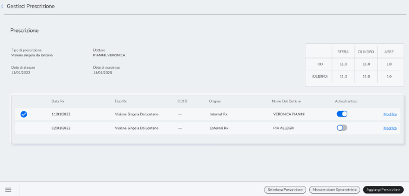
