# Creazione WO Frame + Lenti o Solo Lenti

Su Ciao!Optical si può scegliere cosa vendere al cliente, Complete
pair nel caso si voglia vendere sia montatura che lenti o Solo
lenti nel caso di solo le lenti.

A seconda di cosa si sceglie, al termine della creazione del vostro WO è
il sistema stesso che fornisce un feedback sulla lavorazione con cui
quell\'ordine verrà prodotto (job type)

1.Se abbiamo scelto "Complete pair" il sistema può darci 3 feedback
diversi:

-   Complete pair se c\'è la disponibilità in laboratorio sia della
    montatura che delle lenti;

-   Lens only se servono solo le lenti dal lab e la montatura è già
    in negozio;

-   Frame to Come se la montatura non è qualificata a Sedico (per
    esempio il caso di Lindberg)

2.Se abbiamo scelto "Solo lenti" il sistema in base a cosa abbiamo
selezionato può dirci:

-   Se abbiamo fleggato montatura del cliente ci verrà sempre
    proposto Frame to Come in maniera cautelativa;

-   Se abbiamo inserito UPC di un prodotto riconosciuto a Sedico,
    allora il sistema potrà proporre lavorazione di Lens Only

Vediamo adesso tutti i passaggi per inserire un ordine di un occhiale
completo, cioè Frame + Lenti, si accede al *Profilo* *Cliente:*

1.  Assicurarsi di aver selezionato una prescrizione attiva per un
    difetto visivo per occhiale da vista *(vedere capitolo 4.3)*. Una
    volta selezionata una prescrizione, questa sarà visibile in
    anteprima nel *Profilo Cliente*.

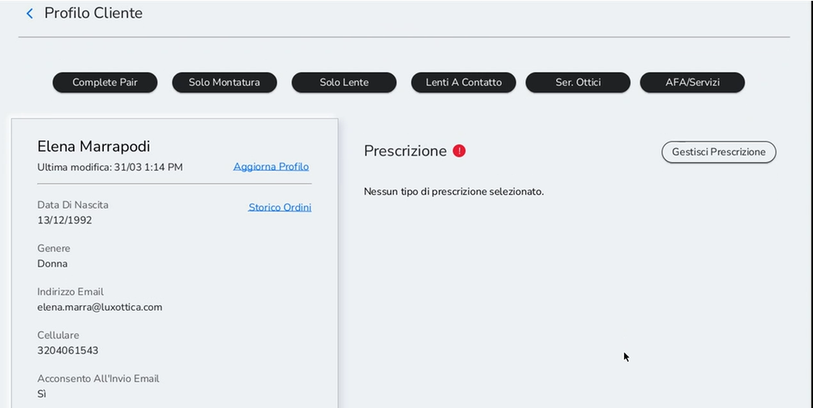


## Step 1: selezione montatura

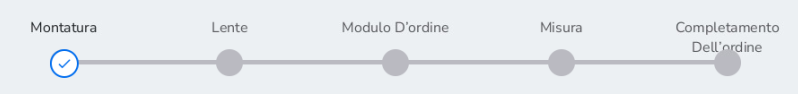

La selezione della montatura può avvenire in diverse modalità:

A.  Inserendo l'UPC di una montatura. È possibile scansionarlo con la
    fotocamera dell'iPad o il bar code reader. Selezionare *Cerca
    Montatura* o premere invio per visualizzare la selezione effettuata.

B.  Ricercando per brand utilizzando il campo Marca e Codice Modello. È
    necessario sempre inserire prima il brand nel campo Marca dove a
    seconda delle lettere inizialmente inserite, il sistema suggerisce
    automaticamente in un menu a tendina i brand selezionabili.
    Dopodichè è necessario inserire il codice del modello nel campo
    Codice Modello (es. RB4147). Selezionare *Cerca Montatura* o premere
    invio avviare la ricerca.

> Il risultato della ricerca è una lista di tutti gli articoli
> disponibili del brand selezionato. Dopo aver cliccato sulla riga della
> montatura d'interesse, posizionare il puntatore del mouse fuori dalla
> lista e scorrere verso il basso per visualizzare la selezione
> effettuata.

C.  Selezione da Smartshopper (solo su iPad). Cliccare su *Avvia Smart
    Shopper* e scegliere la montatura. Selezionare *Aggiungi al
    carrello* successivamente *Vai al carrello* ed in definitiva *Ordina
    adesso.* La montatura selezionata diventa così visibile su Ciao!

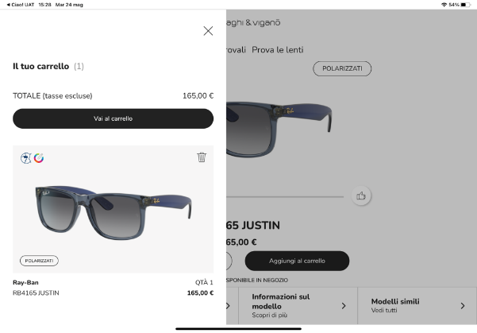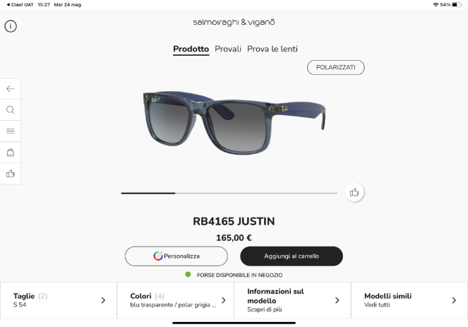

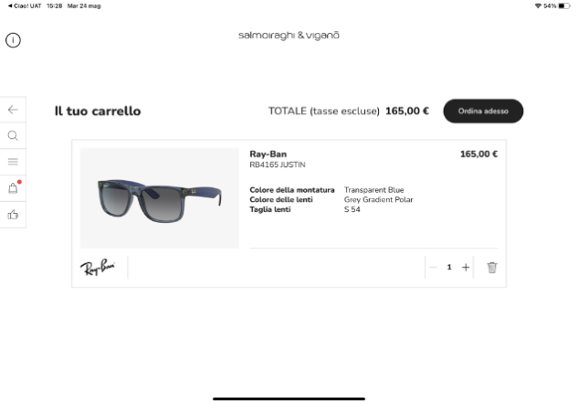

Viceversa, il flusso può partire da Smartshopper (vedere dettagli flusso
da Smart Shopper nel *capitolo 12*)

D.  Montatura del Cliente: questa opzione verrà effettuata quando si
    presenta un caso di cambio lenti e si potrà effettuare una SOLO
    volta [seguito il percorso di *Solo Lenti*]{.underline}.

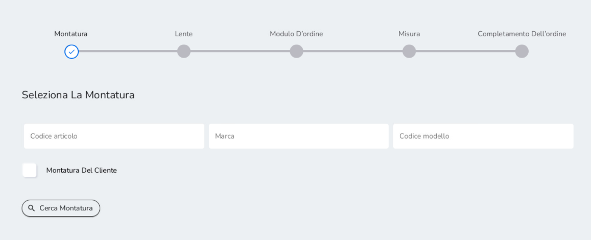

I campi obbligatori da compilare sono il prezzo di vendita (inserire il
valore 0), la tipologia di occhiale (Oftalmico o Sole) e il fornitore
(Marca). Selezionare sempre *Montatura in Negozio* sulla destra e
cliccare su *Continua*.

Se l'ordine è un Lens Only, selezionare Montatura del Cliente nel caso
in cui la montatura sia di proprietà del cliente.

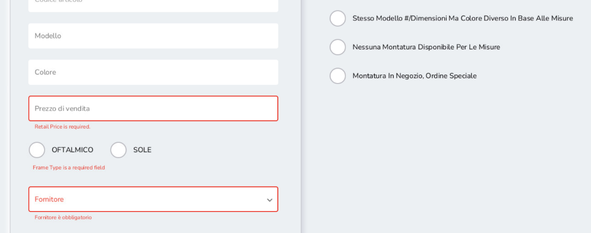

Dopo aver selezionato la montatura con una delle modalità viste sopra
flaggare una delle seguenti opzioni:

A.  Montatura in negozio, opzione più utilizzata (è quindi possibile
    procedere con la presa misurazioni per qualsiasi tipo di difetto
    visivo)

B.  Montatura presente in negozio, ma di differente colore

C.  Nessuna montatura disponibile per le misure. Selezionando questa
    opzione e cliccando su *Continua* esce un messaggio di errore e il
    sistema propone di selezionare una nuova montatura

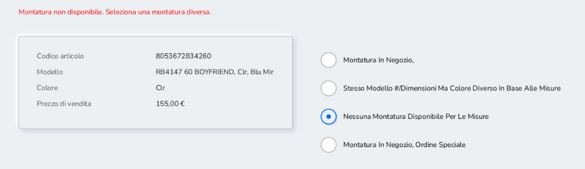

D.  Montatura in negozio, Ordine Speciale (da non utilizzare)

Cliccare su *Continua* per procedere con la selezione delle lenti.
Cliccare su *Sospendere ordine* per mettere in pausa la vendita.
L'ordine viene salvato nella lista di ordini attivi dello store per 3
giorni, al termine dei quali potrà comunque essere recuperato dalla
sezione Archivio entro 27 giorni.

## Step 2: Selezione lenti oftalmiche

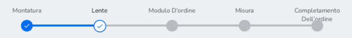

Lo step successivo è la selezione delle lenti oftalmiche che avviene con
i seguenti step:

-   Selezionare la tipologia di lente (Chiare, Sole o Transitions)

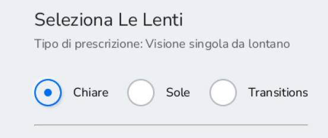

-   Il campo Tipo di Visione è già precompilato con le alternative
    supportate dal tipo di prescrizione selezionata prima di iniziare il
    flusso d'ordine. Il tipo di prescrizione selezionato è visibile
    sotto la dicitura Seleziona Lenti. Nell'esempio riportato sotto la
    prescrizione selezionata è Visione Singola da Lontano e quindi nel
    campo Tipo di Visione viene automaticamente inserito Monofocale.

> 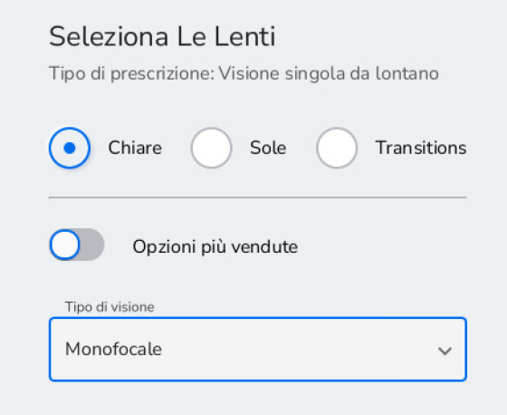

-   Selezionare Design delle Lenti, Materiale, Trattamento e Colore. La
    possibilità di selezionare ognuno di questi campi si abilita una
    volta inserito il precedente.

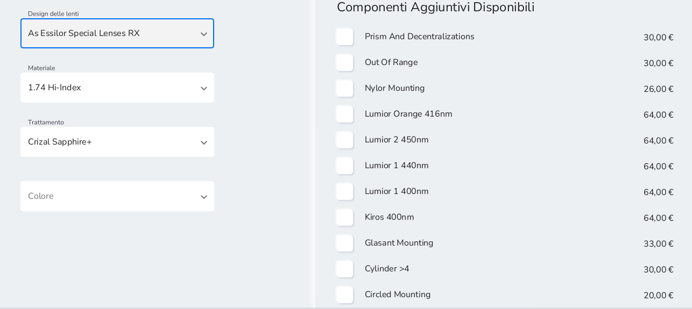

È possibile verificare le caratteristiche delle lenti selezionate
attraverso i pacchetti lenti. Accedere al toolkit cliccando sull'icona
del mappamondo in basso a sinistra e selezionare la cartella Listini
nella prima pagina del toolkit. Aprire la cartella che contiene i
listini d'interesse.

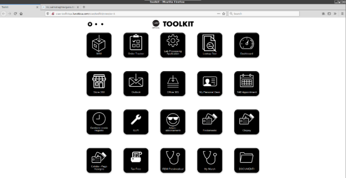

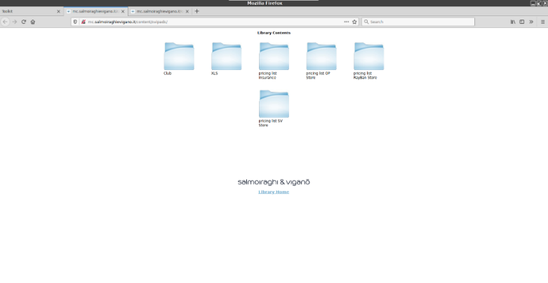

Sulla destra è presente una sezione di dettaglio delle caratteristiche
delle lenti selezionate. Sotto questa sezione è presente la sezione
dedicata agli add-on disponibili per il pacchetto lenti selezionato
(servizi e lavorazioni aggiuntive). [Selezionare sempre
l'opzione]{.underline} *Mounting* nei componenti aggiuntivi.

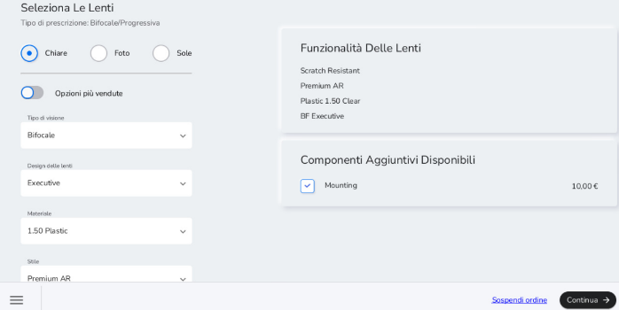


Cliccare su *Continua* per accedere alla sezione riassuntiva
dell'ordine. Anche in questo step è possibile cliccare su *Sospendere
ordine* per salvare l'ordine nella lista ordini attivi.

## Step 3­

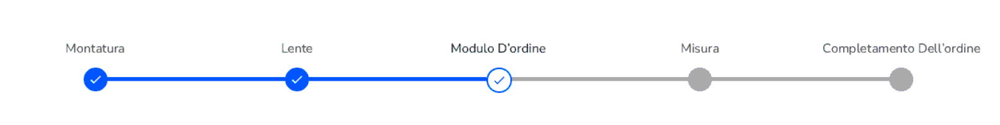

Il *Modulo* *d'Ordine* è la sezione di riepilogo di tutti i componenti
dell'ordine che sono stati selezionati.

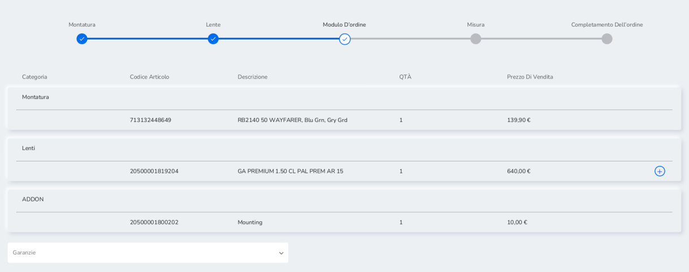

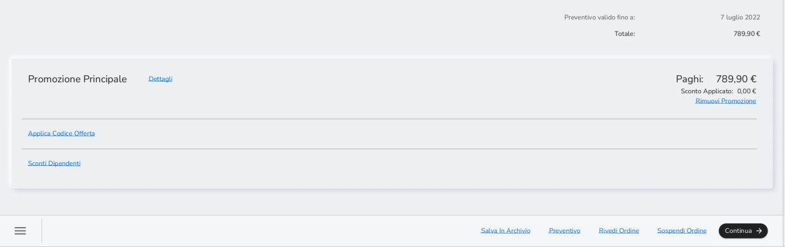

Nella prima parte della sezione sono elencati gli elementi selezionati
fino a quel punto: upc della montatura, upc del pacchetto lenti ed
eventuali add on selezionati. Questa è la fase in cui effettuare un
ultimo controllo per assicurarsi che il pacchetto lenti selezionato
corrisponda a quello effettivamente d'interesse controllando che l'upc
qui mostrato sia uguale a quello presente sul listino.

In questa sezione è possibile, inoltre:

-   Selezionare la garanzia che si desidera vendere. Le garanzie sono
    selezionabili dal menù a tendina attivabile dal campo Garanzie.

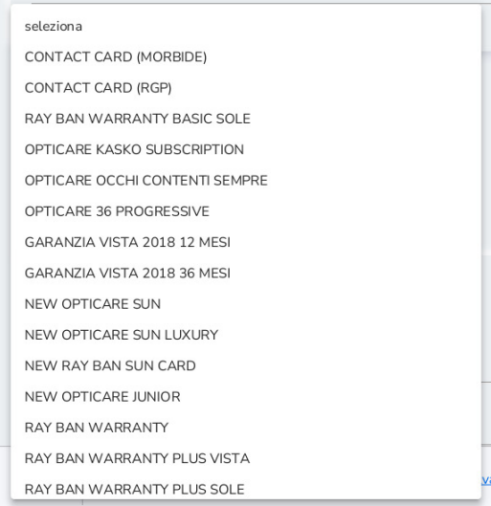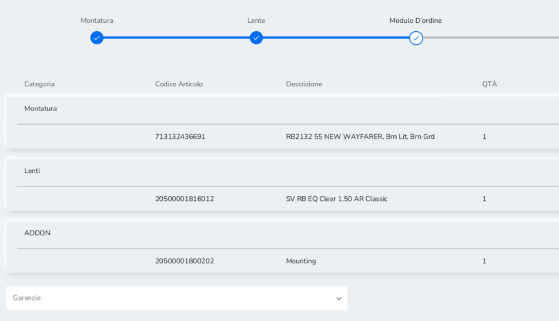

È importante selezionare la garanzia giusta, in quanto, *il sistema non
opera alcun controllo sulle garanzie*. Per esempio, se si seleziona una
garanzia Opticare 36 progressive ma le lenti sono monofocali, il sistema
non evidenzia l'incongruenza.

-   Applicare eventuali Promozioni o Sconti Dipendenti (per dettagli
    vedere Cap 12 del manuale)

-   Attivare la generazione di un preventivo

Per attivare la generazione di un preventivo cliccare su *Preventivo* e
*Salva in Archivio.* In questo modo viene dato l'input ad una app
esterna al sistema Ciao! per creare il preventivo e l'ordine viene
salvato direttamente nella Lista Ordini in Archivio in modo che rimanga
visibile per i successivi 27 giorni.

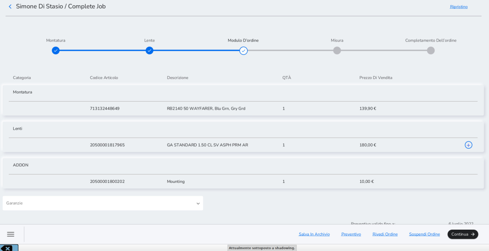

Per visionare il preventivo e condividerlo con il cliente, accedere al
Toolkit e selezionare l'app Preventivi. Le credenziali d'accesso da
utilizzare sono quelle di MIM.

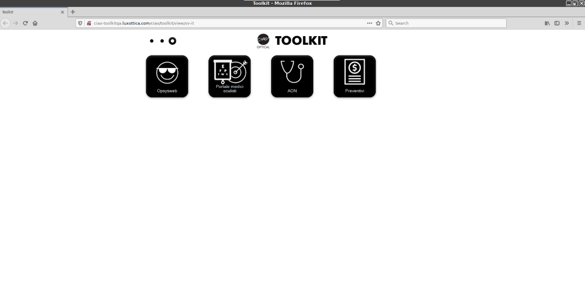

Cercare l'ordine attraverso il nome, cognome, e-mail del cliente o ID
Ordine. L'ID ordine può essere recuperato da due punti del flusso di
vendita:

1.  Dalla sezione *Modulo d'Ordine*, cliccando su *Rivedi Ordine*

2.  Da *Elenco ordini*, selezionando *Archivio* e cliccando su
    *Dettagli*

Una volta selezionato il preventivo, cliccare su *Action* e selezionare
*Preview* per vedere in anteprima il pdf del documento.

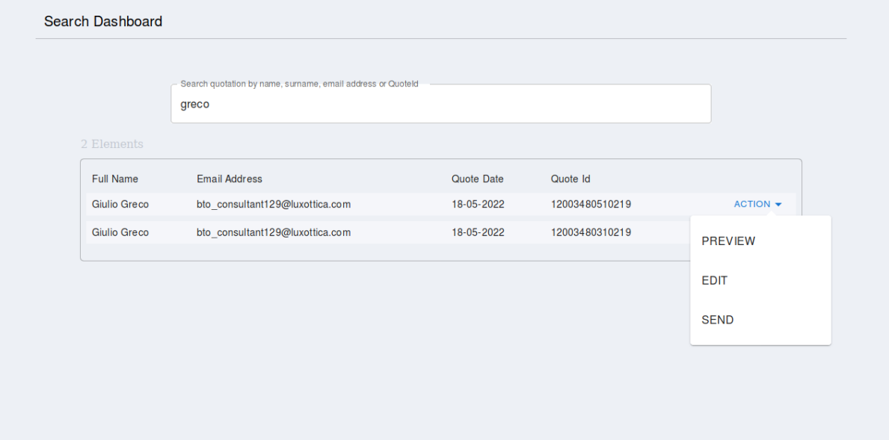

Una volta aperto il preventivo, selezionare *Send* per mandarlo via
e-mail al cliente, *Edit* per modificare il preventivo e *Print* per
stamparlo.

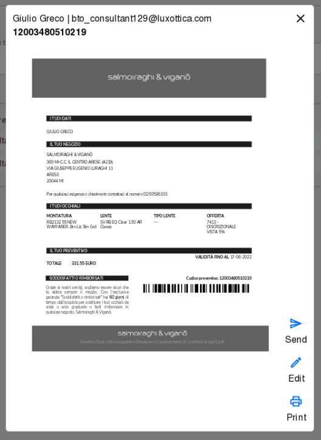

Nel momento in cui il cliente torna in negozio per completare il suo
ordine, accedere alla Lista Ordini in Archivio e ricercare l'ordine
attraverso la scansione del barcode presente sul preventivo o inserendo
il cognome e nome del cliente. Cliccare su *Sposta in Attivo*,
recuperare l'ordine nella Lista Ordini Attivi e selezionare *Modifica*.
L'ordine viene quindi riaperto dallo step del Modulo d'Ordine.

Se non si vuole stampare un preventivo, cliccare su *Continua* per
proseguire con gli ultimi due step del flusso di ordine.

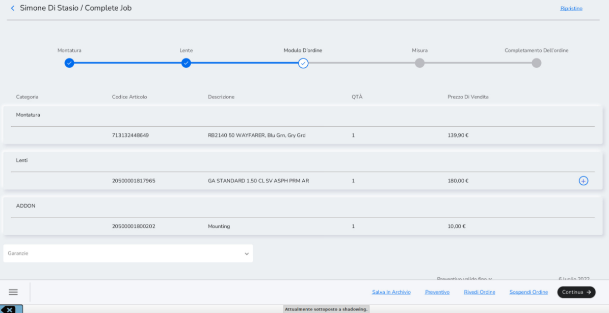

## Step 4: Presa misurazioni

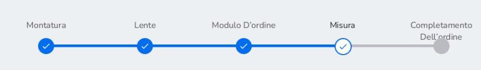

Prima di procedere alla compilazione dei campi, assicurarsi di aver
flaggato la casella *Inizio Misurazione*.

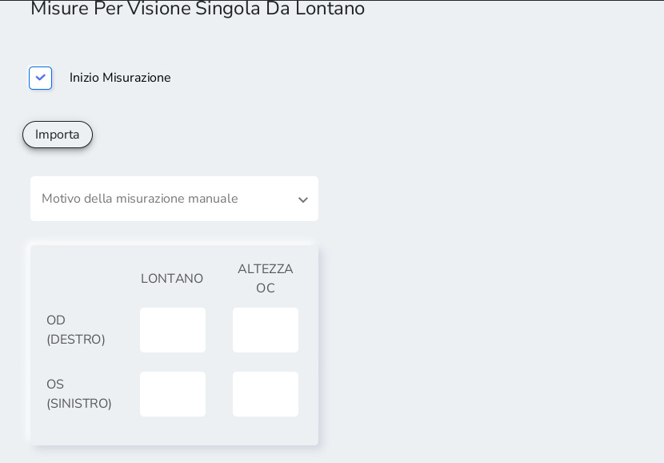

Sono presenti diverse modalità per l'inserimento dei dati delle
misurazioni [(nel caso in cui aveste iniziato il flusso da pc, salvare
la vendita e recuperarla dall'iPad tramite la lista Ordini Attivi perché
solo quest'ultimo è integrato con Accufit]{.underline}).

A.  Importazione dei parametri catturati attraverso Accufit: per
    aprire l'app Accufit selezionare il tasto *Cattura* e procedere alla
    presa dei parametri (solo su iPad) e salvare. In questo caso tutti i
    dati, eccetto quello sullo spessore delle lenti, sono
    automaticamente compilati in base alla montatura selezionata.
    Compilare i dati sullo spessore e indicare il motivo della
    misurazione manuale.

B.  Importazione dei parametri catturati attraverso torretta
    Varilux. Cliccare su *Importa.*

C.  Inserimento manuale in caso di problemi di collegamento o
    misurazioni prese con Eyeruler (es: Varilux Physio). Anche in questo
    caso, indicare il motivo della misurazione manuale come mostrato in
    figura.

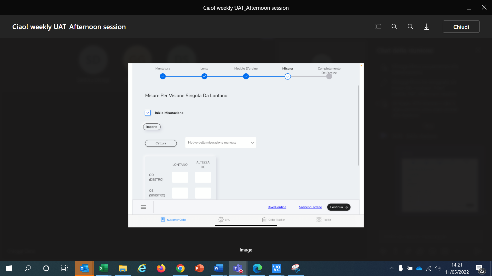

Per tutte le misurazioni inserite il sistema effettua una validazione
per verificare che i dati siano corretti. In caso di misurazioni non
corrette il sistema segnala l'errore in rosso, suggerendo gli intervalli
di valori corretti da inserire.

Per il campo *Spessore*, selezionare sempre *Normali*.

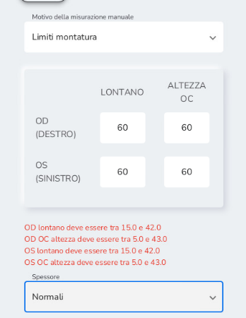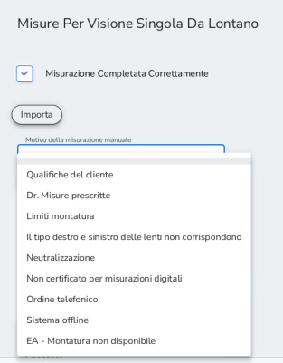

Alla fine della sezione è presente uno specchietto di riepilogo delle
informazioni relative alla montatura. Tale specchietto si popola in
automatico. In alcuni casi alcuni campi possono non essere compilati. È
possibile compilarli oppure continuare lasciando i campi vuoti.

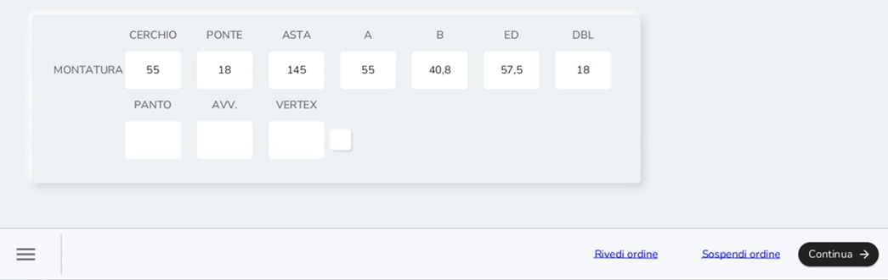

Cliccare su *Continua* per proseguire o su *Sospendi ordine.* È inoltre
possibile verificare la correttezza dei dati inseriti cliccando su
*Rivedi Ordine*.

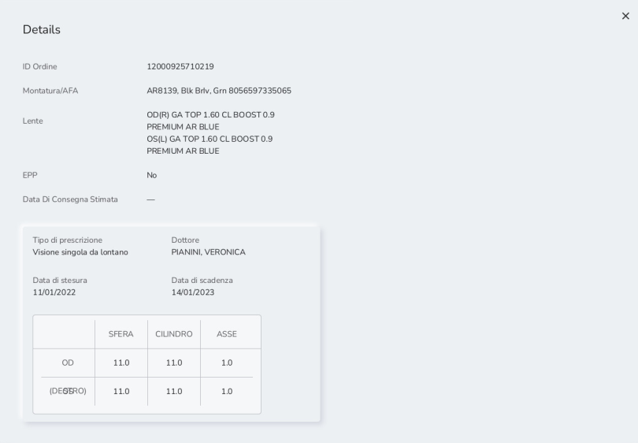

##  

## Step 5: Completamento ordine su Ciao!

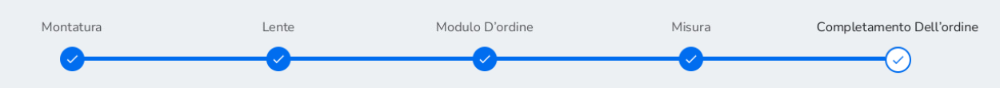

Come ultimo step del flusso il sistema effettua due verifiche: la
disponibilità a magazzino Sedico dei prodotti selezionati e la
fattibilità della combinazione montatura / lenti / misurazioni inserite.

Vi possono essere due tipi di pop-up:

Tipologia di ordine: se l'ordine è corretto questo pop-up indica il
feedback della lavorazione che il sistema identifica, cioè se il job
verrà realizzato come Complete job, Frame TO Come o Lens Only.

Se abbiamo scelto all'inizio della creazione del WO Complete pair il
sistema può darci 3 feedback diversi:

-   Complete pair se c\'è la disponibilità in laboratorio sia della
    montatura che delle lenti;

-   Lens only se servono solo le lenti dal lab e la montatura è già
    in negozio;

-   Frame to Come se la montatura non è qualificata a Sedico (per
    esempio il caso di Lindberg)

Se abbiamo scelto invece la voce Solo lenti il sistema in base a cosa
abbiamo selezionato può dirci:

-   Se abbiamo fleggato montatura del cliente ci verrà sempre
    proposto Frame to Come in maniera cautelativa;

-   Se abbiamo inserito UPC di un prodotto riconosciuto a Sedico,
    allora il sistema potrà proporre lavorazione di Lens Only

Le diciture che il sistema può riportare in questo campo sono le
seguenti:

> 1.Questa è una lavorazione one hour
>
> 2.Questo ordine verrà gestito dal Laboratorio il giorno successivo
>
> 3.Il sistema è offline, questo ordine dovrà essere inoltrato
> nuovamente a LPA
>
> 4.Questo ordine è un Complete Pair gestito dal Laboratorio
>
> 5.Questo ordine è un Frame to Come. Il Laboratorio necessita l\'invio
> del frame da parte del negozio
>
> 6.Questo ordine è un Lens Only con lavorazione one hour. Il
> Laboratorio spedisce solo le lenti non tagliate.
>
> 7.Questo ordine è un Lens Only. Il Laboratorio spedisce solo le lenti.
>
> 8.Questo ordine prevede delle lenti da fornitore terzo. No invio
> ordine a Sedico

È quindi molto importante prestare attenzione alla dicitura che il
sistema vi riporta nel quadrato sottostante, perché è una prima
indicazione di quello che sarà il job type del WO che state creando.

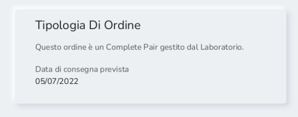

A.  Errore: nel caso in cui il sistema riscontri degli errori di
    combinazione viene mostrato un alert che indica il tipo di errore
    (es: spessore lenti non compatibile con montatura selezionata;
    parametri scorretti inseriti per le misurazioni). I possibili
    messaggi:

Se si comprende l'errore e si riesce a modificare correttamente
l'ordine, procedere nel flusso. Altrimenti, se non si comprende l'errore
o se non si riesce a risolverlo, contattare l'Help Desk Toshiba.

Nel caso in cui vi fosse stata una ricodifica di prodotto a listino e si
selezionassero prodotti (es: lenti) con un vecchio codice questo è il
punto in cui verrà segnalata l'eventuale scorrettezza della combinazione
delle lenti / montatura.

La data di consegna prevista è la stessa di quella indicata su order
tracker.

L'ID vassoio è un campo utilizzato per facilitare l'identificazione di
un ordine all'interno della lista ordini attivi e LPA.

*L'ID vassoio è utile nel caso in cui la vendita sia coperta da
assicurazione. In questo caso, infatti, la trasmissione dell'ordine al
laboratorio è sospesa previa approvazione da parte della compagnia
assicurativa ed è necessario confermare su LPA l'invio dell'ordine una
volta ricevuta l'approvazione. Per recuperare velocemente l'ordine
sospeso è possibile utilizzare una convenzione tale per cui l'ID vassoio
è nominato "ASS". Una volta ricevuta l'approvazione sarà sufficiente
recuperare da LPA l'ordine con ID vassoio "ASS" per inoltrarlo al
laboratorio.*

Selezionare i tasti corrispondenti per:

A.  *Caparra*: raccogliere caparra per l'ordine (da 0 € al 100% del
    valore) se no caparra no registrato come WO generato

B.  *Sospendi ordine*: per sospendere la transazione e recuperarla
    successivamente dalla lista di ordini attivi nel caso in cui fosse
    necessario

C.  *Continua a fare acquisti*: per lasciare al cliente il tempo di
    visionare altri prodotti ed eventualmente aggiungere all'acquisto
    altri elementi.

Per ordini multipli usare questa opzione. Dopo aver cliccato su questa
opzione, il sistema riporta alla schermata di inizio flusso in cui è
possibil effettuare un nuovo ordine. Procedere con il nuovo ordine e
cliccare su *Salva Ordine* per salvare il secondo ordine nella lista
degli ordini attivi. Per completare il pagamento multipli andare sulla
lista degli ordini attivi, selezionare gli ordini di interesse e
cliccare su Procedi al Pagamento per ultimare il pagamento di entrambi
gli ordini.

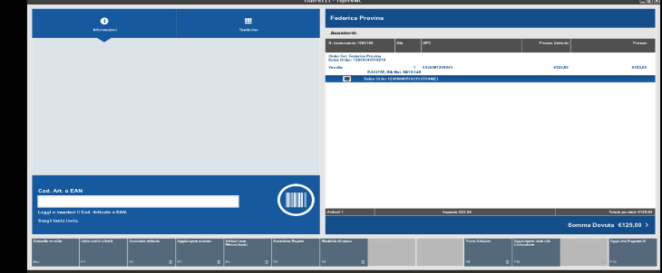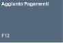

D.  *Salvare l'ordine*: per un secondo momento. L'ordine è salvato nella
    lista ordini attivi.

E.  *Procedi al pagamento*: Si procede al pagamento dell'importo totale.

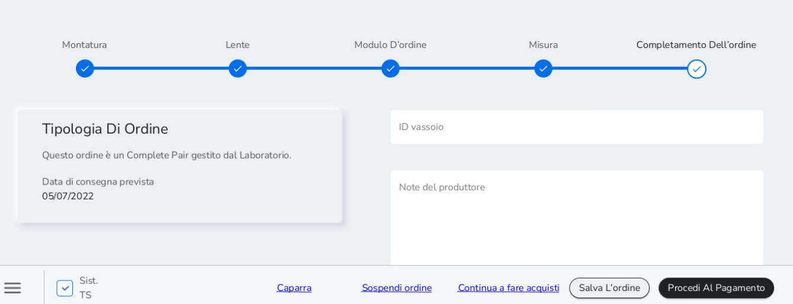

## Raccolta caparra

Si consiglia di prendere sempre una caparra (anche a valore zero) quando
si inserisce un ordine in modo da *avere l'ordine sempre disponibile
nella Caparra*. Gli ordini presenti nella lista *Caparra*, a differenza
degli ordini presenti in lista ordini attivi o in archivio, non sono
soggetti ad alcuna scadenza.

La raccolta della caparra può avvenire tramite due flussi:

-   Dalla pagina *Completamento dell'Ordine*: contestualmente al flusso
    di ordine, cliccando su *Caparra* come anticipato nel capitolo
    precedente

-   Dalla *lista ordini attivi*: recuperando l'ordine d'interesse dalla
    lista e cliccando su *Caparra*.

Cliccando su *Caparra* il sistema si connette a Xstore, dove avviene la
raccolta della caparra.

Cliccare su *Aggiunta* *Pagamenti*. Se si sta effettuando il flusso su
iPad, cliccare su *Somma dovuta* (per iPad non è disponibile l'opzione
di pagamento Contanti).

Selezionare il metodo di pagamento:

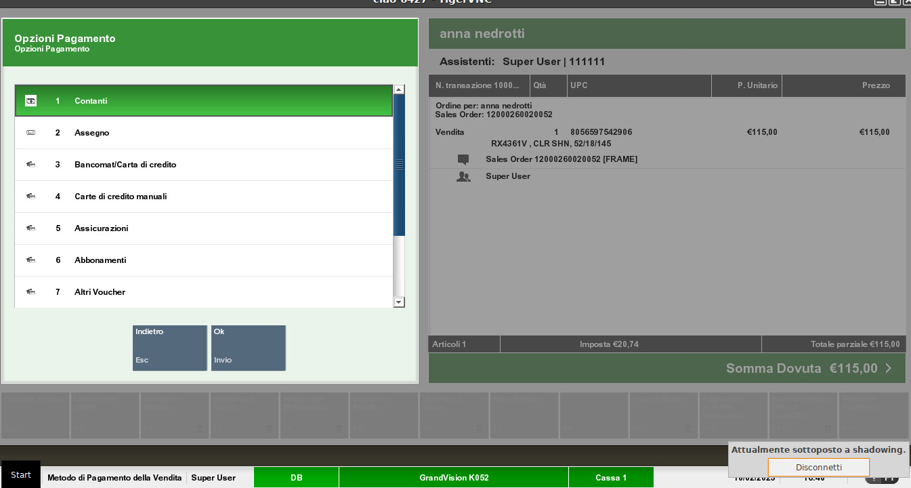

-   Selezionare contanti per un pagamento in contanti. Il limite massimo
    accettato di pagamento in contanti è di 1999,99 euro

-   Selezionare Assegno per incassare un assegno. Inserire nei dati
    richiesti 11 volte 1 e premere invio, poi reinserire solo una volta
    1.

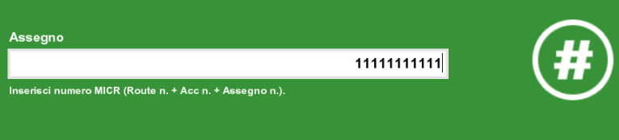

-   Selezionare Bancomat / Carte di credito per pagare con questi
    metodi.

-   Nel caso in cui sia richiesta una firma è possibile raccoglierla su
    iPad.

-   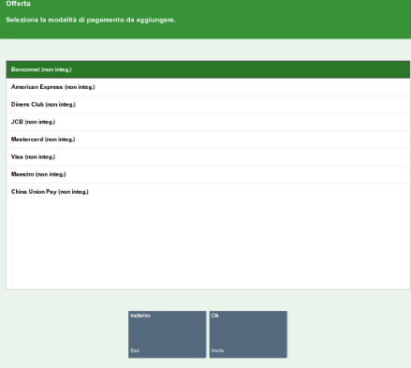Selezionare Carte di Credito manuali
    per pagare con carte di credito o bancomat. Rispetto al metodo
    precedentemente descritto, qui è necessario indicare manualmente il
    tipo di carta scegliendolo dall'elenco. Inserire le ultime 4 cifre
    del numero della carta e la data di scadenza (formato: MMAA).

-   Selezionare Assicurazioni e Abbonamenti per trovare l'elenco
    completo di questi ultimi

-   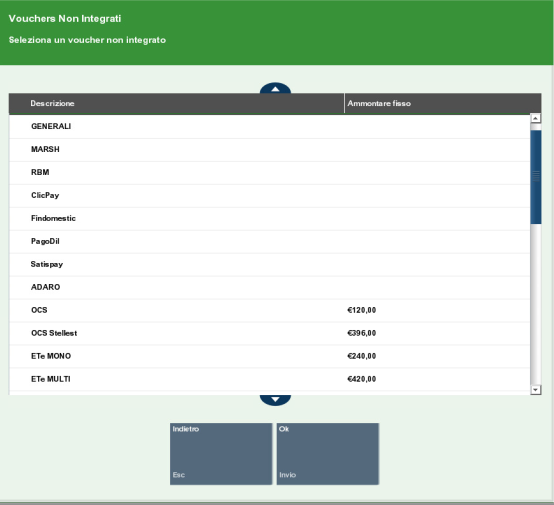Selezionare Voucher non integrati per
    utilizzare tutti i restanti metodi di pagamento (es: assicurazioni,
    abbonamenti, gift card, scorrendo in basso troverete XME PROTEZIONE
    che va a sostituire il metodo di pagamento provvisorio Best
    Shopping).

Una volta selezionato il metodo di pagamento, inserire l'importo della
caparra e cliccare su *Invio*.

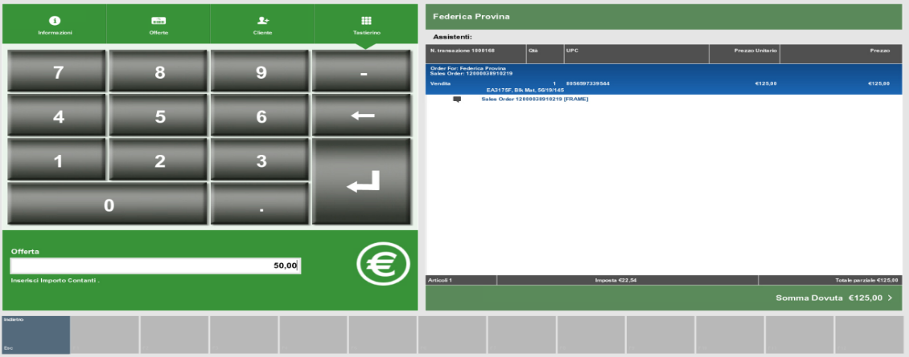

Dopo aver premuto *Invio* per depositare la prima caparra, selezionare
*In attesa di pagamento.*

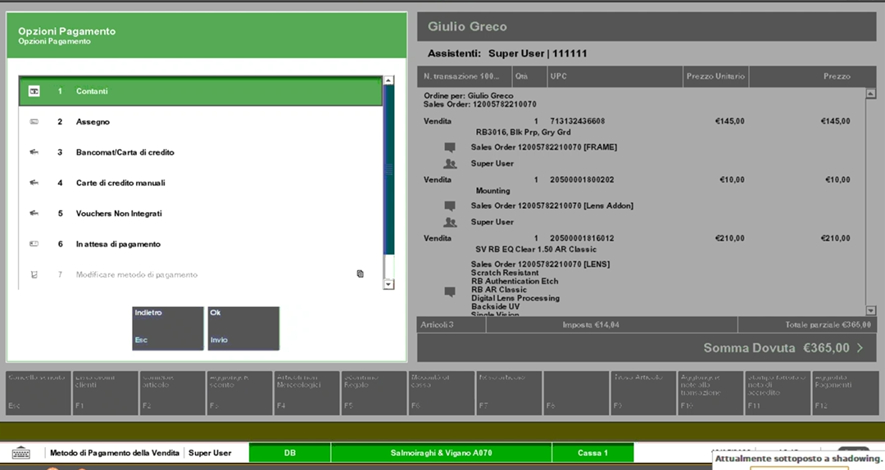

Cliccando su *In attesa di pagamento* il sistema calcola e registra
automaticamente l'importo restante da versare per saldare la vendita*.*
Cliccare nuovamente su *Invio. È necessario calcolare il saldo, solo al
versamento della prima caparra, non per le eventuali caparre
successive*.

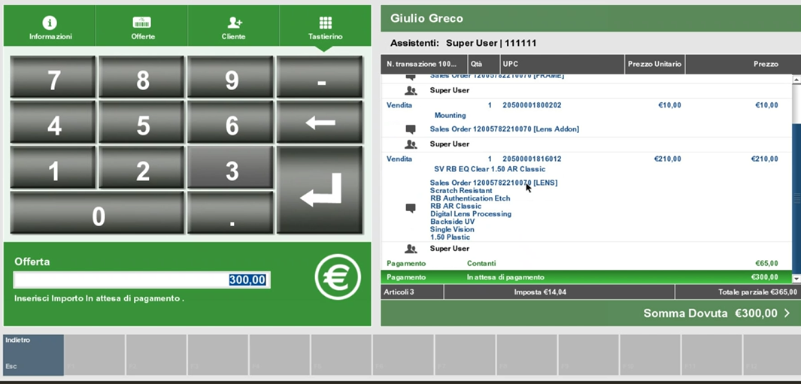

Una volta cliccato su *Invio*, selezionare la modalità d'invio del
documento caparra (stampa o e-mail). Cliccando su *e-mail*, il sistema
recupera automaticamente la mail registrata del cliente. È in ogni caso
possibile modificare la mail.

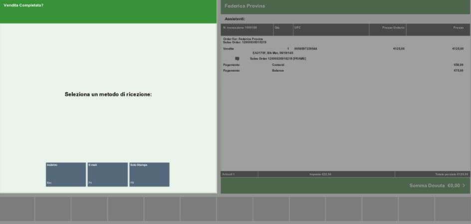

Da qui è possibile decidere se stampare e
inviare l'e-mail di conferma o se inviare solo l'e-mail.

Una volta selezionato il metodo di condivisione della caparra, il
sistema torna nella schermata arancione di Xstore. Accedere per tornare
sulla Ricerca cliente.

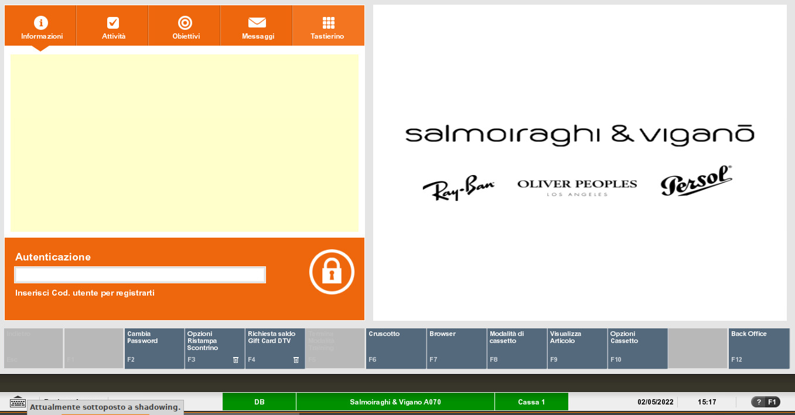

Al completamento del flusso vengono stampati tre documenti:

-   Documento di conformità (in doppia copia)

Questo documento è possibile [ristamparlo]{.underline} andando su:
*Backoffice* -- *Giornale* -- *Giornale elettronico*. Ricercare la
transazione per la quale si desidera ristampare il documento di
conformità, per facilitare la ricerca, inserire il cognome del cliente
nel campo *Cliente o Cognome*

> 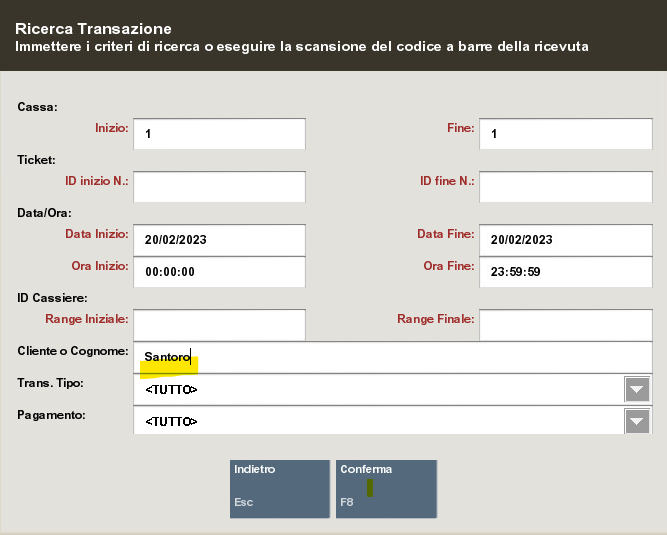

Premendo su Conferma appariranno tutte le transazioni per quel cliente,
[selezionare la transazione di presa caparra]{.underline} e premere su
*Visualizza dettagli*. È fondamentale selezionare la transazione di
presa caparra altrimenti NON verrà visualizzato il tasto èer ristampare
il documento di conformità.

> 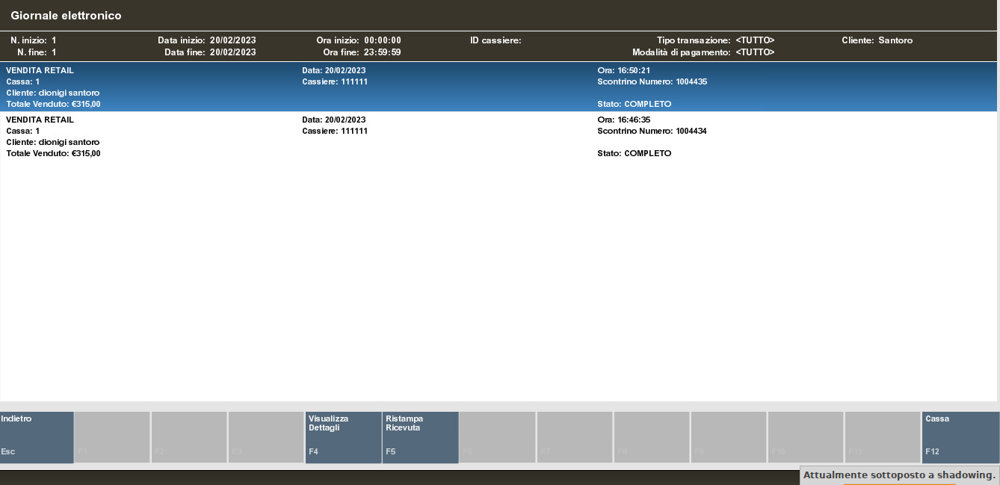
>
> Una volta selezionata la transazione di presa caparra, cliccare su
> *Statement of compliance Reprint* e il documento di conformità verrà
> ristampato.
>
> 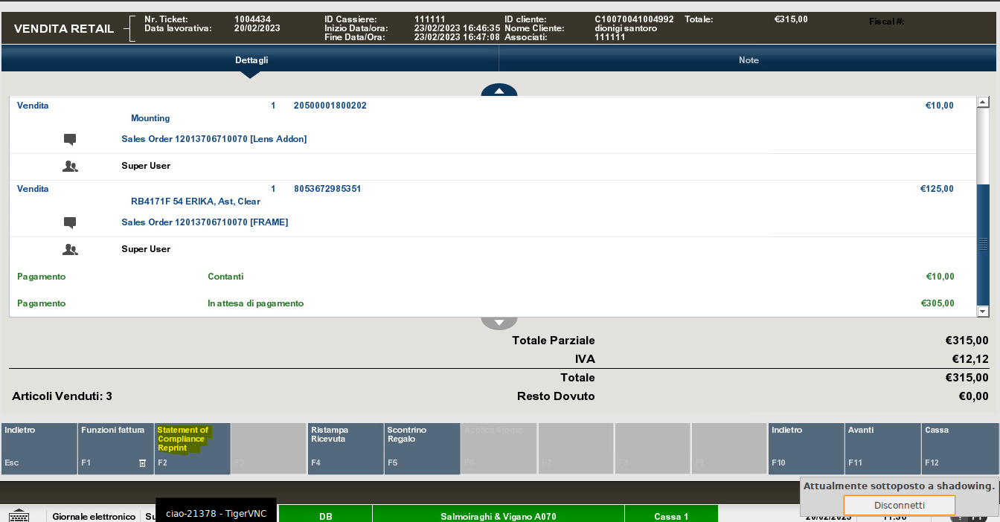

-   Tray ticket, assimilabile al Recap del WO in Acuitas. Questo
    documento può essere utilizzato per creare la bustina di consegna
    dell'occhiale.

-   Lab ticket, documento necessario per effettuare le tracciature

Il tray ticket è composto da due sezioni:

-   Recap dell'ordine: sezione sulla sinistra, contenente i dati
    utilizzati per fare un match all'arrivo del prodotto da Sedico. Sul
    Tray Ticket è possibile visualizzare l'ID Order.

-   Scheda controllo qualità: da non compilare

L'ordine viene salvato nella lista Caparra. Se serve raccogliere un
secondo deposito cliccare su *Caparra*.


Inserire l'importo del versamento successivo alla prima caparra nel box
in alto e cliccare su *Procedere al Pagamento* per accedere a XStore e
registrare l'importo.

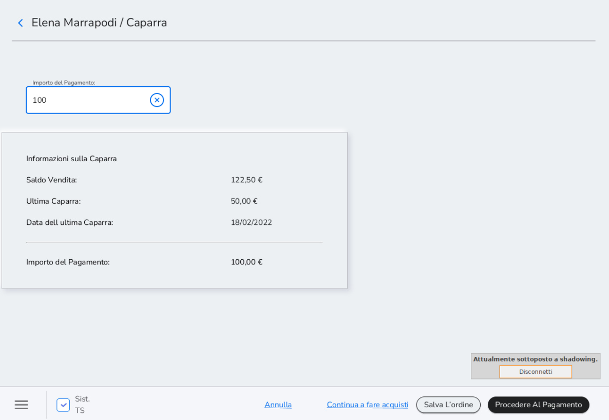

Il processo segue quanto visto per la raccolta prima caparra. In questo
caso, l'unica differenza è che la somma netta da saldare è calcolata
automaticamente e non è necessario cliccare su *In attesa di Pagamento*.

## Invio ordine al Laboratorio di Sedico

Come visto nel paragrafo 5.5 nella sezione Completamento d'ordine in
Ciao! a seconda di cosa scegliamo, al termine della creazione del vostro
WO su Ciao!, il sistema stesso da un feedback sulla lavorazione con
cui quell\'ordine verrà prodotto (job type)

Se abbiamo scelto Complete pair il sistema può darci 3 feedback diversi:

-   Complete pair se c\'è la disponibilità in laboratorio sia della
    montatura che delle lenti;

-   Lens only se servono solo le lenti dal lab e la montatura è già
    in negozio;

-   Frame to Come se la montatura non è qualificata a Sedico (per
    esempio il caso di Lindberg)

Se abbiamo scelto Solo lenti il sistema in base a cosa abbiamo
selezionato può dirci:

-   Se abbiamo fleggato montatura del cliente ci verrà sempre
    proposto Frame to Come in maniera cautelativa;

-   Se abbiamo inserito UPC di un prodotto riconosciuto a Sedico,
    allora il sistema potrà proporre lavorazione di Lens Only

Una volta che l'ordine è stato l'ordine a Sedico, poiché la
trasmissione non è automatica.

Vediamo insieme la procedura per trasmettere l'ordine a seconda delle
diverse casistiche:

-   Complete pair: nel caso in cui il sistema vi proponga Complete
    pair da Ciao, basterà trasmetterlo cliccando qui
    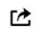

```{=html}
<!-- -->
```
-   Se il sistema propone Lens Only o Frame to Come avete la
    possibilità di modificarlo prima di trasmetterlo o lasciarlo così.

[Se NON volete la tipologia d\'ordine che il sistema vi propone cosa
bisogna fare?]{.underline}

Se per esempio il sistema vi ha dato come feedback che l\'ordine è un
Frame to Come avete la possibilità di trasmetterlo come Lens Only. Gli
step da effettuare sono i seguenti:

1\. Ricercare l'ordine in LPA e selezionarlo. Entrare nella sezione
Edit Processing Type -- Change Lab. Nella sezione Current Lab
l'ordine sarà identificato come Outside Processing - Central Lab - Store
Sends Frame

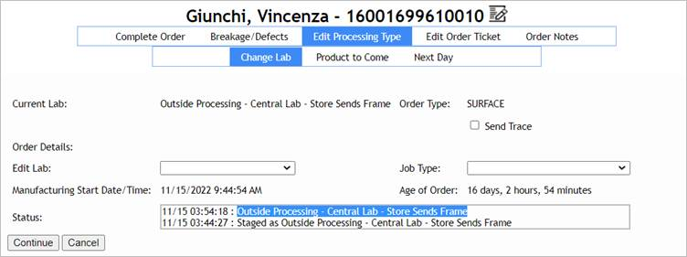

2\. Procedere a prendere la tracciatura

3\. Nella sezione Edit Lab, scegliere nel primo menù a tendina
Outside_Processing e nel secondo menù a tendina scegliere il job
type desiderato ossia Lens Only Cut and Edge. Flaggare la voce
Send Trace.

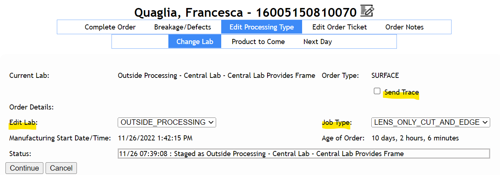

4\. Nel caso in cui ci sia la voce Printer, selezionare la stampante e
poi selezionare Continue. Nel giro di qualche secondo vedrete che
l'ordine cambierà job type nella sezione Current Lab.

5\. Trasmettere l'ordine cliccando su questa icona


## Invio ordine al Laboratorio di Essilor

Una volta che l'ordine è stato inserito in Customer Order è necessario
accedere a Opsysweb per gestire e trasmettere l'ordine al laboratorio di
Essilor. Questo processo deve essere eseguito solo nel caso il cui il
Work Order sia un Lens Only e per quelle lenti i cui ordini non
devono essere inviati a Sedico.

È importante premere sempre il tasto Opsysweb così da poter
inviare il Work Order al laboratorio corretto.

Effettuando l'accesso a LPA sarà possibile individuare questa tipologia
di ordini perché in corrispondenza della colonna *Type* sarà possibile
trovare *"RX Sun Authentics".*

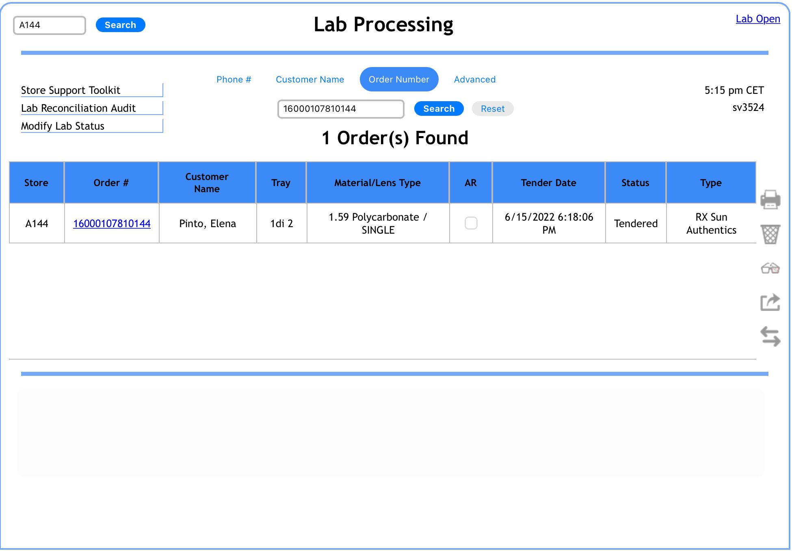
