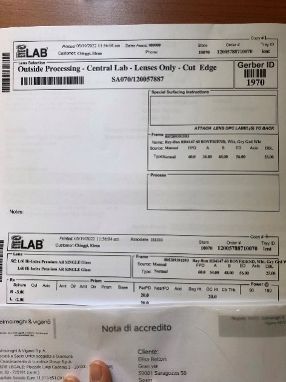
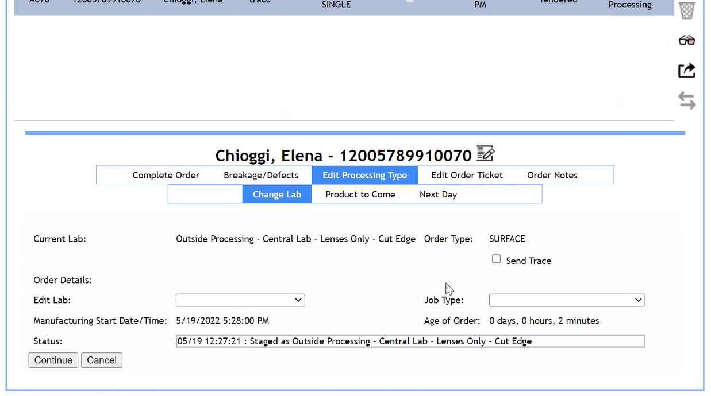
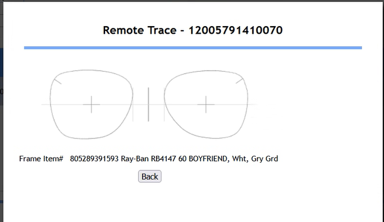
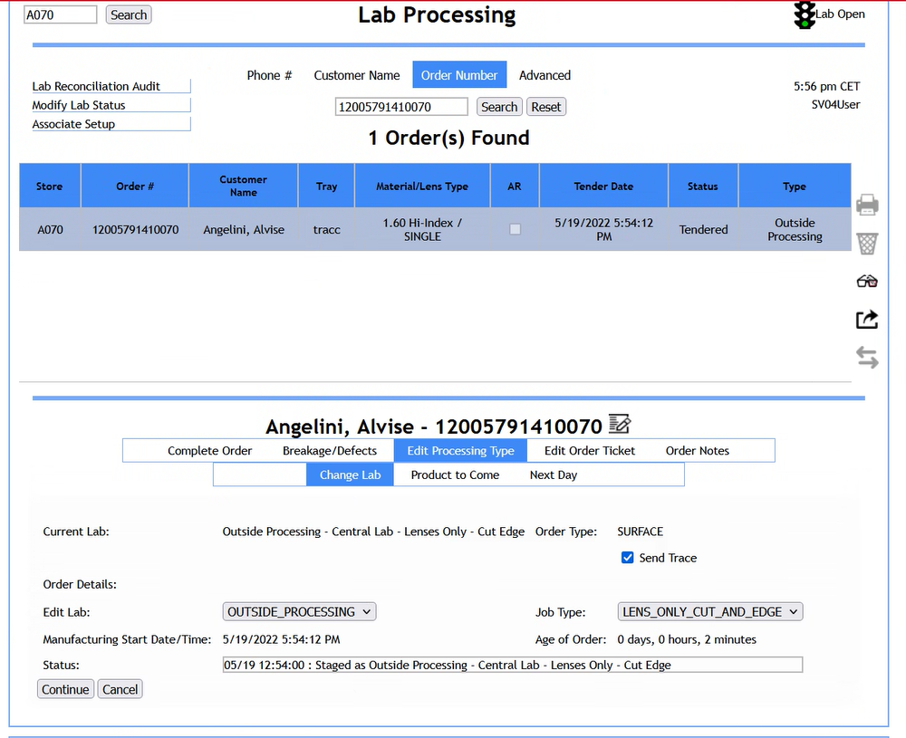
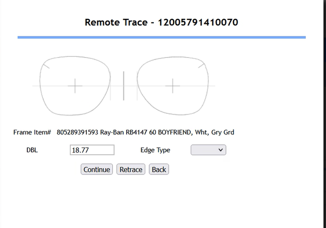
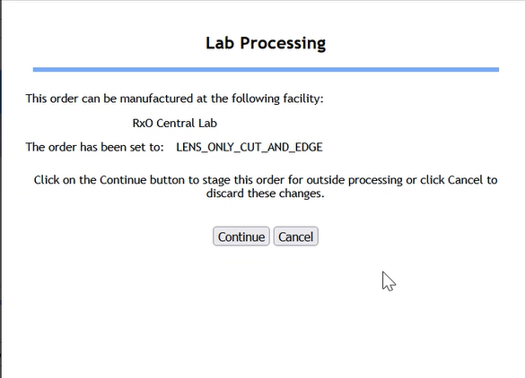

# Tracciatura

La tracciatura viene svolta se l'ordine è un Lens Only.

Una volta terminato il flusso di creazione dell'ordine verrà emesso il
Lab Ticket che servirà per il processo di tracciatura.

Recarsi al tracer e premere il bottone 1 o 2 in base a quello che il
tecnico il giorno del Go live vi ha settato, che permette la
trasmissione dell'ordine al laboratorio di Sedico. Successivamente,
eseguire la tracciatura e scannerizzare il Garber ID presente sul Lab
Ticket ed eseguire la tracciatura della montatura.

Successivamente accedere a LPA e selezionare l'ordine appena concluso.
Selezionare l'icona per vedere il risultato della tracciatura appena
eseguita.

Se l'ordine che stiamo effettuando è un Frame to Came e vogliamo
modificarlo in un Lens Only, dobbiamo cliccare su *Back* e selezionare
*Lab Processing Type* e successivamente *Change* *Lab* nel menù delle
opzioni.

Scegliere *Outside_Processing* tra le opzioni del menù a tendina
associato alla voce Edit Lab e *Lens_only_cut_and_edge* tra le opzioni
associate a Job Type.

Successivamente flaggare *Send Trace* e cliccare *Continue*. In questo
modo avremo cambiato il nostro ordine in un Lens Only.

Se invece il nostro ordine è già un Lens
Only, non sarà necessario effettuare l'operazione appena descritta, ma
basterà cliccare di nuovo l'icona.

Verranno mostrate due schermate successive di riepilogo in cui è
possibile continuare per confermare la tracciatura, eseguire nuovamente
il processo di tracciatura o tornare Indietro per continuare a
modificare.

Nel campo *Edge Type* è possibile selezionare il tipo di montature (se
metallo o plastica). Selezionare *Continue* per due volte

Trasmettere l'ordine a Sedico cliccando
l'icona. Ancora una volta verrà proposta una schermata riepilogativa.

Una volta trasmesso l'ordine lo Status dell'ordine passerà da Tendered a
Trasmitted.

Nel caso in cui il WO fosse un Complete Pair, ma che alla fine del
processo di creazione del WO Customer Order ci restituisce che è un lens
only. (Frame non in Stock a Sedico) Sempre su LPA c\'è la possibilità di
[trasmettere comunque l\'ordine lens only]{.underline} (senza aver preso
realmente la tracciatura della frame). In questo caso si riceveranno le
lenti sagomate correttamente.

Durante la tracciatura è importante sapere quale voce selezionare in
base alla tipologia di montatura che si sta tracciando:

-   Se la montatura è standard, cioè NON rimless, basterà selezionare
    METAL e ZYL, come riportato nella tabella sottostante.

-   Se la montatura è invece di tipo RIMLESS, sarà necessario
    selezionare anche le altre voci riportate in tabella.

  ------------------------------------------------------------------------
  LPA             Description                   Acuitas
  --------------- ----------------------------- --------------------------
  Metal           Metal Standard V              Bevel / Metal

  Zyl             Plastic Standard V            Bevel / Plastic

  Groove          Standard Groove               

  MTLGRV          Inline groove                 

  Drill           Drill                         
  ------------------------------------------------------------------------

N.B. Nel caso in cui per momentanei off della stampante, i Lab
Ticket non fossero stati stampati automaticamente alla creazione del WO,
il nuovo link presente nel Toolkit *Lab Ticket Reprint* (terza
pagina) ci permetterà di ristamparli per i due giorni antecedenti.

Per farlo: accedere e sostituire la parte finale del link (evidenziata
qui in rosso) con il numero dello store come appare nei WO (esempio
store A062 inserirà 10062)

[http://instorelabs.luxgroup.net/ticket/\<store_numbe\>/](https://eur01.safelinks.protection.outlook.com/?url=http%3A%2F%2Finstorelabs.luxgroup.net%2Fticket%2F%253cstore_numbe%253e%2F&data=05%7C01%7CMarta.Bonamini%40luxottica.com%7Cad17fdd8ff734e32552908da963a0952%7Cc7d1a8f705464a0c8cf53ddaebf97d51%7C0%7C0%7C637987473324555106%7CUnknown%7CTWFpbGZsb3d8eyJWIjoiMC4wLjAwMDAiLCJQIjoiV2luMzIiLCJBTiI6Ik1haWwiLCJXVCI6Mn0%3D%7C3000%7C%7C%7C&sdata=gFil5XWiSj1Rg%2Fsylf4SuXQB33qPFNZB7iqQ7aa9xLs%3D&reserved=0)
-\>[http://instorelabs.luxgroup.net/ticket/10062/](https://eur01.safelinks.protection.outlook.com/?url=http%3A%2F%2Finstorelabs.luxgroup.net%2Fticket%2F10062%2F&data=05%7C01%7CMarta.Bonamini%40luxottica.com%7Cad17fdd8ff734e32552908da963a0952%7Cc7d1a8f705464a0c8cf53ddaebf97d51%7C0%7C0%7C637987473324555106%7CUnknown%7CTWFpbGZsb3d8eyJWIjoiMC4wLjAwMDAiLCJQIjoiV2luMzIiLCJBTiI6Ik1haWwiLCJXVCI6Mn0%3D%7C3000%7C%7C%7C&sdata=grh68W8pYMwgdP1FXOBdu%2FXsg3kMZJG4P9IBk0499Xw%3D&reserved=0)
