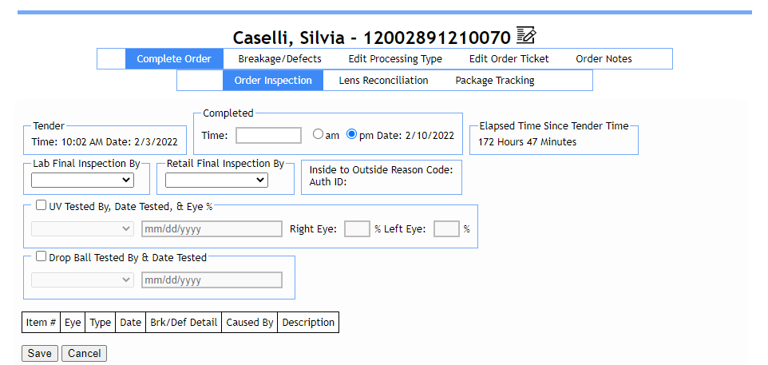
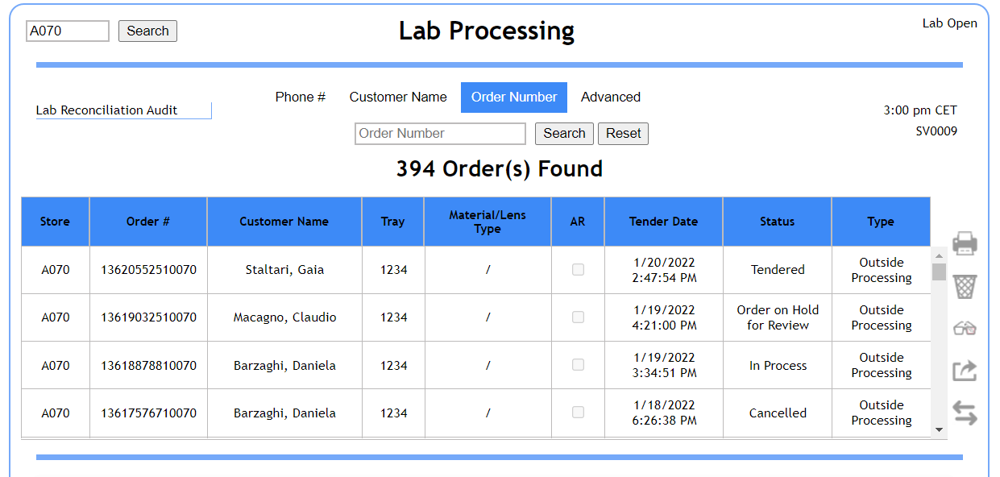
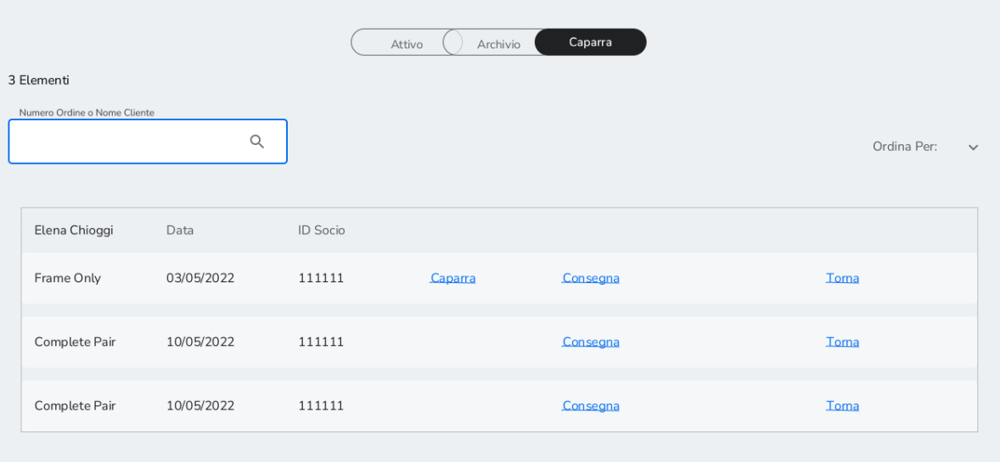
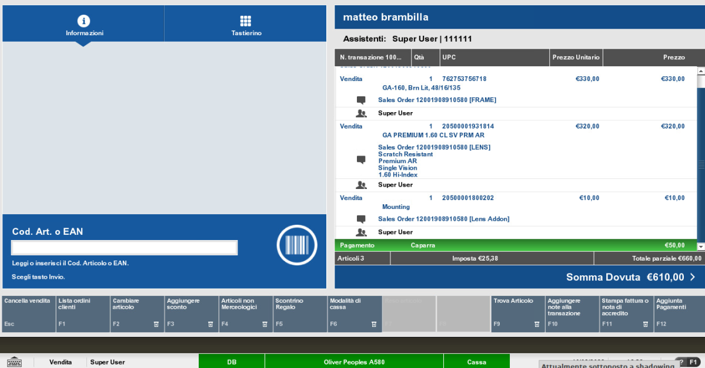
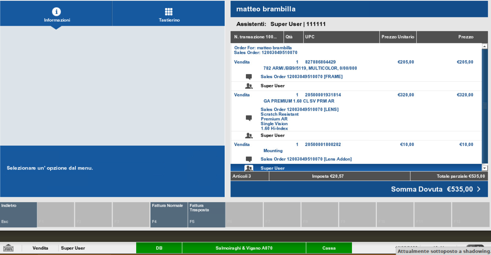
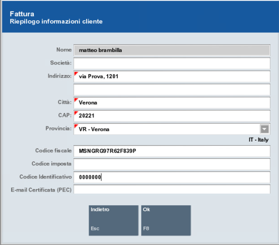
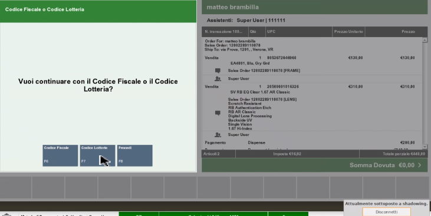
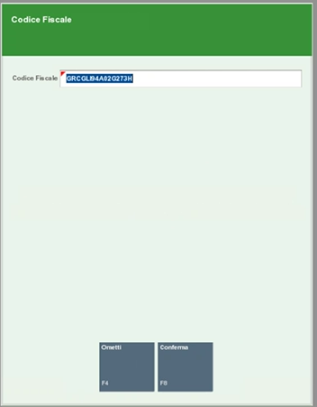
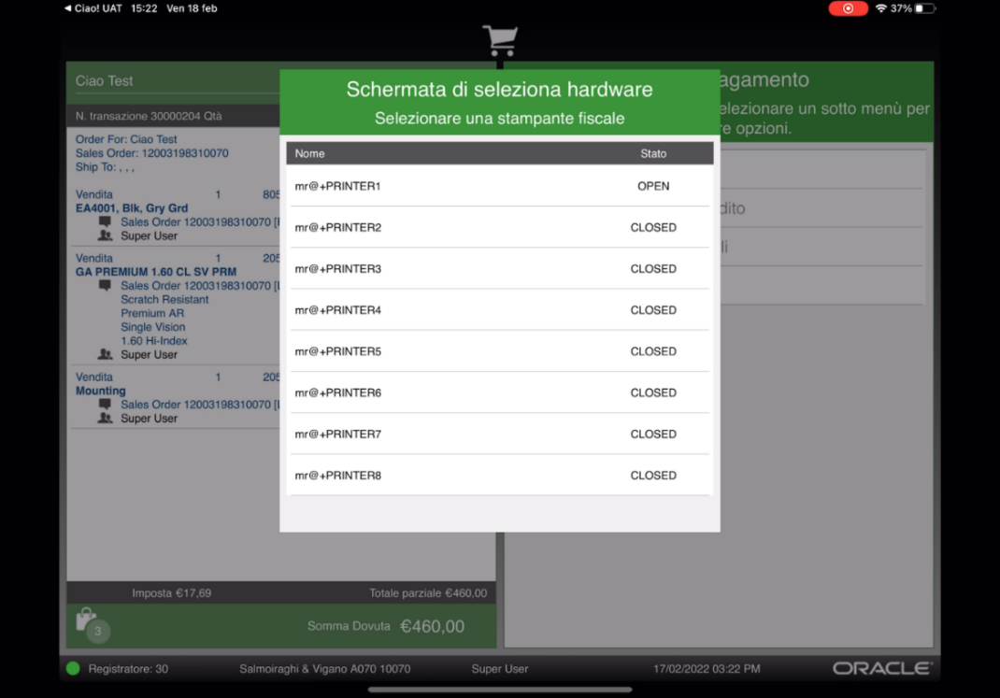
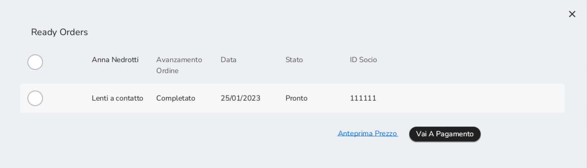

# Ricezione ordine Complete Job -- FTC -- Lens Only e consegna al cliente

## 7.1 Procedura di ispezione 

Una volta ricevuto l'ordine in negozio, è necessario effettuare
un'ispezione per verificare che la merce ricevuta non sia difettata.

Per procedere con l'ispezione, accedere a LPA, ricercare l'ordine per
cui si vuole registrare un'ispezione (gli ordini ricevuti in negozio
sono in status "Received"), e selezionare *Complete Order*.
Successivamente cliccare su *Order Inspection*. Compilare i seguenti
campi:

-   Time: selezionare data e ora dell'ispezione

-   Retail final inspection by: selezionare chi ha effettuato ispezione
    in store. Il menù a tendina contiene già i nominativi del personale
    di store.

Se l'ispezione va a buon fine, cliccare su *Save* in basso a sinistra.

Alla ricezione del prodotto in negozio, nel caso in cui ci si accorgesse
che l'ordine è sbagliato / prodotto è danneggiato, si consiglia di non
compilare l'ispezione su LPA, ma di fare direttamente il remake
selezionando l'icona del remake, in questo modo il numero d'ordine non
cambia.

Di conseguenza, si può compilare l'ispezione solo una volta che ci si è
assicurati che l'ordine è corretto e in perfette condizioni.

Diversamente da Acuitas, il processo di ispezione si svolge
completamente su LPA.

## Pagamento e consegna al cliente

Una volta effettuata l'ispezione, se questa va a buon fine, è possibile
completare il pagamento e consegnare il prodotto al cliente. Il
pagamento dell'ordine avviene su XStore.

Questo procedimento è utilizzato per tutti gli ordini per cui si è
raccolta una caparra.

Dalla homepage di ricerca cliente cliccare sul tasto del menù in basso a
sinistra e selezionare *Elenco Ordini*. Successivamente selezionare la
lista *Caparra.*

Per recuperare la vendita per completare il pagamento, ricercare per
cliente o per numero ordine nella barra di ricerca sulla sinistra. Una
volta trovato l'ordine, cliccare su *Consegna*.

Il completamento del pagamento avviene su XStore. Prima di concludere il
pagamento, richiedere la preparazione della fattura, la quale sarà
inviata se il pagamento va a buon fine (da iPad si consiglia di fare
sempre la fattura prima del completamento pagamento, dal momento che su
iPad non è disponibile l'opzione di ristampa fattura descritta al
*capitolo 17*). Cliccare su *Stampare fattura o nota di accredito.*

Selezionare il tipo di fattura: normale o trasposta.

Compilare con i dati del cliente, assicurandosi di aver inserito codice
fiscale e codice identificativo. Per il codice identificativo inserire
sette volte lo zero. I dati inseriti durante la creazione
dell'anagrafica sono automaticamente recuperati dal sistema.

Cliccare su *Ok*.

Dopo aver registrato la fattura, cliccare su *Aggiunta Pagamenti.*
Selezionare il metodo di pagamento tra quelli elencati e inserire
l'importo del pagamento. Premere su *Invio* e selezionare il metodo di
ricezione come visto nel *capitolo 5.6.*

Una volta completato il pagamento viene fornita la possibilità di
inserire il codice fiscale per lo scontrino fiscale.

Se dopo aver selezionato *Codice fiscale*, il cliente non volesse
inserire più il codice fiscale, è possibile selezionare *Ometti* per
procedere. Di conseguenza la transazione non apparirà nel report del
sistema TS, anche nel caso in cui il tasto TS abbia il flag attivo.

Scegliere la modalità preferita per la ricezione dei documenti fiscali.

Una volta scannerizzato il prodotto in cassa, per la consegna è generato
lo scontrino, lo stato dell'ordine è aggiornato automaticamente su Order
Tracker in status "Dispensed", ovvero consegnato.

È possibile selezionare la stampante più
vicina alla postazione di vendita per la stampa. La stampante più vicina
è selezionata di default, se questa non è disponibile, la stampante è
selezionabile dalla lista di stampanti.

N.B. Nella fase di consegna del WO al cliente c'è anche la
possibilità di [aggiungere un item nello scontrino.]{.underline}

È infatti possibile aggiungere eventuali altri prodotti (prodotti da
vendita veloce come occhiali da sole, spray, lac da banco etc)
all'interno dello scontrino fiscale di un WO quando viene consegnato.

Per farlo, procedere al normale flusso di vendita veloce da anagrafica
cliente (tasto *AFA Servizi*) e salvare il prodotto nella Lista di
ordini attivi selezionando la voce Completa l'ordine. Scegliere poi il
WO da consegnare, selezionare *Consegna.*

A questo punto apparirà un pop up, che potete vedere in figura, il quale
mostra tutti i prodotti in status *Pronto* nella Lista ordini attivi
riferiti a quel cliente. Selezionare cosa portare in scontrino e
procedere.

