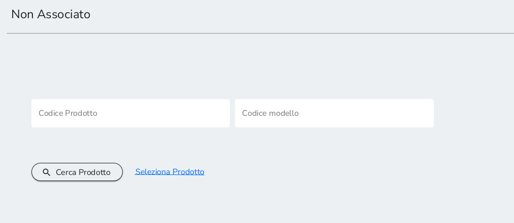
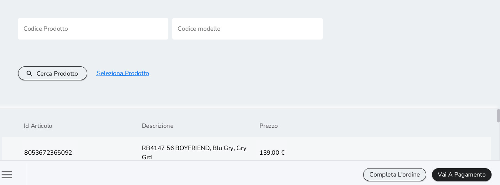
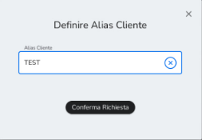
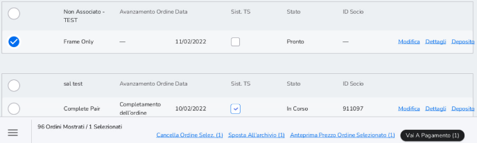
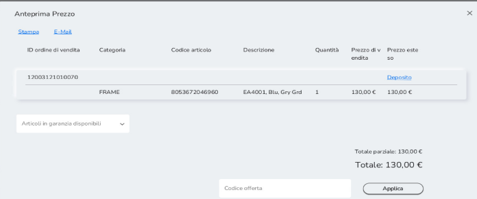
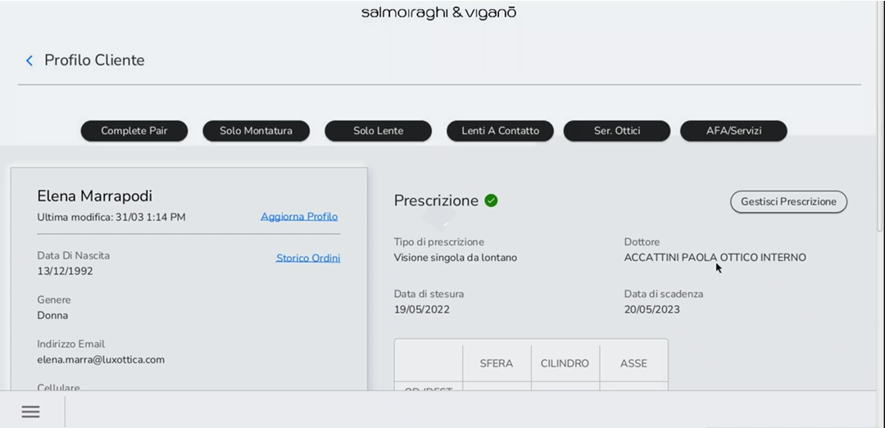
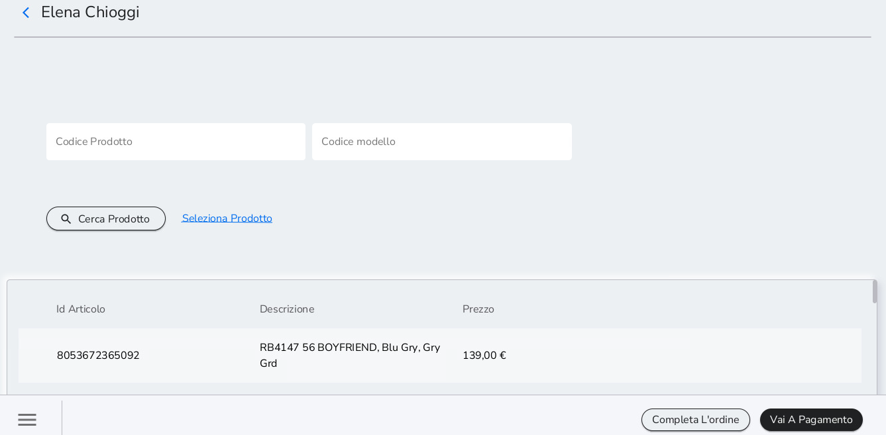
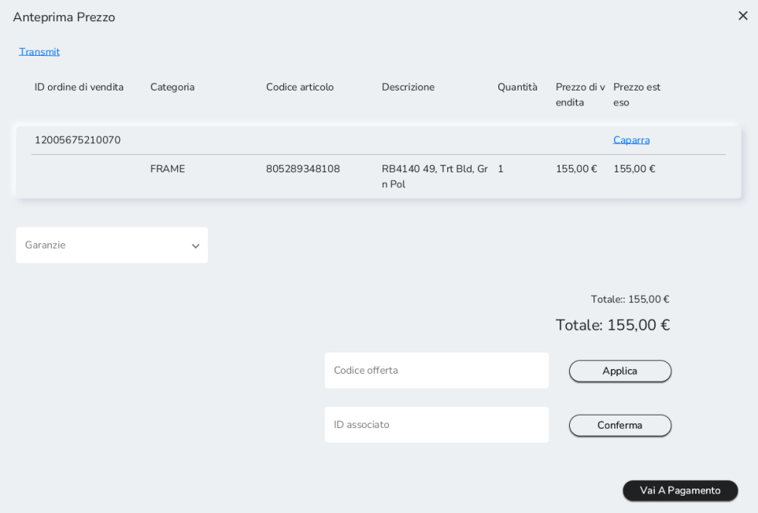

# Vendita occhiali da sole

La vendita di occhiali da sole può avvenire tramite due modalità:

1)  Senza anagrafica: sempre tramite vendita veloce. Permette di vendere
    un prodotto senza raccogliere i dati del cliente. È consigliato
    effettuarla solo in casi eccezionali, essendo sempre preferibile
    creare un'anagrafica per ogni nuovo cliente.

2)  Con anagrafica: tramite sezione *AFA/Servizi* del *Profilo Cliente*.
    La vendita è soggetta all'esistenza di un profilo cliente, per cui
    si richiede la cattura dei dati nel caso di un nuovo cliente o
    l'accesso ad un profilo pre-esistente.

## Vendita veloce (senza anagrafica)

Dopo aver effettuato l'accesso al sistema, cliccare sull'icona del menù
in basso a sinistra e successivamente su *Vendita Rapida*. In questo
caso la vendita è effettuata senza creare alcuna anagrafica cliente.

Inserire l'UPC del prodotto (manualmente o scannerizzando il barcode) e
cliccare su *Cerca Prodotto*. Selezionare il prodotto e scegliere se
proseguire con il pagamento cliccando su *Vai al Pagamento* o se salvare
la transazione nella lista degli ordini attivi cliccando su *Completa
l'ordine*.

Nel secondo caso verrà richiesto un ALIAS. L'ALIAS è l'identificativo
con cui riconoscere e recuperare la transazione nella lista degli ordini
attivi (contrariamente alle transazioni con cattura di dati del cliente,
questa transazione non è associata ad alcun nominativo).

Inserire l'Alias cliente nella casella come mostrato in figura. Dalla
lista di ordini attivi, selezionare la vendita cliccando sul tasto a
sinistra. È possibile cancellarla, salvarla in archivio, visualizzare
l'anteprima o procedere al pagamento cliccando su *Vai a Pagamento.*

Cliccando su *Anteprima Prezzo Ordine Selezionato* è anche possibile
aggiungere garanzie e sconti e visualizzare maggiori dettagli.

Cliccare nuovamente su *Vai a Pagamento*
per concludere la vendita su XStore.

## Vendita con anagrafica

Dopo aver inserito i dati di un nuovo cliente o selezionato un cliente
già presente in anagrafica, accedere al *Profilo cliente* e selezionare
*AFA/Servizi* dal flusso di vendita in alto a destra.

Inserire l'UPC del prodotto (manualmente o scannerizzando il barcode) e
cliccare su *Cerca Prodotto*. Selezionare il prodotto e scegliere se
proseguire con il pagamento cliccando su *Vai a Pagamento* o se salvare
la transazione nella lista degli ordini attivi cliccando su *Completa
l'ordine*.

Nel primo caso, cliccando su *Vai a Pagamento*, si visualizza
l'anteprima della vendita. Nella stessa schermata è inoltre possibile
creare un preventivo cliccando su *Preventivo* o una caparra cliccando
su *Caparra*.

Cliccare nuovamente su *Vai a Pagamento* per concludere la vendita su
Xstore.

Nel secondo caso, cliccando su *Completa l'ordine*, la vendita risulta
associata al cliente d'interesse ed è registrata in Lista ordini attivi.
Come per la vendita senza anagrafica, da qui è possibile visualizzarne i
dettagli, spostarla in archivio, cancellarla, visualizzare l'anteprima o
completare il pagamento cliccando su *Vai a Pagamento*.

