# Vendita lenti a contatto

La vendita di lenti a contatto può avvenire in tre modalità:

1.  Senza anagrafica: tramite vendita veloce. Permette di vendere un
    prodotto senza raccogliere i dati del cliente. È consigliato
    effettuarla solo in casi eccezionali, essendo sempre preferibile
    creare un'anagrafica per ogni nuovo cliente

2.  Con anagrafica cliente. Dal *Profilo cliente*, quindi con la cattura
    dei dati nel caso di un nuovo cliente o l'accesso ad un profilo
    pre-esistente:

a.  Sezione *AFA/Servizi (senza prescrizione)*

b.  Sezione *Lenti a contatto (con prescrizione)*

3.  Prima applicazione LAC e campioni

## Vendita veloce senza anagrafica cliente

Questa vendita solitamente è effettuata quando il cliente non presenta
particolari mix di difetti visivi (es: astigmatismo e miopia) che
richiederebbero la creazione di un ordine specifico con tempi di
consegna più lunghi. Questa modalità è solitamente utilizzata per i
clienti che si recano in negozio e desiderano acquistare in modo rapido
le lenti a contatto.

Dopo aver effettuato l'accesso al sistema, cliccare sull'icona del menù
in basso a sinistra e successivamente su *Vendita Rapida*. In questo
caso la vendita è effettuata senza creare alcuna anagrafica cliente.

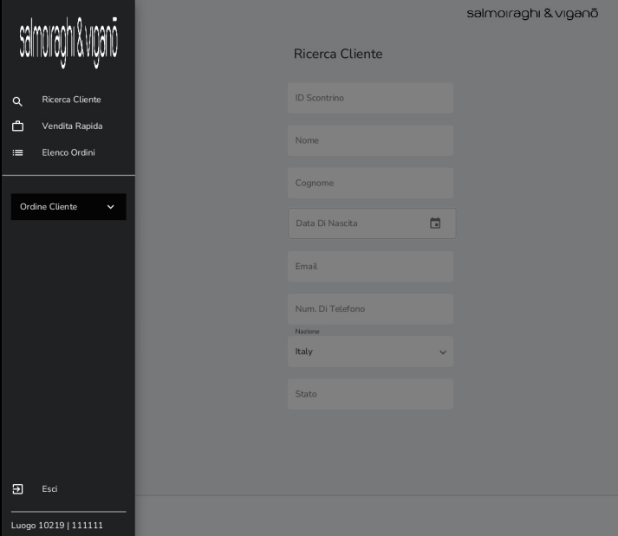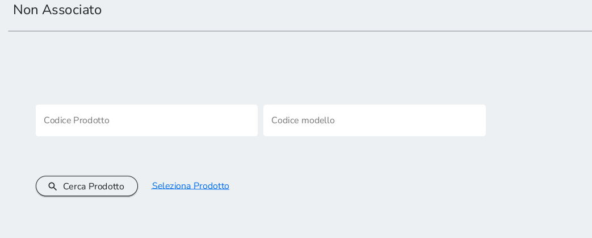

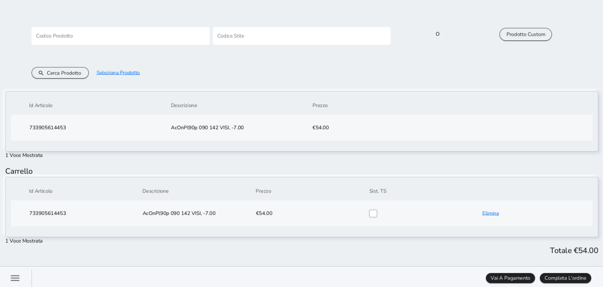Inserire l'UPC del prodotto (manualmente o
scannerizzando il barcode) e cliccare su *Cerca Prodotto*. Selezionare
il prodotto e cliccare su *Vai a Pagamento* per visualizzare l'anteprima
del prezzo ed aggiungere eventuali sconti.

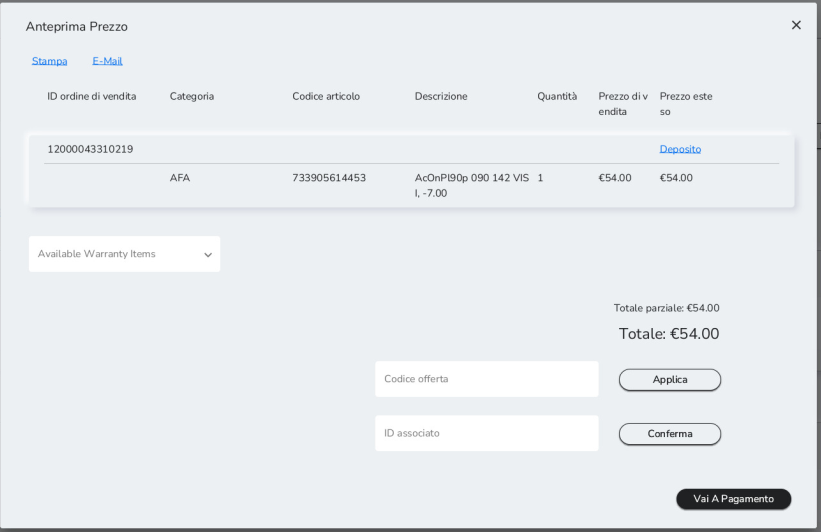Cliccare nuovamente su *Vai a Pagamento* per concludere
la vendita su Xstore secondo le modalità già descritte.

Se si desidera sospendere momentaneamente la vendita salvandola nella
lista di ordini attivi, cliccare su *Completa Ordine* per aggiungere
l'alias cliente come già visto nel *capitolo 8.1*.

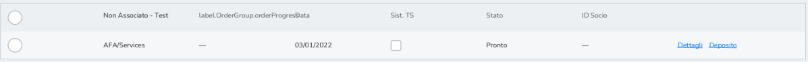

## Vendita con cattura anagrafica cliente

Nel caso di vendita con cattura di dati cliente, ma *senza utilizzo di
una prescrizione per lenti a contatto*, accedere al *Profilo Cliente* e
cliccare su *AFA/Servizi*.

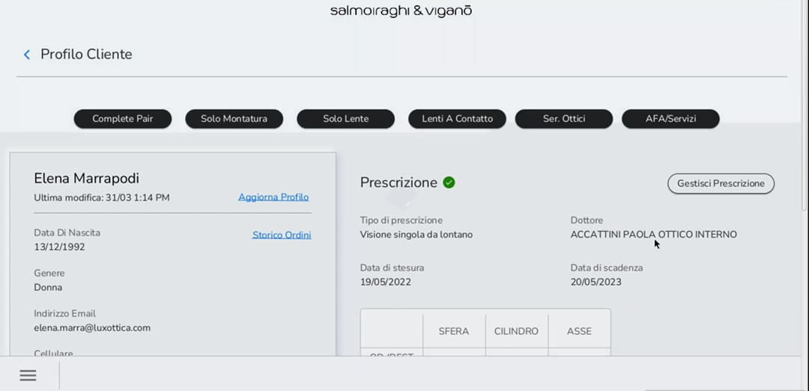

Da qui, i passaggi da seguire sono gli stessi evidenziati nel *capitolo
precedente*. L'unica differenza è che in questo caso, salvando l'ordine
nella lista di ordine attivi, la vendita non sarebbe più legata
all'Alias, ma all'anagrafica del cliente.

Per vendere lenti a contatto *utilizzando una prescrizione* e catturando
i dati cliente, saranno necessari due step:

1.  Creazione della prescrizione o ricetta

2.  Vendita delle lenti a contatto tramite il flusso di vendita "Lenti A
    Contatto".

Accedere al *Profilo Cliente* e aggiungere o selezionare una
prescrizione per lenti a contatto cliccando su *Gestisci Prescrizione.*

Nel caso in cui non sia già presente una prescrizione o ricetta per
lenti a contatto o vi fosse necessità di crearne una più aggiornata,
cliccare su *Aggiungi Prescrizione.*

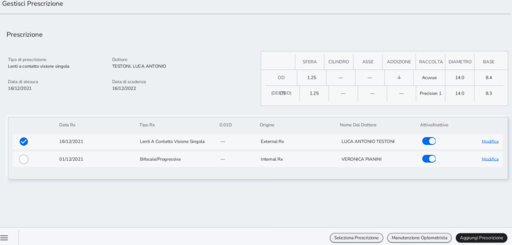

Dopo aver selezionato l'origine e il nominativo di chi ha prodotto la
ricetta o prescrizione, selezionare il tipo di prescrizione (tra quelle
per le lenti a contatto) dal campo Tipo di prescrizione.

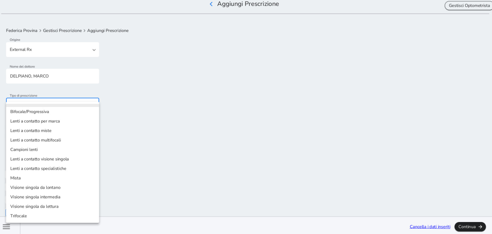Per inserire una prescrizione per lenti a
contatto generiche è necessario selezionare *Lenti a contatto per Marca*
nel tipo di prescrizione. Successivamente è necessario inserire il campo
*Sfera* e iniziare a digitare il nome nel campo *Marca.*

Di seguito uno specchietto con l'indicazione del campo Marca per alcune
delle lenti generiche che più si vendono.

  -------------------------------------------------------------------------------
  GEOMETRIA     LINEA                  Upc          Marca
  ----------------- -------------------------- ---------------- -----------------
  Torica        FOCUS DAILIES PLUS TOR 20500000794472   FOCUS

  Torica        OASYS 1 DAY FOR ASTIG    20500000797688   ACUVUE
                    30P                                       

  Torica        1 DAY MOIST FOR          20500000797664   ACUVUE
                    ASTIG30PZ                                 

  Torica        GIORN EYE NEXT ASTIG   20500001402635   EYE NEXT

  Torica        ACUVUE OASYS FOR         20500000797671   ACUVUE
                    ASTIG6PZ                                  

  Torica        LE GIORNALIERE ADV       20500000828887   LE GIORNALIERE
                    AST30P                                    

  Multifocale   TOTAL 1 MULTIFOCAL     20500000828238   DAILIES TOTAL 1
                                                                MF

  Torica        BIOFINITY TORIC        20500000797565   BIOFINITY

  Multifocale   TOTAL 1 MULTIFOCAL     20500000828221   DAILIES TOTAL 1
                                                                MF

  Torica        LE MENSILI ADV ASTIGM  20500000828900   LE MENSILI
  -------------------------------------------------------------------------------

Inserire le specifiche mediche (Sfera, Cilindro, Asse, Curva Base,
Diametro e Addizione) e indicare la marca e la gradazione. Solo per le
"Lenti a contatto per marca", a cui fa riferimento la foto sotto, è
necessario selezionare la gradazione del pacchetto lenti a contatto dal
menù a tendina. Infatti, tutte le lenti general assortment (non
codificate puntualmente) ricadono in questa categoria.

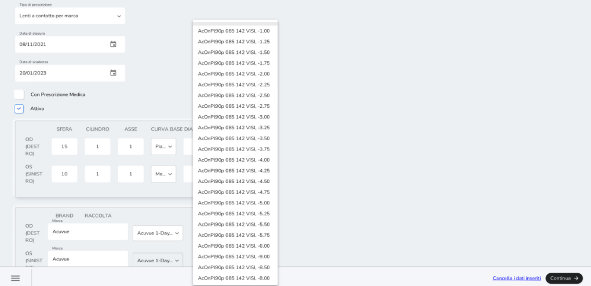

Cliccare su *Continua* e raccogliere i consensi privacy per i dati
medici.

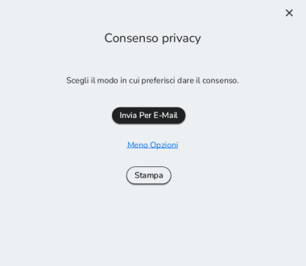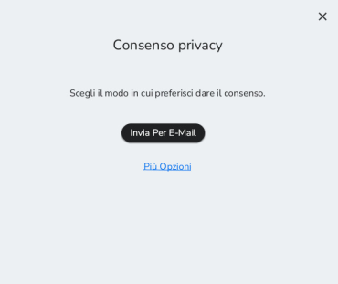

Il rilascio di questi rispecchia quanto
visto nel *capitolo 3.3* per i consensi marketing raccolti via e-mail o
stampa.

Cliccare nuovamente su *Continua* per completare la registrazione della
ricetta o prescrizione. Questa è visibile nello storico delle
prescrizioni del cliente.

Per facilitare la comprensione della vendita delle lenti a contatto
riportiamo un paio di esempi concreti.

Il primo riguarda <u>le lenti a contatto con codice specifico</u>
a livello di potere (lenti a contatto sferiche e alcune multifocali come
ad esempio le Moist)

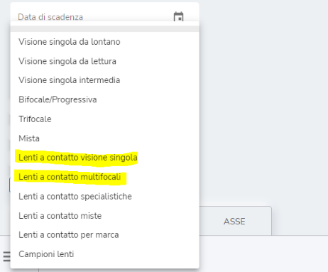

Dopo averle selezionate vi comparirà la schermata dei valori da
compilare sono obbligatori per avviare la ricerca: POTERE, CURVA BASE E
DIAMETRO + ADDIZIONE nei casi delle multifocali.

Una volta compilata vi comparirà una tendina con già con le lenti
disponibili per questi parametri.

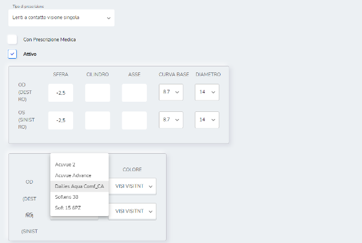

Una volta completato l\'ordine non sarà necessario ricrearlo anche su
MIM, l'operazione sarà sutomatica.

Il secondo tipo di lenti che vogliamo analizzare sono le lenti a
contatto con <u>codice generico</u> (la quasi totalità delle
lenti multifocali e toriche)

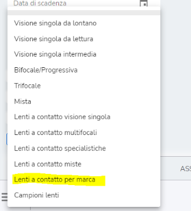

Il minimo indispensabile per avviare la ricerca è compilare la SFERA,
ovviamente è possibile compilare tutti i restanti campi per affinare la
ricerca. In questo caso non comparirà il menù a tendina, sarà vostro
compito scrivere l\'inizio del nome della marca.

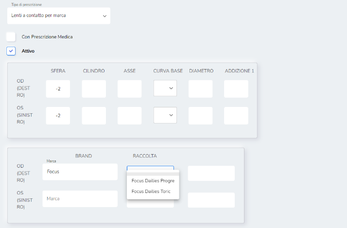

Nel caso di dubbi su cosa inserire nella voce marca, si consiglia di
fare fare riferimento alla stessa dicitura di MIM nella seconda tendina
di ricerca delle lenti a contatto. Importante è ricordare che in questo
caso l\'ordine NON parte in automatico ma va poi creato in MIM.

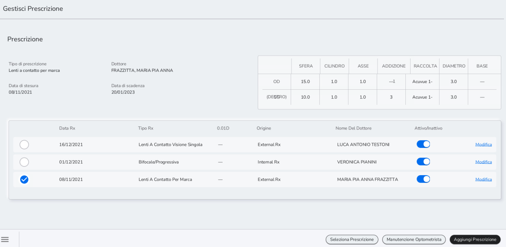Continuando con il flusso, selezionare e
cliccare *Seleziona Prescrizione* per renderla attiva e utilizzabile per
la vendita.

Dal *Profilo Cliente*, cliccare su *Lenti a contatto.*

Nella pagina Lenti a contatto selezionare la quantità di pacchetti in
stock e le modalità di spedizione (Rapida o Standard) per i pacchetti
non presenti in stock. Indicare dove spedire il prodotto (Indirizzo
primario o secondario del cliente, oppure in negozio). Selezionando
"Cliente -- Principale" per la spedizione, i dati saranno
automaticamente compilati con i dati inseriti durante la fase di
creazione dell'anagrafica.

Cliccare su *Continua* per accedere al *Modulo d'Ordine* o su
*Sospendere l'Ordine*. Per tutte le lenti a contatto registrate
puntualmente (non general assortment), l'ordine in Ciao! genera l'ordine
in MIM per fare il calco.

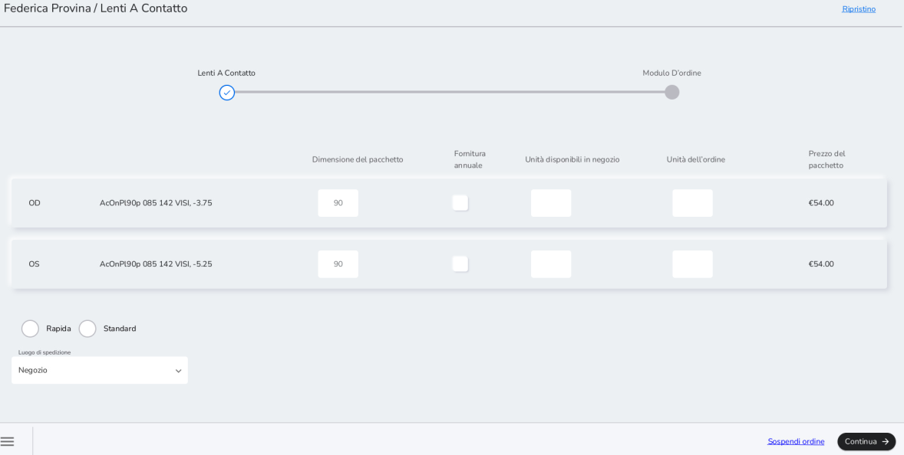

<u>Quantità in stock va SEMPRE completata con 0</u>

Nella pagina *Modulo D'ordine* è possibile inserire eventuali sconti e
procedere al pagamento su Xstore. Alternativamente, è possibile stampare
o inviare via e-mail il preventivo (tasti Stampa), Sospendere l'ordine,
Continuare a fare acquisti o salvare l'ordine nell'archivio.

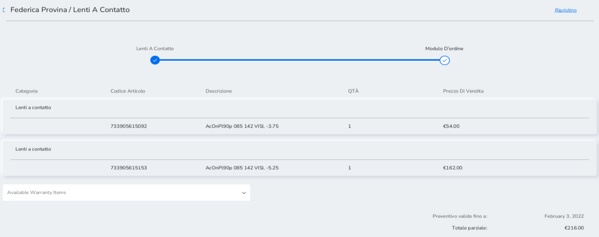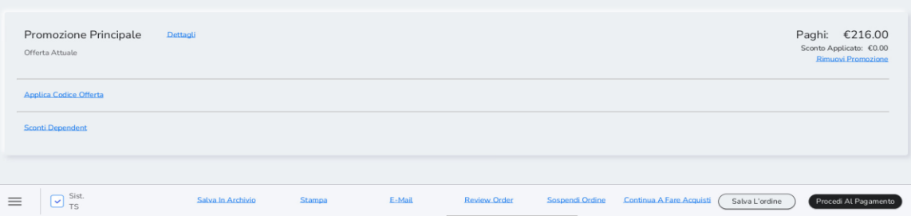

Per la consegna delle lenti a contatto si segue la procedura di consegna
vista per il complete pair al *capitolo 7.1.*

Qualora si procedesse alla raccolta della caparra per l'acquisto lenti
sia in vendita veloce (*vedere capitolo 9.1*) sia per la vendita con
anagrafica (*vedere capitolo 9.2*), verrà emesso ed inviato solo lo
scontrino non fiscale (documento gestionale).

## Registrazione prima applicazione LAC e campioni

La scheda per la prima applicazione LAC è digitale ed è memorizzata nel
sistema di cassa.

La scheda è integrata nel flusso di creazione della prescrizione.
Aggiungendo una nuova prescrizione, cliccare su *Campioni lenti* nel
campo Tipo di prescrizione.

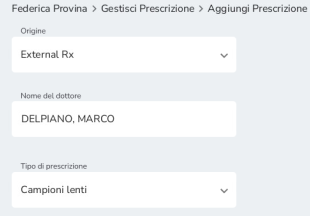

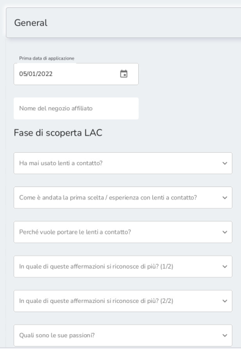

In seguito a questa selezione, nella stessa
pagina si rendono disponibili tre sezioni: General, Contact Lenses
Details e Feedback. Queste sezioni sono integrate nella prescrizione e
utilizzate per raccogliere tutte le informazioni legate alla prima
applicazione lenti a contatto del cliente.

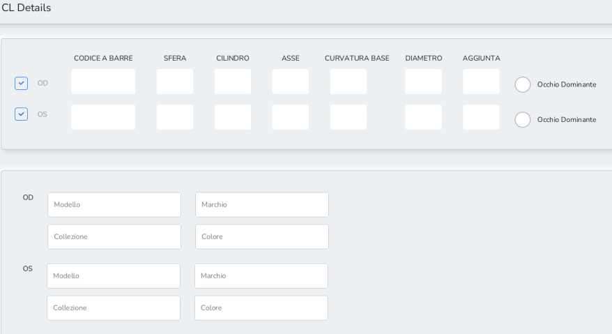

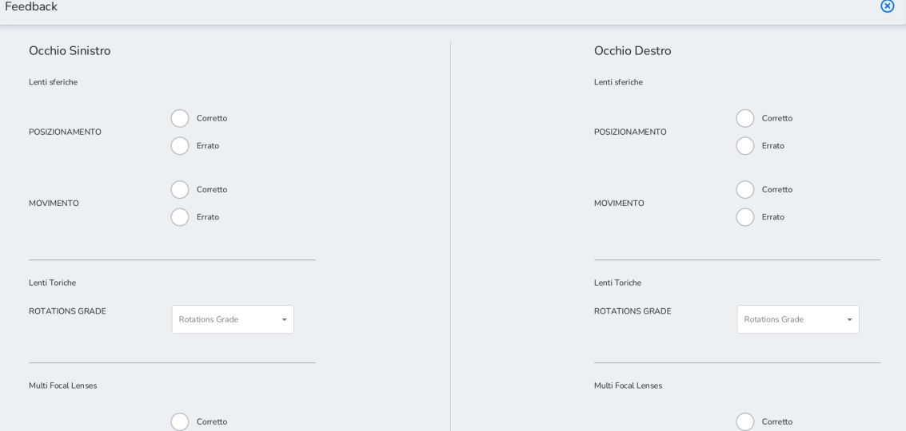*Nella sezione "Feedback" andranno inserite le
informazioni a seguito della prova di prima applicazione LAC effettuata
dal cliente.*

Cliccando su *Continua*, è richiesto il consenso privacy per i dati
medici. È prevista la sola modalità di stampa.

Selezionare la prescrizione e cliccare sulla sezione *Lenti A Contatto*
posto all'interno del profilo Cliente.

Procedere, inserendo le quantità desiderate e cliccare su *Continua*.

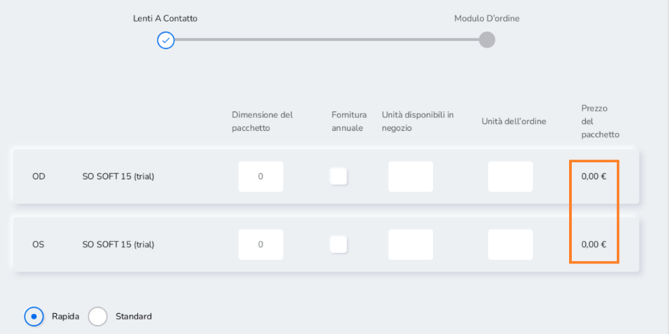

Successivamente, cliccare su *Procedi Al Pagamento* (con importo pari
0,00 €)

Una volta entrati su Xstore, cliccare su *Transazione Completata* e
selezionare il metodo di ricezione (e-mail o solo stampa).

Terminato il processo di transazione, in base alla modalità di ricezione
documenti, il sistema erogherà la seguente documentazione:

-   Documento gestionale (NON fiscale): da consegnare al cliente

-   Tray ticket

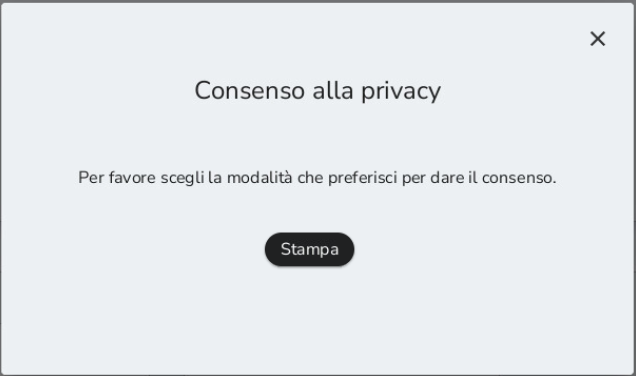

