# Vendita accessori, ricambi e servizi

## Vendita accessori

Seguire procedura di vendita rapida con sole e lenti (*capitoli 8 e 8*).

## Vendita ricambi e servizi

Per procedere alla vendita di un servizio o di un ricambio il processo è
il seguente:

-   Entrare in *Afa/Servizi*,

-   inserisce l\'UPC del prodotto, selezionarlo per inserirlo nel
    carrello.

-   una volta inserito il prodotto nel proprio carrello, prima di
    procedere al flusso di presa caparra, flaggare la dicitura *ORDINE
    SPECIALE.*

-   premere *Vai a pagamento*, compare *Anteprima prezzo*, a
    questo punto procedere con il ritiro della caparra

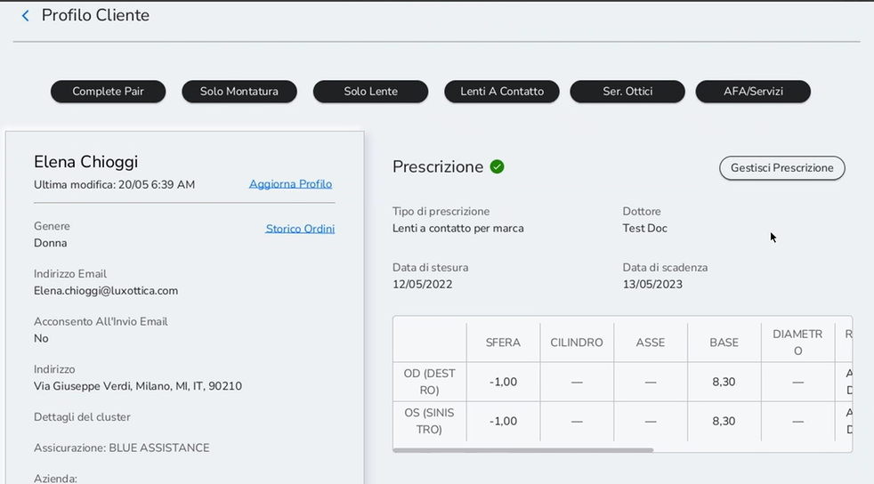

Importante è flaggare sempre sula tasto *Ordine speciale in modo
che* il sistema crei automaticamente il PO in MIM per il carico merce.
Senza aprire il GLPI a Store Supporto per la creazione di quest\'
ultimo.

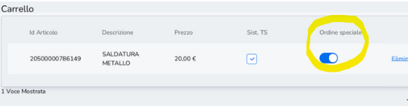

Cliccare su *Caparra* e selezionare *Aggiunta pagamenti* nel menù in
basso a destra e successivamente la modalità 'in attesa di pagamento'
(caparra a 0). In questo modo sarà possibile trovare l'ordine nella
lista caparra (come AFA).

Nel caso in cui i pezzi di ricambio fossero più di uno, consigliamo di
fare caparra su 1 ricambio e tenere il secondo pezzo in pagamento alla
consegna definitiva al cliente.

Molto importante è conservare lo scontrino caparra relativo ai
ricambi, in modo da poter tracciare l'ordine, che ritroverai
facilmente in elenco ordini caparra.

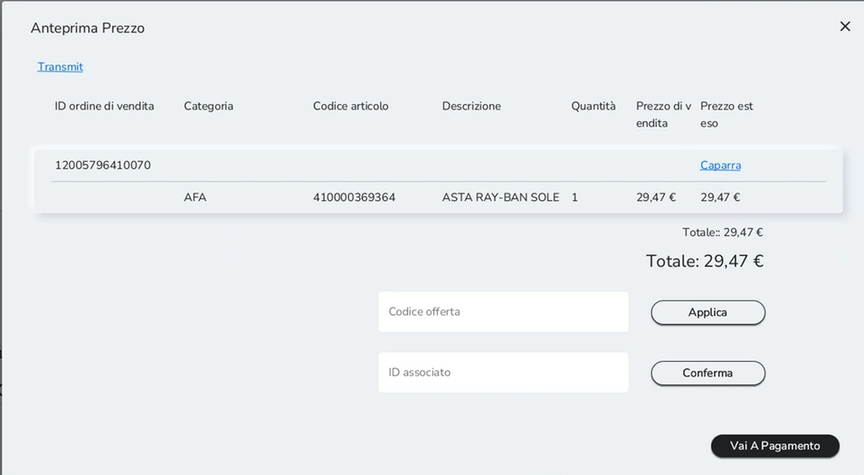

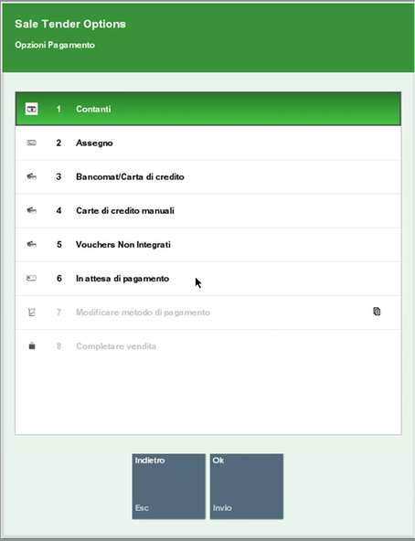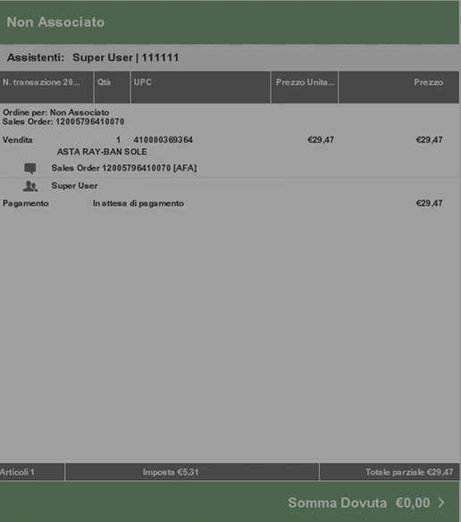

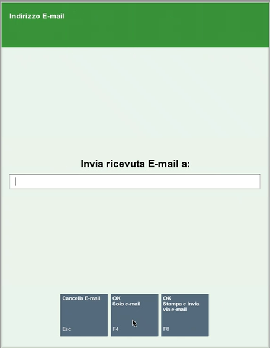

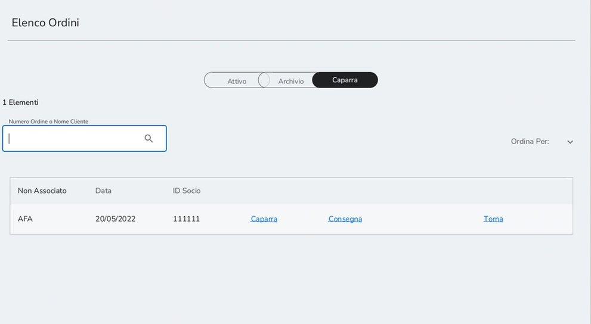

Tale scontrino non deve essere consegnato al cliente ma conservato dal
negozio per poi poter associare il pezzo con il nome del cliente.

Quando si opta per il deposito di una caparra, procedere all'emissione
del documento sia per e-mail che per stampa, selezionando e-mail e
Stampa. La copia stampata sarà conservata dal negozio per associare il
nome del cliente non appena il pezzo nuovo sarà disponibile in store.
Questa procedura è essenziale al fine di poter monitorare l'ordine e
quindi per la consegna dell'articolo.

##  Vendita Gift card

A differenza di tutte le altre vendite, le Gift Card sono l'unico item
che dobbiamo vendere direttamente in Xstore senza l'associazione
dell'anagrafica cliente

1.  Dalla schermata di Customer Order, tornare ad XStore selezionando la
    freccia blu (da pc) o aprendo menù a tendina in basso a sinistra e
    selezionando Vai a Xstore (da iPad)

2.  Nella schermata blu di Xstore, inserire l'UPC della gift card
    nello spazio in basso a sinistra e selezionare *Invio*

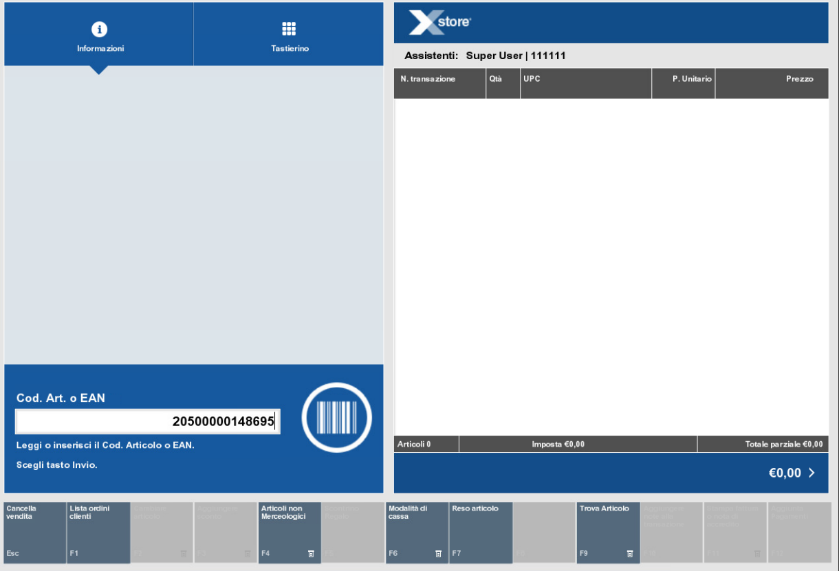
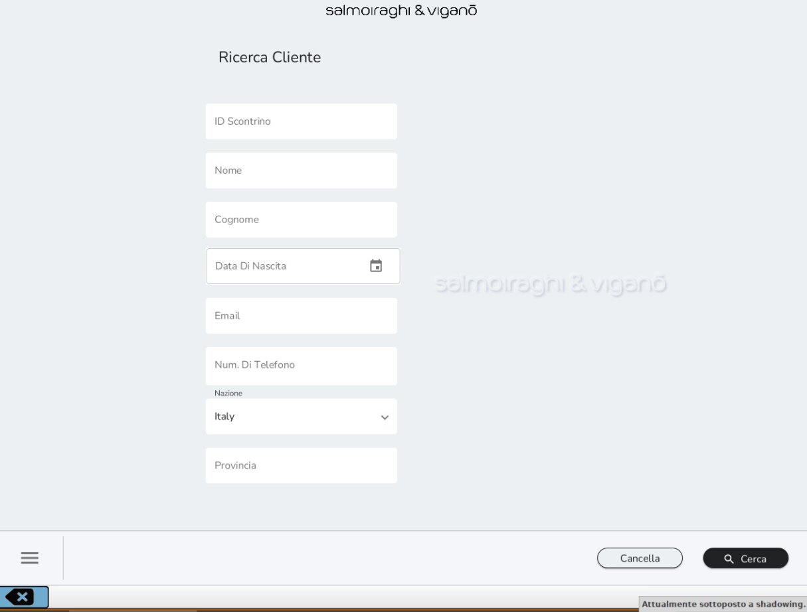

3.  Dopo aver inserito l'UPC inserire sempre nella barra in basso a
    sinistra il codice numerico della Gift Card (già in precedenza
    attivata sul portale Amilon come da attuale proceduta) e selezionare
    *Invio*

4.  Procedere a pagamento

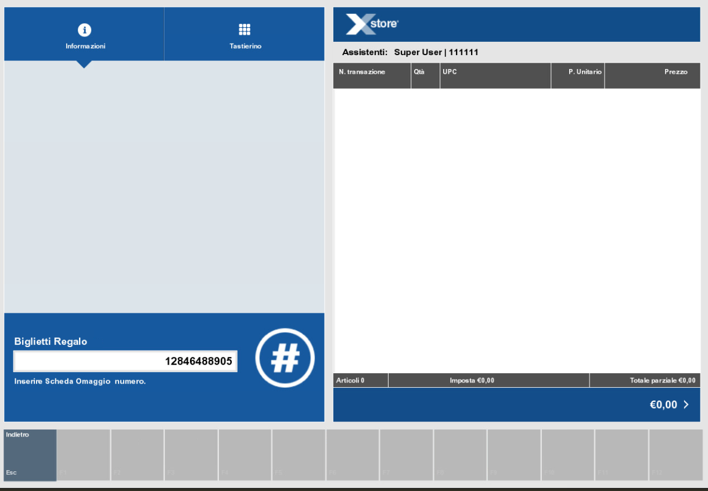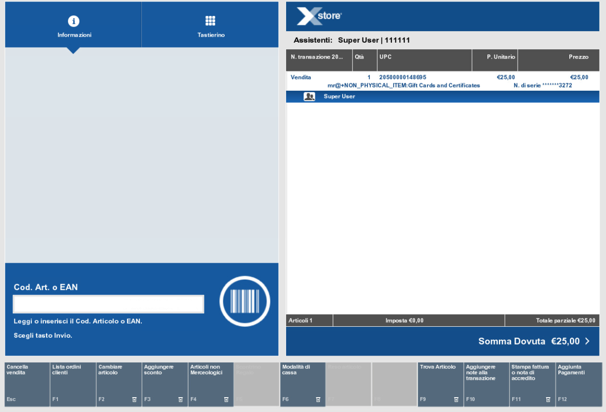
