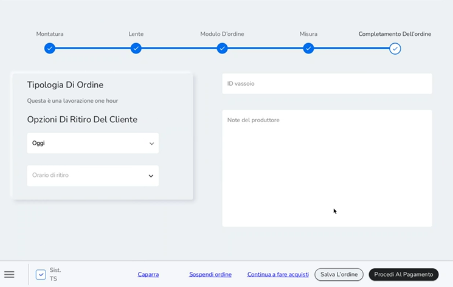
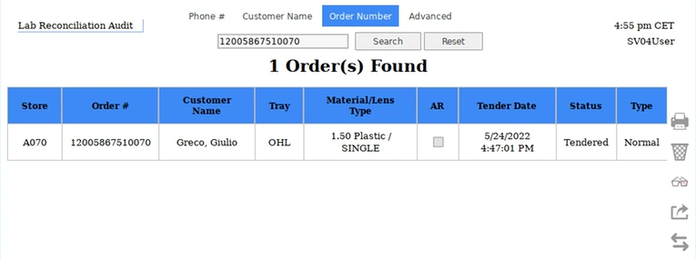
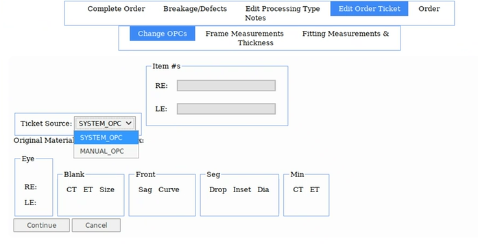

# One hour Lenses

Le lenti one hour sono una tipologia di lenti che non richiede
l'attività del laboratorio ma che viene eseguita direttamente in store.
Per procedere alla selezione delle lenti one hour, eseguire un ordine
'Complete pair' o 'lens only' e selezionare una tipologia di lente one
hour. Si visualizzerà nel commento di recap ordine la dicitura 'Questa è
una lavorazione One Hour' e si potrà inserire la tempistica di ritiro.

Una volta completato l'ordine su Customer Order si potrà accedere a LPA
per gestire/ricercare l'ordine one hour. Per effettuare la ricerca
selezionare *Order Number* e inserire il numero d'ordine. Questo
particolare tipo di ordine non dovrà essere inviato al laboratorio e
quindi lo stato non dovrà essere Transmitted, ma Tendered fino a quando
non verrà consegnato.

Attraverso il menù Edit Order Ticket è possibile cambiare l'OPC
selezionando dal menù a tendina, in corrispondenza della voce Ticket
Source, Manual_OPC. Ticket Source di default è sempre impostato su
System_OPC.

