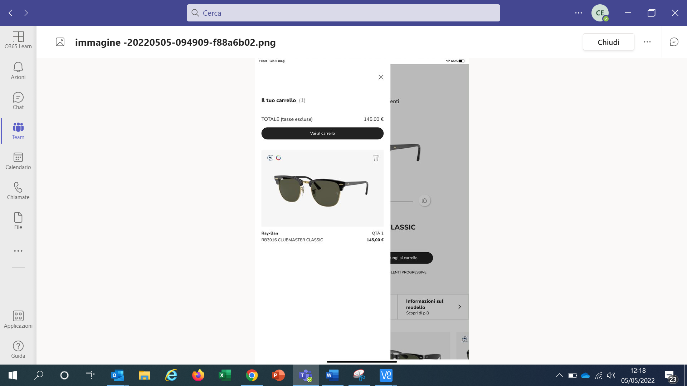
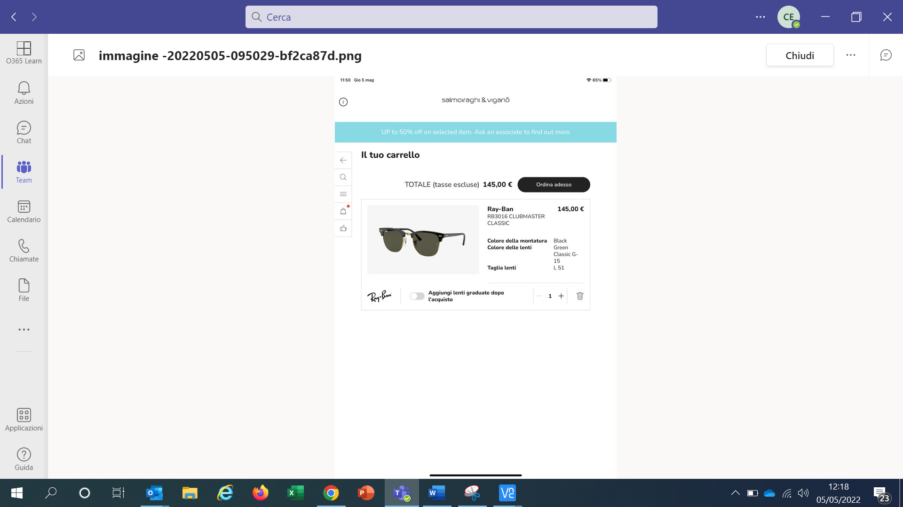
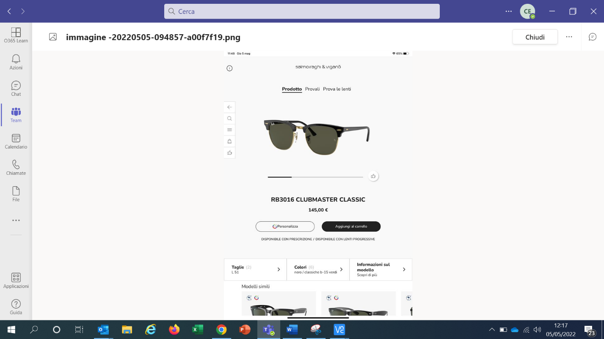
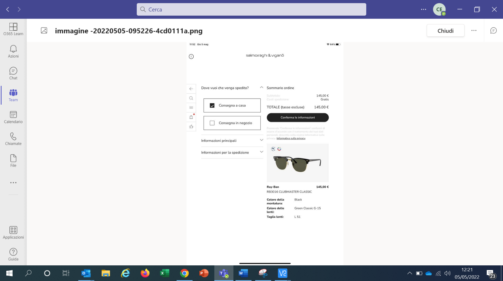
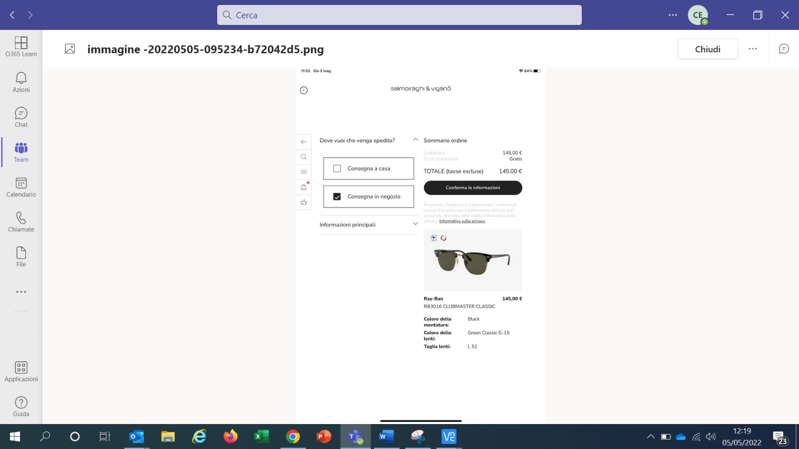
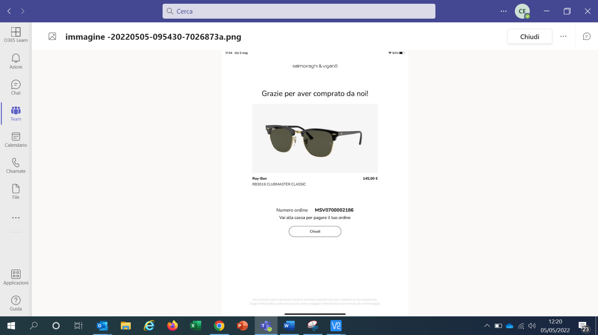
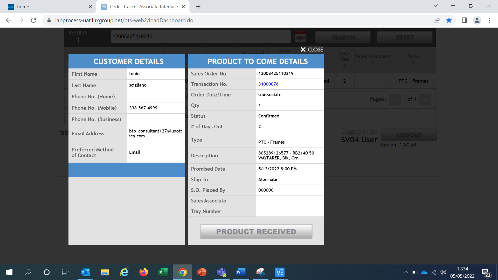

# Vendita da Smart Shopper

Per effettuare un ordine partendo da
SmartShopper cliccare sull'icona di SmartShopper. Una volta selezionata
la montatura cliccare su *Aggiungi al carrello* e successivamente su
*Vai al carrello* e *Ordina adesso*.

Selezionare *Consegna in negozio* se si vuole spedire l'ordine in
negozio o *Consegna a casa* per spedirlo direttamente a casa del cliente
(in questo ultimo caso bisognerà inserire anche le Informazioni per la
spedizione). Procedere con l'inserimento delle informazioni personali e
cliccare su *Conferma le informazioni* e *Chiudi*.

Dopo aver completato l'ordine su SmartShopper tornare su Ciao! Optical,
l'ordine appena concluso si trova nella lista degli Ordini Attivi. Dopo
aver selezionato l'ordine cliccare su *Modifica* e continuare la
procedura di raccolta ordine come descritto sopra. Al momento del
pagamento, se l'anagrafica del cliente è già stata registrata l'e-mail
viene riconosciuta e compare di default.

Cliccando sull'icona di Order Tracker presente nel Toolkit, cercare
l'ordine inserendo il codice ordine o il nome del cliente. L'ordine
appare come Confirmed. Una volta cliccato sull'ordine appare una
schermata con i dettagli dell'ordine. Se precedentemente su SmartShopper
è stata selezionata l'opzione *Consegna in negozio*, alla voce *Ship to*
sarà presente Store. Al contrario, se è stata selezionata l'opzione
*Consegna a casa,* sarà presente Alternate.

## Tracking ordine

Tutti gli <u>ordini effettuati con Smart Shopper</u> sono
monitorabili in Order Tracker. In particolare:

-   Authomatic Dispensed, dopo avere cliccato su Dispensed l'ordine
    scompare su Order Tracker.

-   Ordini di sola montatura (*occhiale da sole o montatura da vista*) à
    l'ordine è visibile nella sezione PRODUCT TO COME di Order Tracker.
    È possibile controllare l'ordine fino al momento in cui viene dato
    in gestione al corriere.

 **Quindi dopo il cambio di stato in Shipped non si potrà vedere più il tracking del corriere.**

-   Ordini di lenti a contatto integrati (su Vision Direct).

-   Ordini di occhiali completi la cui montatura è stata selezionata da
    Smart Shopper (nuova funzionalità disponibile grazie a Ciao!
    Optical) à l'ordine è visibile nella sezione OPEN ORDERS come
    avviene attualmente per tutti i work order.
