# Gestione promozioni

## Promozioni automatiche

Come anticipato nel *capitolo 5.3*, nel *Modulo d'Ordine* sono visibili
le promozioni automatiche applicate all'ordine.

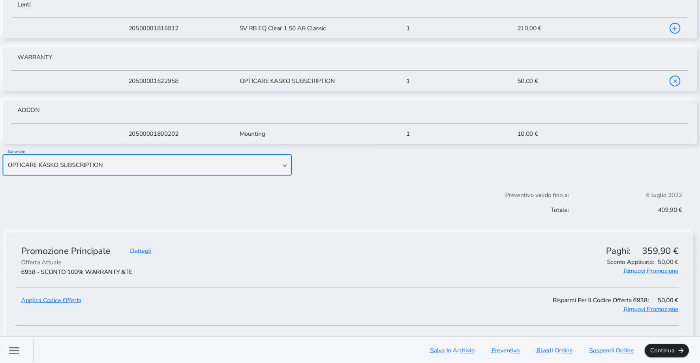

Le promozioni automatiche sono applicate direttamente dal sistema che
propone la scontistica attiva più vantaggiosa per il cliente in base ai
prodotti selezionati nell'ordine.

Ad esempio, se l'occhiale acquistato dal cliente rientra nell'offerta
occhiale completo questa promozione prevale sempre rispetto al
discrezionale 5%.

Nel caso in cui sia necessario non applicare la promozione che il
sistema automaticamente propone selezionare *Rimuovi Promozione.*

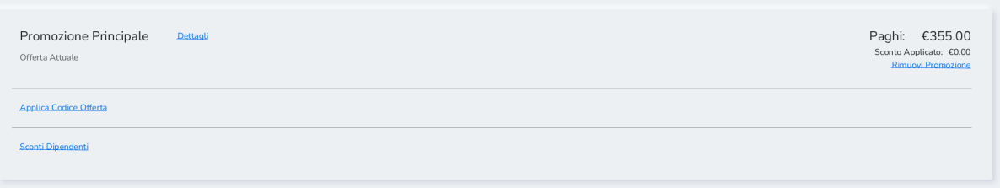

## Promozioni dipendenti

Nel *Modulo d'Ordine* è possibile applicare all'ordine anche le
promozioni e gli sconti riservati ai dipendenti. Nel caso in cui sia
necessario applicare lo sconto riservato a un dipendente selezionare
*Sconti Dipendenti* e inserire il relativo ID del dipendente nella
finestra ID Associato e cliccare su *Conferma*.

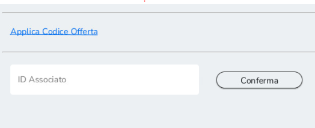

Dopo aver inserito l'ID del dipendente la promozione verrà applicata in
automatico. Nel caso in cui sia necessario non applicare la promozione
che il sistema automaticamente propone selezionare *Rimuovi Promozione.*

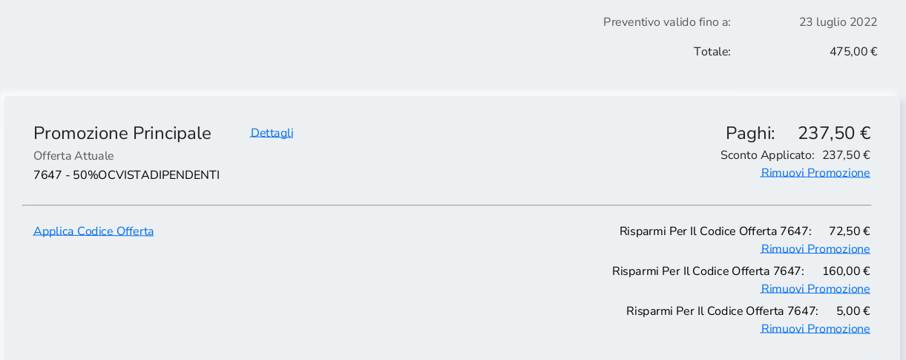

Nel caso in cui il plafond sia stato superato non sarà possibile portare
a termine la transazione in quanto verrà restituito un messaggio di
errore. 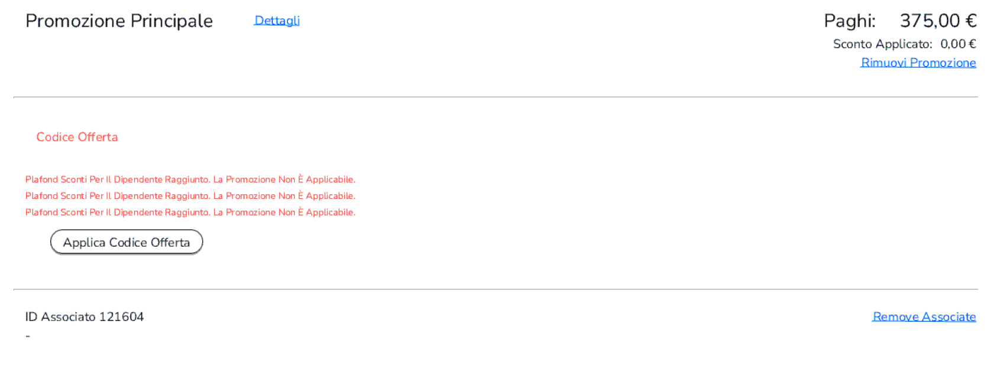

##  

##  

##  

##  

##  

##   

##  

## 13.3 Promozioni manuali e sconti discrezionali 

Gli sconti manuali e discrezionali (con causale o generici a % o valore)
possono essere gestibili da:

1.  XStore

2.  Customer Order

1.  Da Xstore, selezionare la vendita e successivamente selezionare
    *Aggiungere sconto*. Inserire il codice per lo sconto e
    successivamente la percentuale o l'importo in valore da stornare dal
    totale nella schermata specifica alla tipologia di sconto (Enter
    Amount e Enter Percentage). Fondamentale è ricordarsi che questa
    tipologia di sconti <u>va inserita due volte</u>, al momento
    della presa caparra e al momento della consegna.

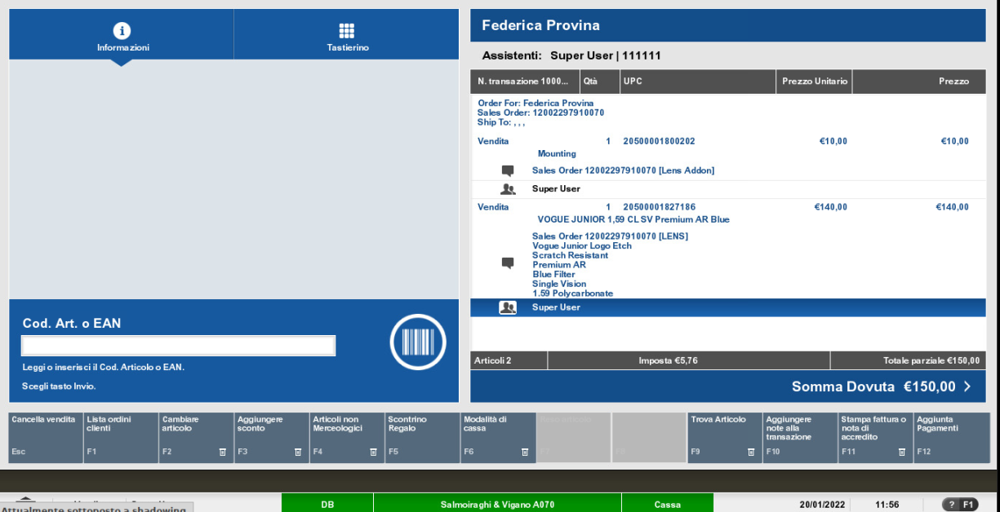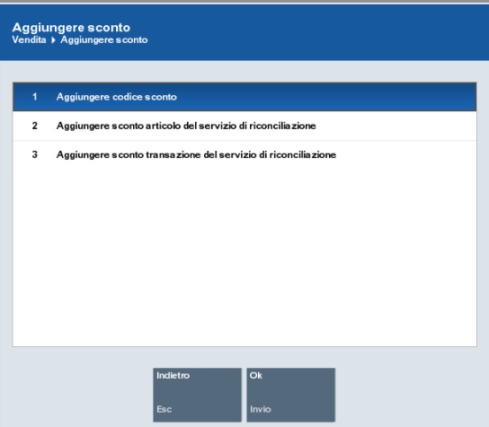

2.  Da Customer Order, nel Modulo d'Ordine, selezionare *Applica Codice
    Offerta.* Inserire il codice promozionale manualmente oppure
    scannerizzare il barcode relativo all'offerta presente nel Booklet
    sul ToolKit e selezionare *Applica Codice Offerta.*

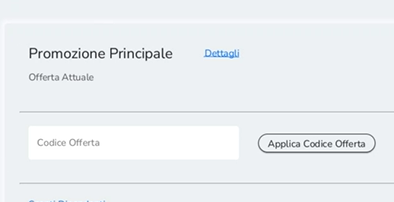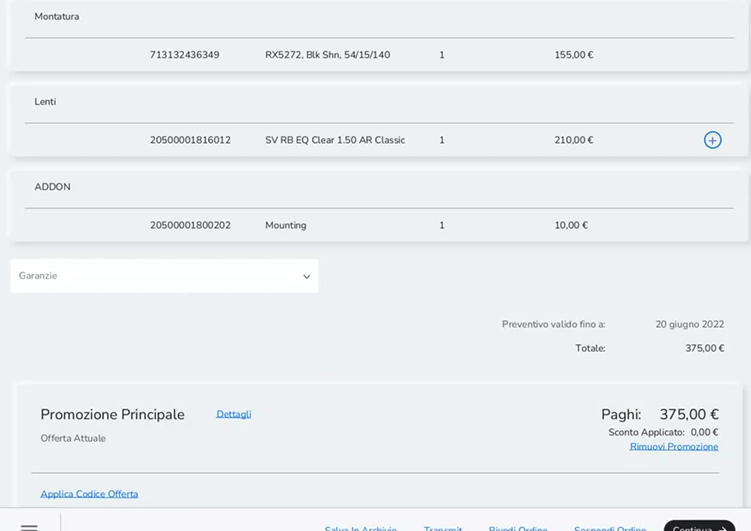

## 13.4 Promozioni con barcode 

Oltre alle promozioni automatiche, nella sezione Modulo d'Ordine possono
essere inserite promozioni tramite scansione di barcode o inserimento di
codice manuale selezionando *Applica Codice Offerta*.

##  

## 13.5 Automatic Couponing 

Nel caso dell'automatic couponing, il sistema verifica automaticamente
quali transazioni sono elegibili per dare diritto ad uno sconto su un
acquisto futuro, in caso di promo automatic couponing attiva. Ad
esempio, acquistando un complete pair il sistema genera un coupon per un
successivo occhiale completo con uno sconto del 50%.

Il coupon viene inviato al cliente insieme alla copia dello scontrino
non fiscale alla fine della transazione se richiesto vi email. In ogni
caso una copia verrà stampata insieme allo scontrino fiscale relativo
alla transazione.

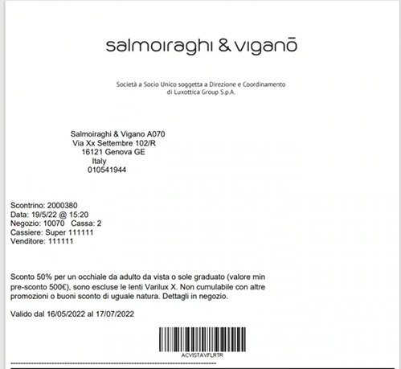

Per utilizzare il coupon e applicare lo sconto bisogna scansionare il
barcode nella sezione Modulo D'Ordine nel flusso di creazione ordine,
verificandone:

-   La scadenza

-   L'idoneità dei prodotti nel carrello per quel determinato coupon

-   Utilizzo precedente (in questo caso decade il diritto allo sconto)

## 13.6 Applicazione sconti assicurazioni, convenzioni e abbonamenti 

Sempre nella sezione *Modulo D'Ordine* è possibile anche applicare gli
sconti per le assicurazioni e gli abbonamenti in maniera corretta, in
particolare:

-   Per gli Abbonamenti, scaricando il barcode dal sito di Zuora e
    mettendolo, sarà possibile applicare il prezzo corretto

-   Per le Assicurazioni / convenzioni, per applicare lo sconto sarà
    necessario utilizzare i codici presenti nella seconda e terza pagina
    del documento caricato nel Tool Kit nella app Listini chiamato
    <u>Ciao! ASSICURAZIONI -- CONVENZIONI</u>. Sparando questo
    codice, sarà automaticamente il sistema ad applicare la promozione
    corretta a seconda degli item selezionati. Per permettere la
    corretta applicazione, la voce Assicurazione nell'anagrafica cliente
    deve essere compilata in modo coerente.

##  

## 13.7 Garanzie 

Vi sono due flussi per l'aggiunta delle garanzie all'ordine dalla pagina
*Modulo d'ordine*:

-   Complete Pair: dopo la selezione della montatura e delle lenti come
    mostrato in foto

-   Montatura per occhiale da sole: dopo la selezione della montatura
    partendo da *AFA/Servizi*

Dal *Modulo d'Ordine* selezionare la garanzia dal campo Garanzia
scegliendo tra le opzioni visibile dal menù a tendina. Una volta
selezionata la garanzia questa figura come elemento aggiuntivo nel
Modulo d'ordine.

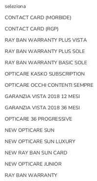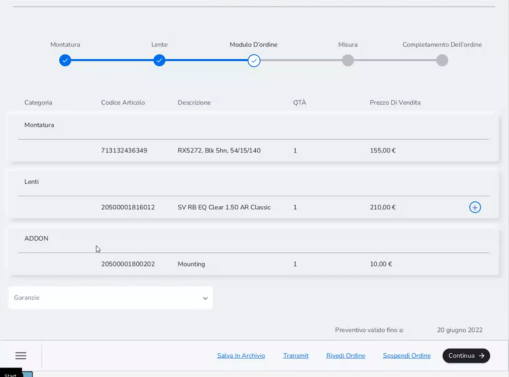

La garanzia viene inviata al cliente in un'e-mail separata rispetto a
quella in cui è presente la copia dello scontrino non fiscale relativo
alla transazione. In alternativa è sempre possibile stamparla.

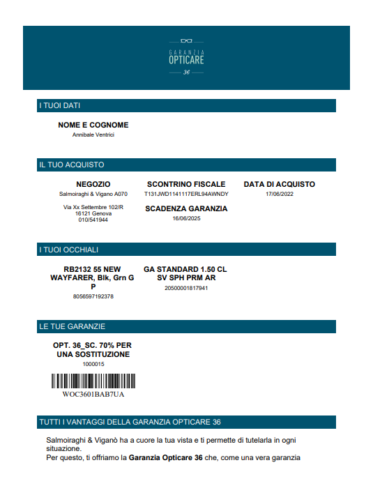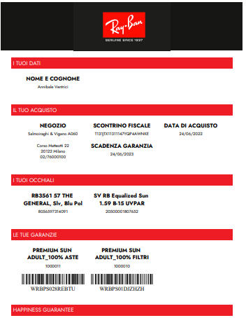

Se il cliente volesse beneficiare di uno dei vantaggi della garanzia è
necessario creare il nuovo WO relativo al prodotto desiderato e
scansionare il barcode nella sezione *Modulo D'Ordine* nel flusso di
creazione ordine, verificandone:

-   La validità della garanzia

-   L'intestatario della stessa

Le tipologie di garanzie acquistabili sono due, quelle acquistabili
negli store Salmoiraghi & Viganò e quelle acquistabili negli store
Ray-Ban.

Le garanzie Salmoiraghi & Viganò sono:

-   OPTICARE 12

-   OPTICARE 36

-   RAY BAN SUN CARD

-   SENZA PENSIERI &TE

-   OPTICARE MINI

-   SENZA PENSIERI &TE MINI

-   OPTICARE SOLE LUXURY

-   OPTICARE 36 PROGRESSIVE

-   OPTICARE SOLE

Le garanzie Ray-Ban sono:

-   RAY-BAN PREMIUM VISTA ADULTO

-   RAY-BAN PREMIUM SOLE

-   RAY-BAN STANDARD VISTA ADULTO

-   RAY-BAN STANDARD VISTA KIDS

-   RAY-BAN PREMIUM VISTA KIDS

-   RAY-BAN STANDARD SOLE ADULTO

-   RAY-BAN STANDARD SOLE KIDS

\
