# Gestione servizi post-vendita

Le procedure di reso e scambio è preferibile effettuarle da PC di cassa
o banchetto.

## 14.1 Reso caparra 

Accedere all' Elenco ordini e successivamente alla lista caparra.
Eseguire la ricerca dell'ordine con caparra, cliccare "Torna" ed
inserire la ragione di reso.

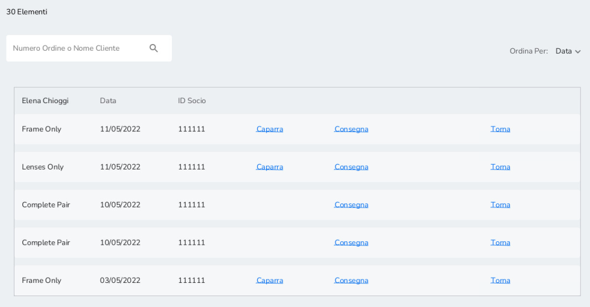

Inserire la *Ragione di Reso* in merito a tale richiesta.

Una volta passati in Xstore verrà richiesto di aggiungere una nota.
Dopodiché, cliccare *OK* per proseguire*.*

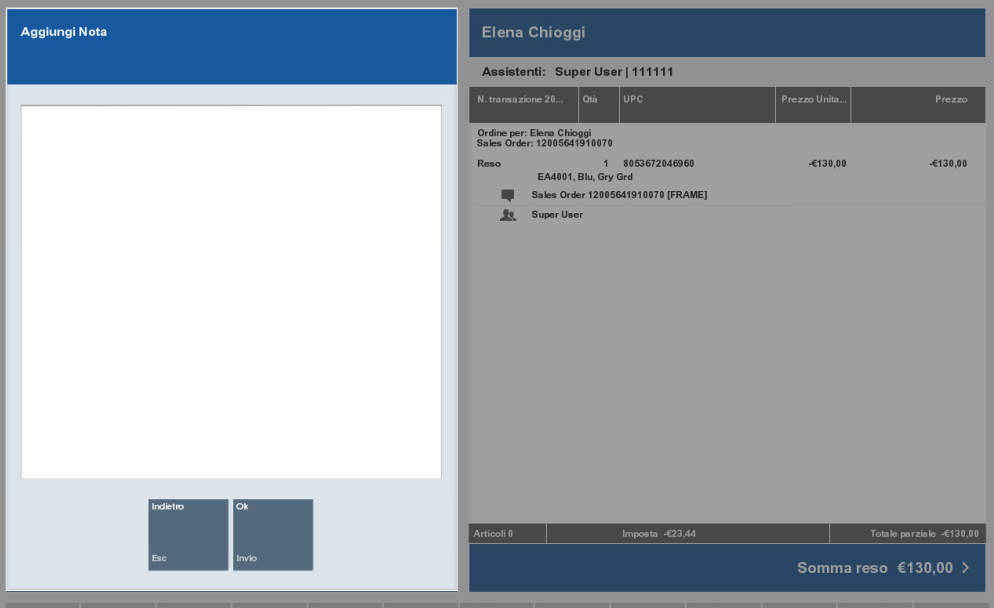

Sarà il sistema stesso a proporvi cosa rendere in contanti e cosa verrà
tolto automaticamente da In attesa di pagamento.

Sarà il sistema stesso a ricordare la quantità della caparra inserita.

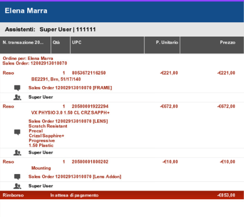

Procedendo con la scelta del metodo di pagamento il sistema vi propone
la somma di reso corretta, cioè la caparra per quel specifico WO.

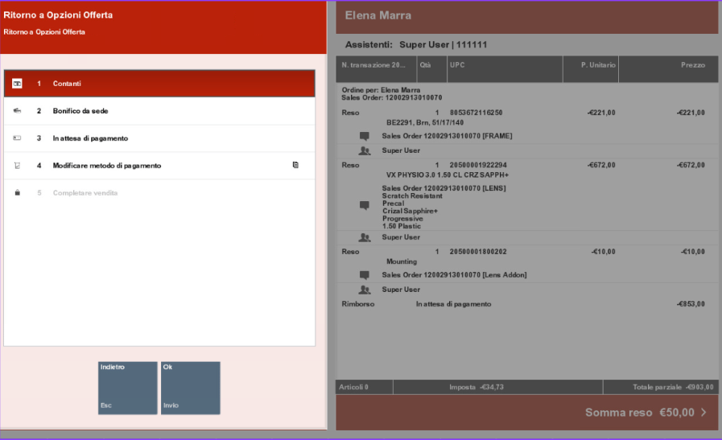

[GIOVA OSSERVARE CHE: qualora si voglia eseguire un reso per un
errore/modifica nel WO che non abbia comportato un reale pagamento, si
andrà a selezionare *In attesa di pagamento* per l'intera
cifra.]{.underline}

Esempio: Viene eseguito un ordine di 329 euro e pagata una caparra di
29. Qualora si volesse rendere, andremo a selezionare *Lista Caparre*,
cercheremo l'ordine, selezioneremo *Torna*, inseriremo una Nota in
Xstore e selezioneremo *Aggiunta Pagamenti*.

Selezioniamo la modalità *Contanti* ed inseriremo manualmente la cifra
di 29 euro, per i restanti 300 euro andremo a selezionare la modalità
'In attesa di pagamento'.

Qualora si voglia eseguire un reso per un errore/modifica del WO che non
abbia comportato un reale pagamento, si andrà a selezionare 'In attesa
di pagamento' per l'intera cifra.

## 14.2 Incamera caparra 

Nella lista Caparra sono presenti gli ordini per i quali è stata presa
caparra.

Al fine di incamerare la caparra per un ordine che ha superato i due
mesi e dopo le relative comunicazioni, selezionare il tasto *Converti*
per incassare la caparra.

Successivamente si aprirà in XStore dove dovrà essere inserita una nota.

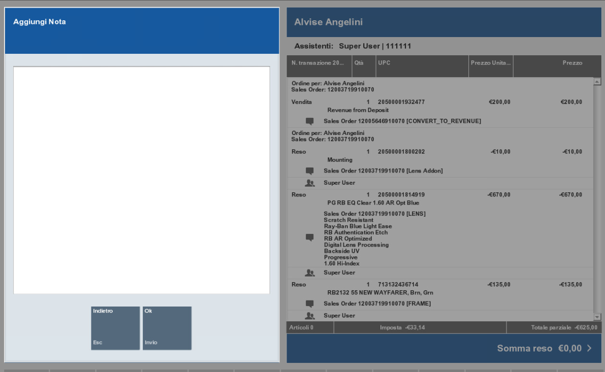

Dopo aver selezionato *Transazione completata* (dove in automatico viene
rappresentato il valore che deve essere incamerato), verranno emessi due
scontrini non fiscali. (selezionare solo stampa, non e-mail altrimenti
viene ricevuta dal cliente).

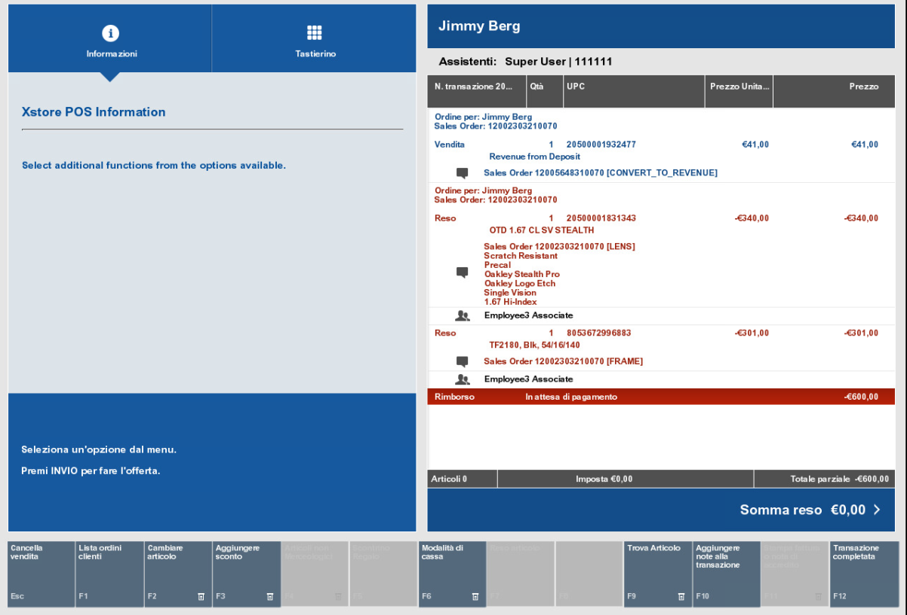

## 14.3 Reso cliente con vendita effettuata su Ciao! 

Per effettuare un reso cliente seguire i seguenti passaggi:

1.  Accedere alla sezione *Ricerca Cliente* e ricercare il cliente
    d'interesse con le modalità viste al *capitolo 3.1*.

2.  Accedere al suo *Profilo Cliente*

3.  Selezionare *Storico ordini* e ricercare l'ordine. In questa sezione
    verranno mostrate automaticamente le vendite dalla più recente alla
    meno recente.

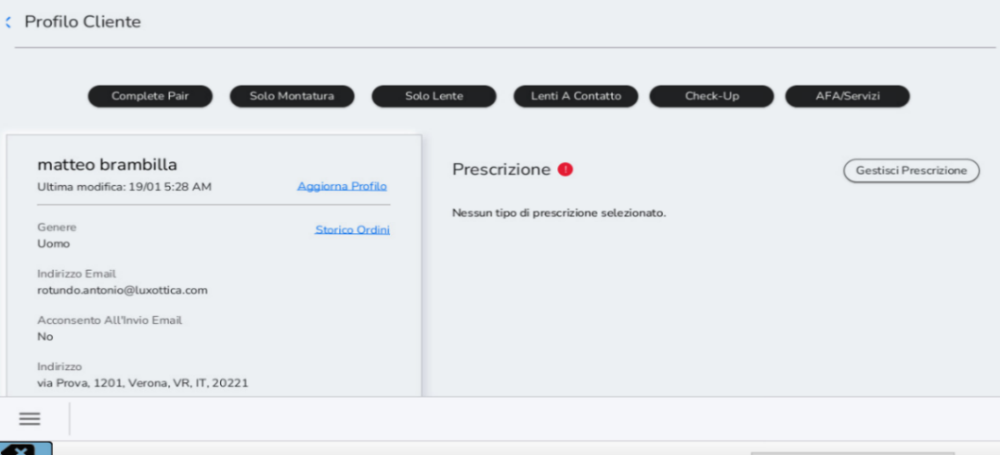

4.  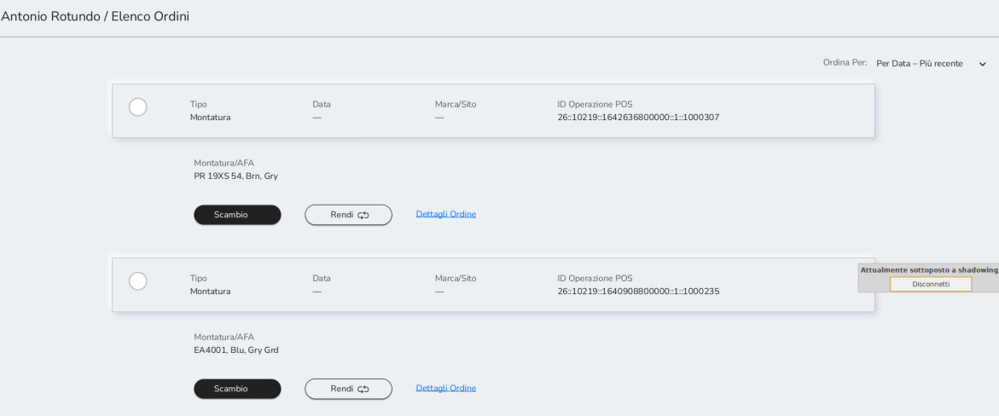Cliccare su *Rendi* in corrispondenza
    dell'ordine d'interesse. Per vedere meglio le specifiche
    dell\'ordine, selezionare *Dettagli ordine*.

*È possibile procedere al reso di più articoli selezionabili dallo
storico ordini del profilo clienti (Ad esempio se si tratta di un frame
only ed un lens only, oppure un accessorio ed un frame only, ecc...)*

*La richiesta multipla di reso non può essere effettuata nel caso di
Complete Pair.*

Selezionare la motivazione del reso tra quelle proposte nel menù a
tendina, a seconda che si tratti di un reso gestionale o un reso denaro
ci saranno delle causali specifiche. La voce Modifica WO serve per le
modifiche gestionali (ristampa fattura cambiando indirizzo, aggiunta
garanzia..)

> 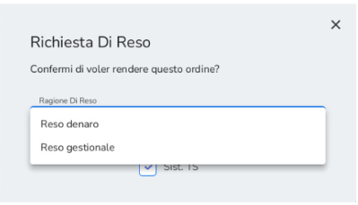
>
> 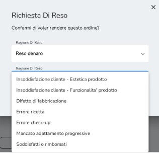
> 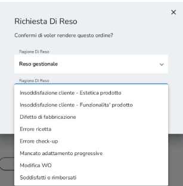

5.  Cliccare su *Vai a pagamento* per procedere alla conclusione del
    reso in Xstore. In alternativa, cliccare su *Conferma Richiesta* per
    salvare l'ordine nella lista di ordini attivi. Gli articoli per cui
    si è avviata una procedura di reso, senza concluderla, figurano in
    Stato *In Reso*

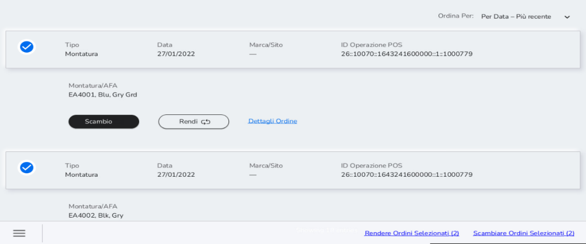

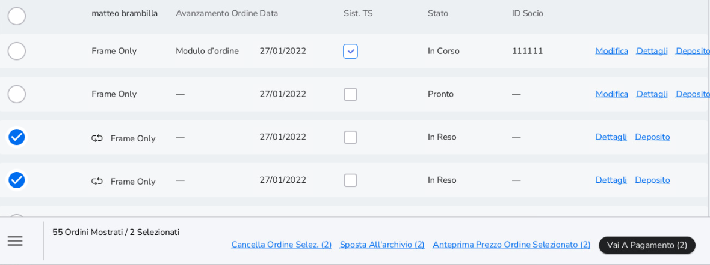

6.  Una volta selezionato *Vai A Pagamento*, su Xstore, viene richiesta
    l'aggiunta di una nota, inserirla e cliccare su *Ok*. In alternativa
    è possibile scannerizzare da iPad selezionando *Cattura ID
    Scontrino* (da ricerca su Customer Order), per catturare il barcode.
    Il sistema mostra all'interno dei Risultati Ricerca il cliente
    desiderato. Dalla sezione *Storico Ordini* del profilo cliente,
    cliccare su *Rendi*, oppure, è anche possibile spuntare la check-box
    dell'ordine e successivamente cliccare su *Rendere Ordini
    Selezionati.*

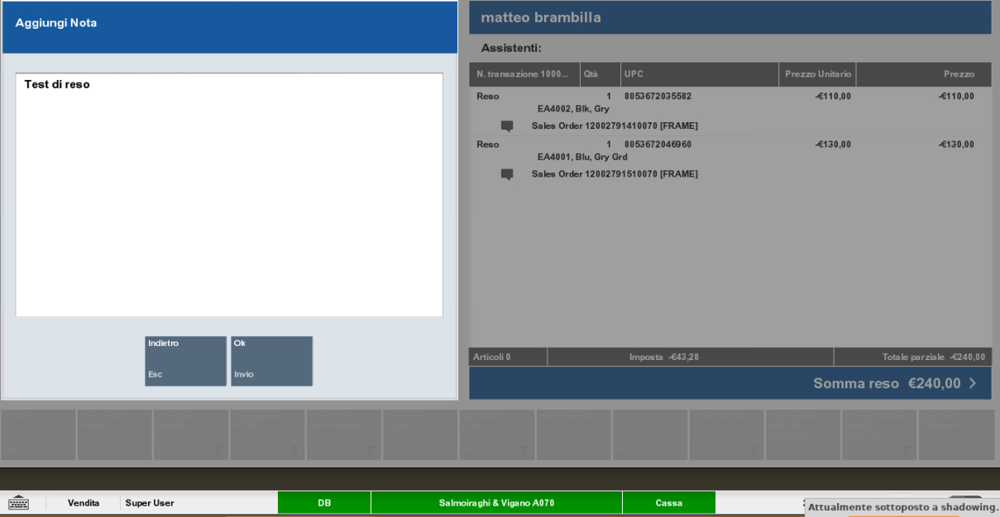

7.  Selezionare *Aggiunta Pagamenti*. Successivamente selezionare la
    modalità di rimborso:

-   Contanti: reso in contanti

-   Bonifico da sede: bonifico da parte del team GBS a seguito di
    un'apertura di GLPI.

La procedura di reso con rimborso tramite bonifico va richiesta
[soltanto in casi eccezionali]{.underline} per i quali non sussista
altra soluzione se non un pagamento da sede.

I casi accettati sono resi a clienti residenti all'estero
impossibilitati a recarsi in negozio, resi di importi superiori al
limite di trasferimento denaro contante, resi a Findomestic per
annullamento pratica.

Non sono ammesse richieste di bonifico:

•  per importo inferiore al valore del fondo cassa o in presenza di
contante in cassaforte superiore al valore del reso (per rimborsare il
cliente si possono utilizzare sia i contanti presenti nel fondo cassa,
sia i contanti in cassaforte in attesa di essere versati;

•  per clienti che non vogliono tornare in store perché di altre città
(è possibile fare i resi in un qualunque store della catena

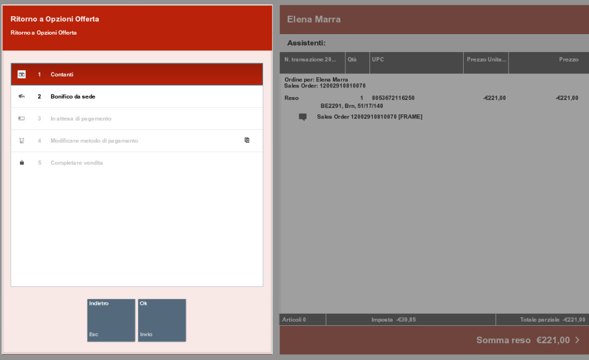

Gli articoli resi sono visualizzati in rosso.

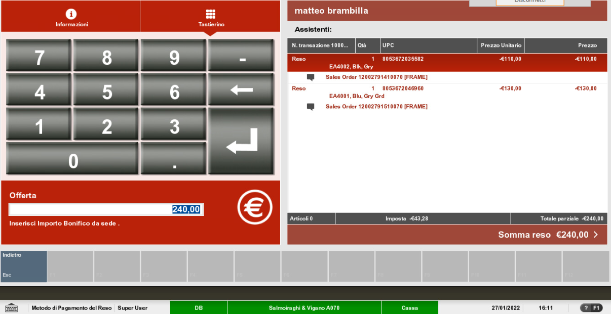

8.  Selezionare un metodo di ricezione per i documenti di reso.

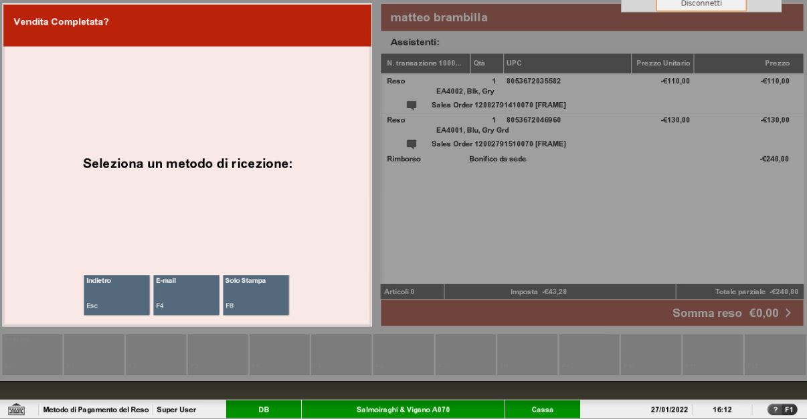

9.  Al termine dell'operazione di reso, il sistema dovrà erogare la
    seguente documentazione:

    -   Reso fiscale (nota di credito)

    -   Pratica di reso non fiscale in doppia copia, una che va fatta
        firmare al cliente e si tiene in negozio, l'altra che si
        consegna al cliente.

## 14.4 Cancellazione Ordine di Reso 

Su Xstore nella sezione pagamento è possibile annullare l'operazione di
reso, cliccando su *Cancellazione Vendita*.

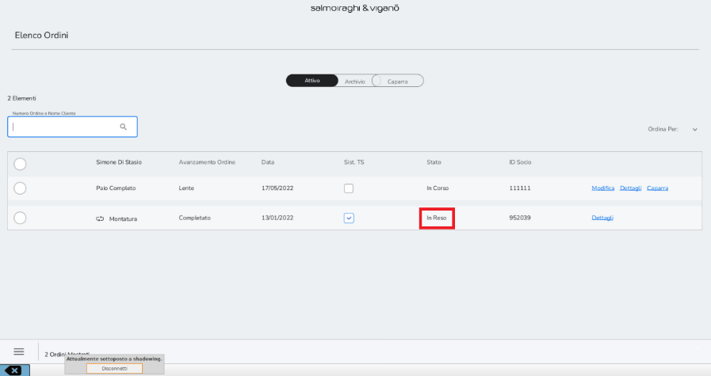Per procedere alla cancellazione di un'operazione di
reso non portata a termine, cliccare su *Elenco Ordini*. Nella sezione
attivi, ricercare per Numero Ordine o Nome Cliente, l'ordine in
questione risulterà *In Reso*.

1.  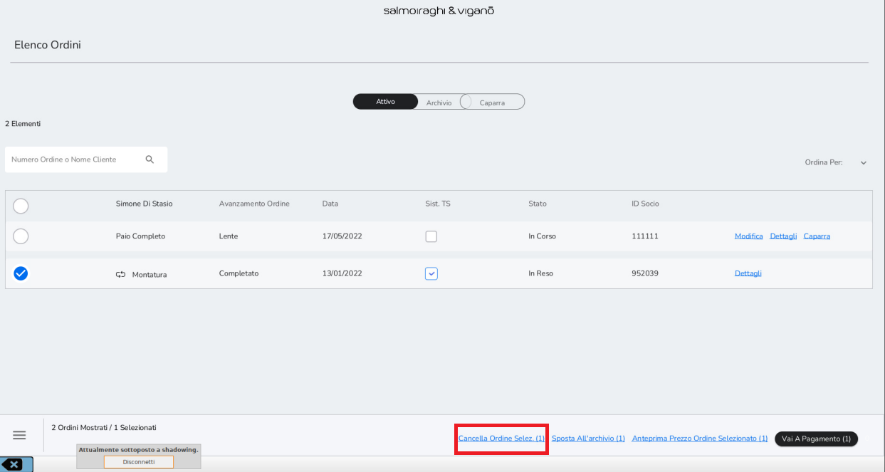Selezionare l'ordine da rendere e
    cliccare su *Cancella Ordine Selezionato*.

2.  Cliccare su *Si* per cancellare l'ordine selezionato.

3.  L'ordine risulterà nello *Storico Ordini* del cliente.

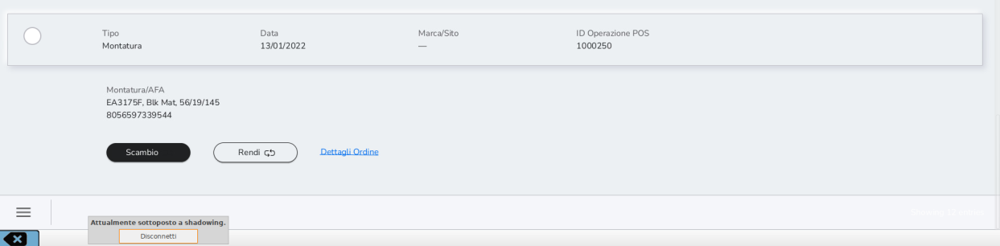

## 14.5 Reso cliente con vendita effettuata su Acuitas 

Lo storico vendite del negozio registrato su Acuitas è stato importato
all'interno dello strumento Lookup Tool (*vedere capitolo 1.2*). L'app
Lookup Tool è uno strumento accessibile dal Tool Kit e permette di
recuperare e consultare tutte le vendite effettuate su Acuitas negli
ultimi tre anni.

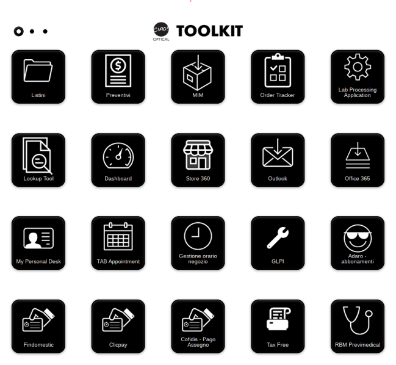

Dopo aver effettuato l'accesso a Lookup Tool, in caso di richiesta di
reso cliente con uno scontrino generato da Acuitas, la ricerca può
avvenire attraverso uno dei seguenti campi. I campi che si consiglia di
utilizzare sono Nome e Cognome del cliente o il numero dello scontrino
fiscale.

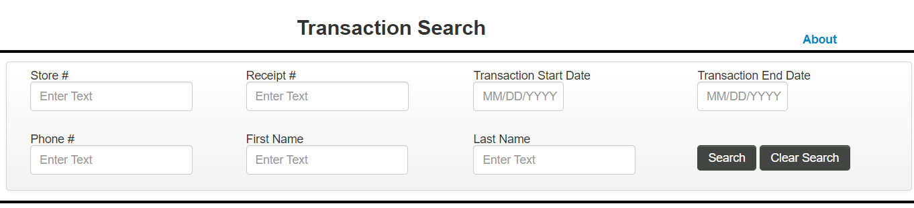

Per aprire i dettagli di una delle transazioni risultanti dalla ricerca
è necessario cliccare sul numero della transazione.

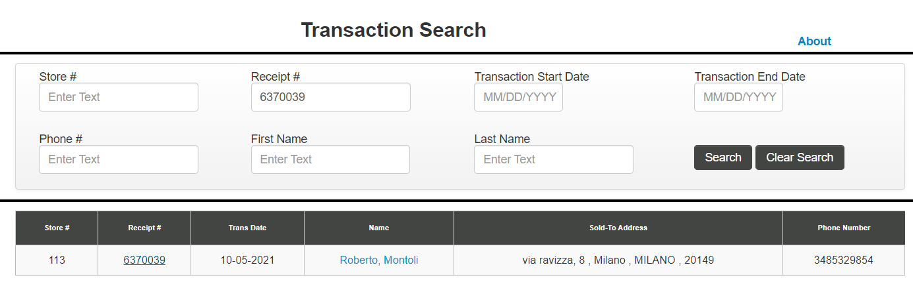

I primi dettagli mostrati sono relativi al negozio dove è stata
effettuata la vendita, il numero di scontrino, la data della vendita e
il nome ed il cognome del cliente.

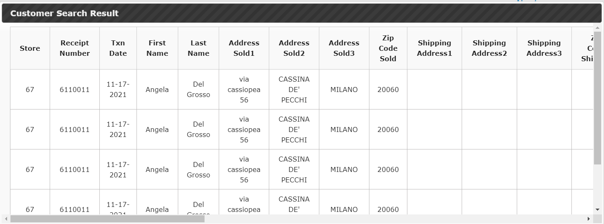

Spostandosi verso destra è possibile poi vedere altre informazioni della
vendita quali:

a.  Elenco [prodotti]{.underline} venduti con relativi codici,
    descrizione dell'articolo, prezzo, eventuale sconto applicato e
    tasse

b.  [Valore totale]{.underline} della transazione dato dalla somma
    dei prezzi dei prodotti elencati. La colonna Total ripete il valore
    totale della transazione in ogni riga. In questo esempio quindi il
    valore totale della transazione è pari a 660€

c.  Dettaglio dei [metodi di pagamento]{.underline} utilizzati per
    questa vendita:

Tender Deposit: valore [caparra]{.underline}

Tender CC: parte della vendita pagata in [carta o bancomat]{.underline}

Tender Gift: parte della vendita pagata con [gift card]{.underline}

Tender 1 Desc + Tender 1 Amt: parte della vendita pagata attraverso
[finanziamenti (Findomestic o PagoDIL) o Adaro]{.underline} (nella
casella Desc viene riportato il nome del metodo di pagamento e nella
casella Amt il valore)

Tender 2 Desc + Tender 2 Amt: parte della vendita pagata attraverso
[assicurazione]{.underline} (nella casella Desc viene riportato il nome
dell'assicurazione e nella casella Amt il valore)

Notes: parte della vendita pagata attraverso altri metodi di pagamento
residuali (Satispay, Clicpay, buoni convenzioni)

La somma dei valori riportati in una riga in questa sezione è pari al
totale della transazione. Tali valori sono arrotondati per eccesso o per
difetto in quanto non vengono riportati numeri decimali. È quindi
consigliato di fare affidamento allo scontrino cartaceo poiché riporta
il valore esatto della vendita.

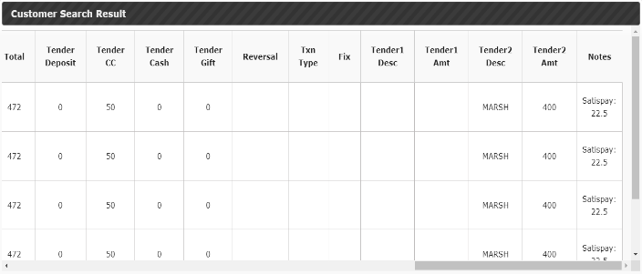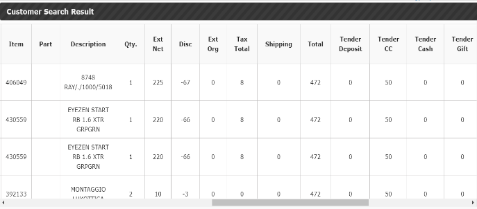

1.  Accedere a Xstore e selezionare *Reso articolo.*

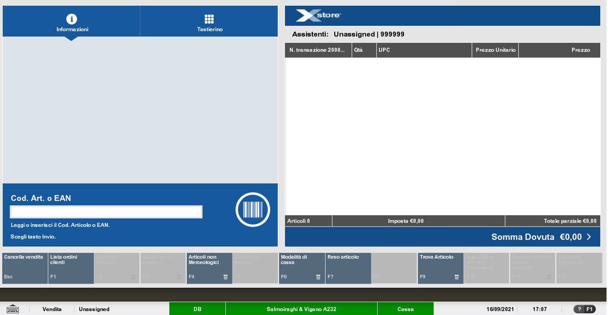

2.  Inserire le informazioni del cliente che procede al reso e
    selezionare *Salva Modifiche*.

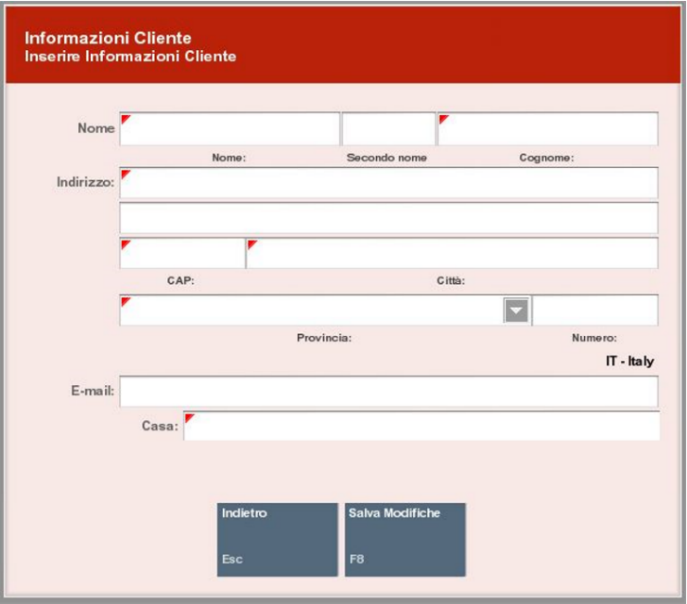

3.  Nella schermata successiva Rientro selezionare *Sì*

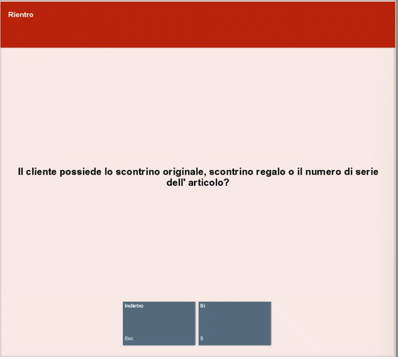

4.  Successivamente inserire le informazioni della vendita precedente e
    cliccare su *Conferma*. Il codice negozio da inserire è 10 + Numero
    SAP di negozio (es: per negozio A070 inserire 10070).

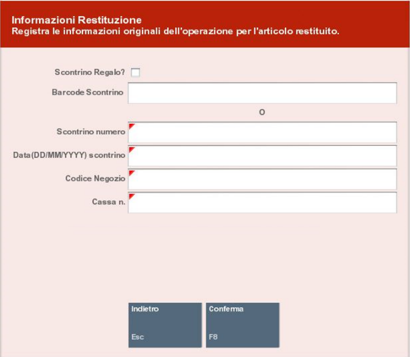

5.  Nella schermata 'Scontrino Originale' cliccare su *Nessuna
    informazione*

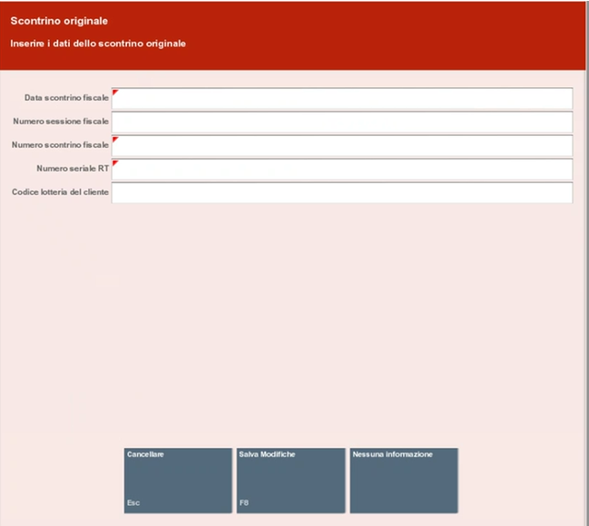

6.  Inserisco il codice articolo nella schermata di reso, eventualmente
    si può cambiare la quantità direttamente modificando la riga da
    Xstore.

7.  Infine, dopo aver selezionato l'UPC da scambiare, indicare il motivo
    generico dello scambio e poi specificarlo nella seconda schermata.

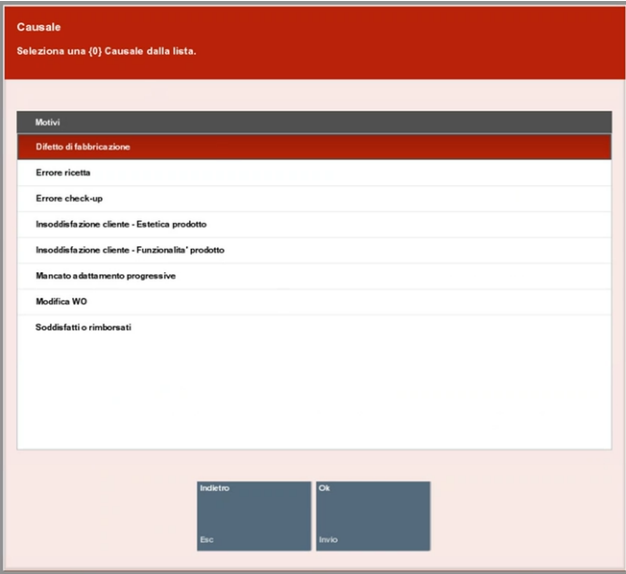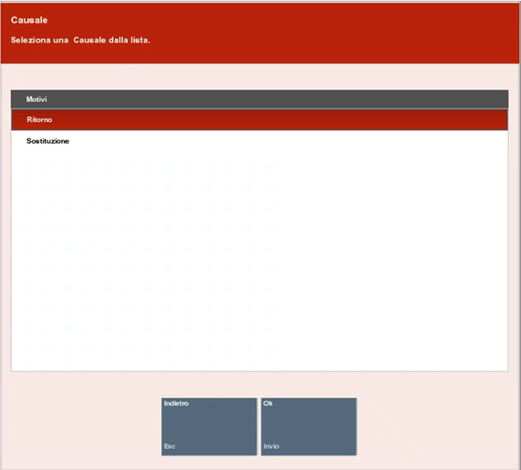

Inserire e ricostruire i dati dell'articolo da rendere recuperandoli dal
Lookup Tool e per i prezzi dallo scontrino cartaceo. Questo processo è
da svolgersi per tutti gli articoli dello scontrino da rendere, nel caso
in cui si volessero rendere più articoli della transazione è possibile
aggiungerli in seguito. Per procedere al pagamento seguire il *capitolo
7.1.*

I documenti che verranno emessi e inviati al cliente sono:

\- Documento di una nuova vendita eventuale a seguito del reso

\- Documento di reso (nota di credito), che dovrà essere archiviato

Al momento dell'inserimento di un reso non verificato da Acuitas su Ciao
è importante sottolineare che [l'iva dei prodotti da rendere sarà
sempre di default al 22%]{.underline}

Percìò nel caso si trattasse di un reso di prodotti con iva al 4%, come
per esempio gli occhiali da vista, è necessario modificare l'importo
dell'iva.

*[Questo processo è fondamentale per evitare di trasmettere prodotti con
iva errata all'agenzia delle entrate.]{.underline}*

Di seguito vi proponiamo i passaggi da effettuare:

1.  Una volta inserito il prodotto da rendere, nella voce *Imposta* sarà
    presente l'iva al 22% di default inserita dal sistema. Per
    modificarla premere su *Cambiare Articolo*

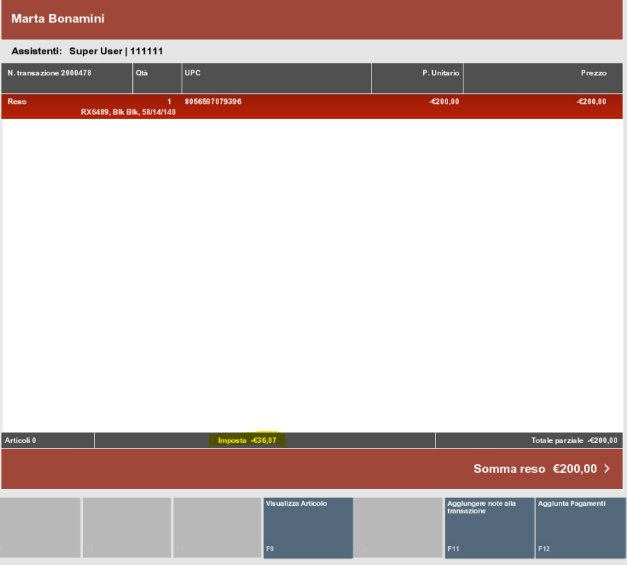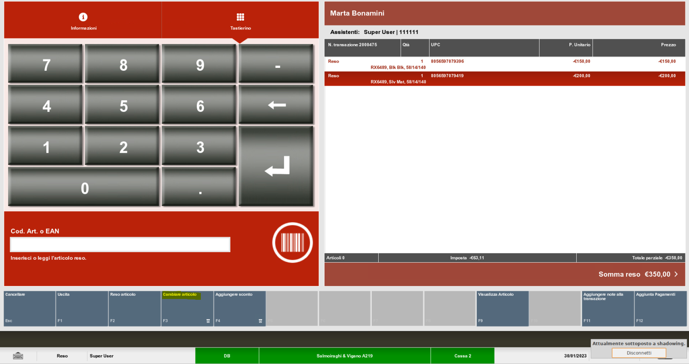

2.  Successivamente premere *Modifica IVA Vendita*

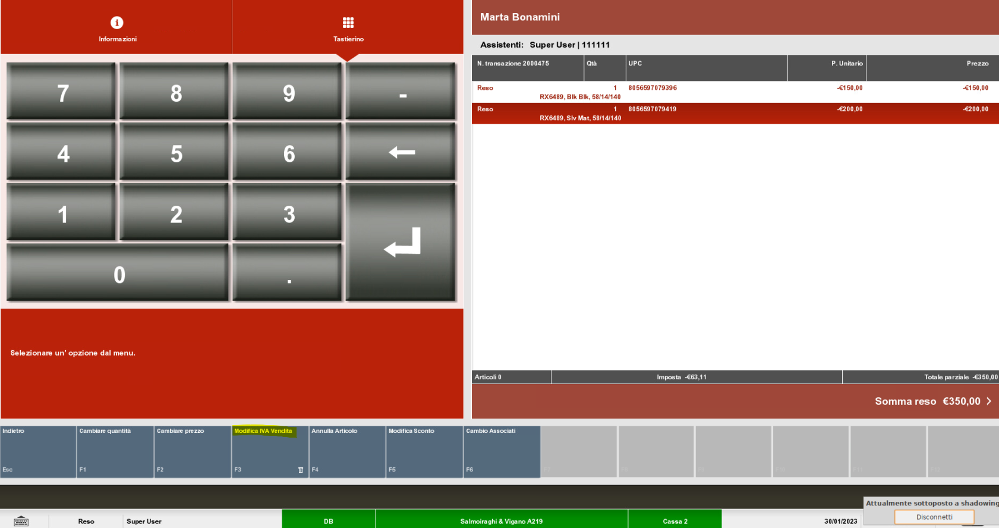

3.  Premere poi su *Modifica Tassazione DM* e dare conferma al Pop up
    che compare

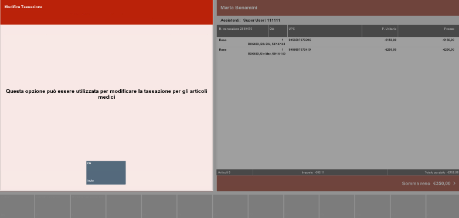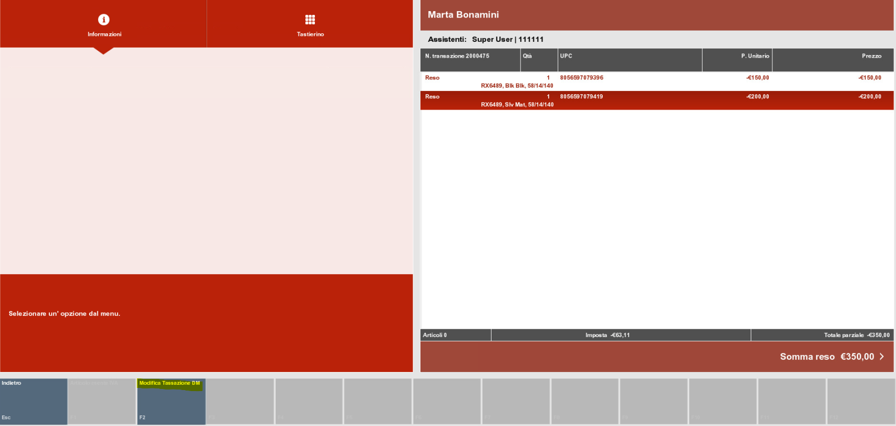

4.  Scegliere per quale prodotto cambiare l'importo dell'iva

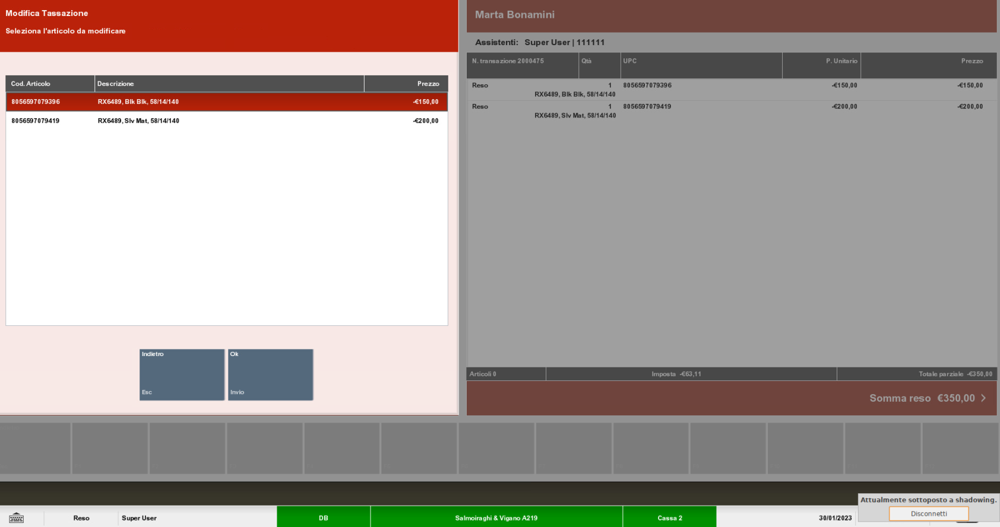

5.  Una volta selezionato alla voce *Imposta* la percentuale dell'iva
    sarà modificata

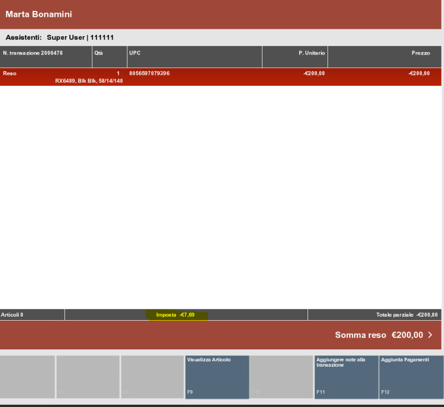

L\'importo dell\'IVA verrà modificato AUTOMATICAMENTE, quindi è
necessario prestare attenzione al valore della dicitura *Imposta*.

Non comparirà nessun Popup che avverte che l\'operazione è riuscita.

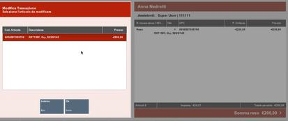

## 14.6 Scambio con vendita effettuata su Acuitas 

Il processo di scambio con vendita effettuata da Acuitas segue
esattamente le stesse logiche del reso. È necessario quindi eseguire
tutti i passaggi del capitolo precedente fino allo step della selezione
della Causale in cui selezionare *Sostituzione* ed in seguito *Scambio*
selezionando poi il motivo specifico dello scambio. Terminare il
processo come uno Scambio effettuato normalmente in Ciao, seguendo le
indicazioni che si trovano nel *capitolo 14.8* (Scambio su Ciao!).

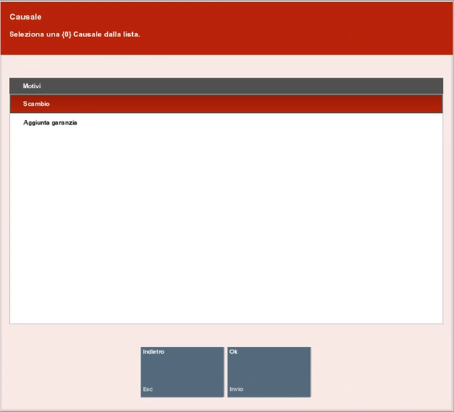
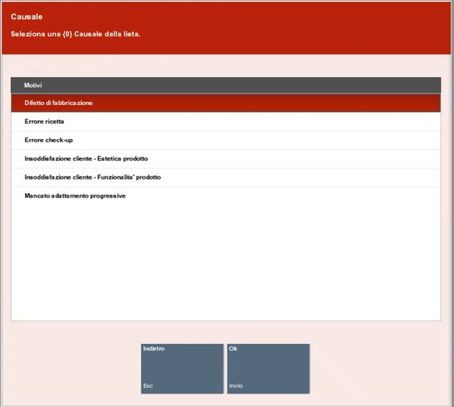

I documenti che verranno emessi ed inviati al cliente sono:

\- Documento nuova vendita

\- Documento di scambio con la firma, che potrà non essere archiviato.

## 14.7 Reso gestionale 

Esistono tre scenari per i quali è possibile effettuare un Reso
Gestionale:

-   Per mancata richiesta di emissione di fattura oltre le 24h.

-   Per mancata erogazione di una garanzia

-   Per modificare WO pre-dispensing (Reso della Caparra)

*Solo per il primo store, selezionare Modifica WO come ragione di reso.*

Per mancata richiesta di emissione di fattura oltre le 24h: seguire
i passaggi 1, 2, 3, 4 del Paragrafo 13.1.

1.  Selezionare la motivazione *Modifica WO* nel menù a tendina.

> 

2.  Procedere come riportato nel Paragrafo 13.1 dal punto 7 al punto 10.

3.  Dopodiché procedere effettuando una nuova vendita come riportato nel
    *capitolo 5*. Inserire nel campo ID vassoio il testo: *GEST*. Su
    LPA non occorrerà procedere con alcuna operazione. Richiedere
    l'emissione della fattura cliccando su *Stampa Fattura o Nota Di
    Accredito* su Xstore e procedere come riportato nel Paragrafo 6.2.

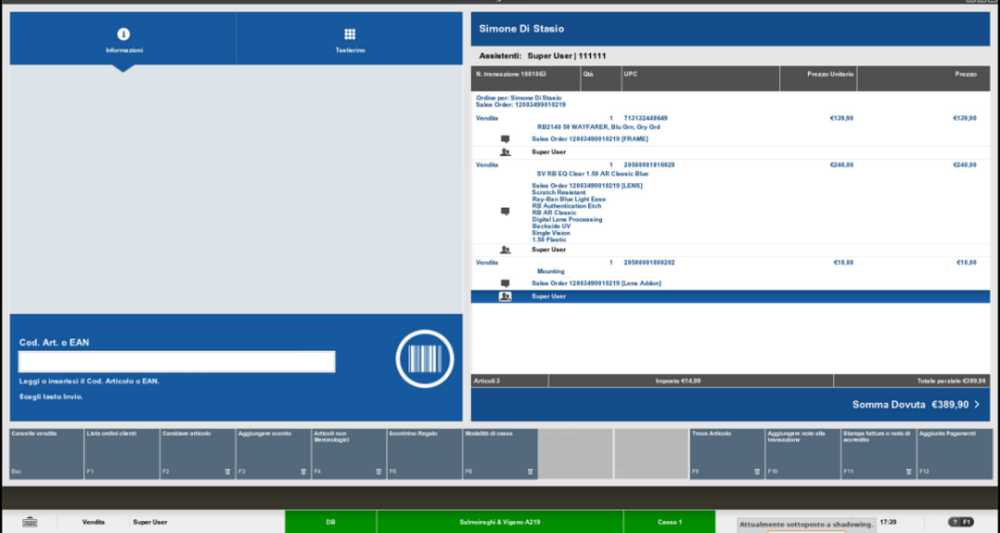

4.  Al termine dell'operazione di reso, il sistema dovrà erogare la
    seguente documentazione:

    -   Reso fiscale (nota di credito)

    -   Pratica di reso non fiscale in doppia copia, una che va fatta
        firmare al cliente e si tiene in negozio, l'altra che si
        consegna al cliente

    -   Fattura emessa

    -   Scontrino relativo alla nuova vendita

Per mancata erogazione di una garanzia: seguire i passaggi 1, 2, 3,
4 del Paragrafo 13.7.

1.  Selezionare la motivazione *Modifica WO* nel menù a tendina.

2.  Procedere come riportato nel Paragrafo 13.7 dal punto 7 al punto 10.

3.  Procedere effettuando una nuova vendita come riportato nel *capitolo
    5*.

4.  Cliccare sul campo *Garanzie* posto all'interno della sezione Modulo
    d'Ordine e scegliere la garanzia desiderata.

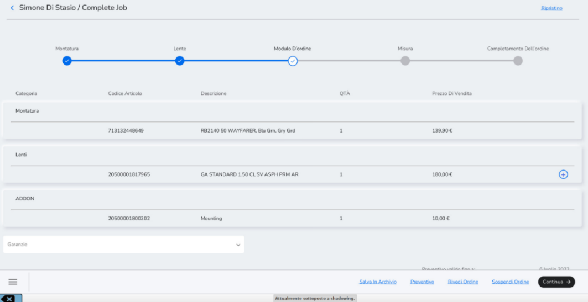

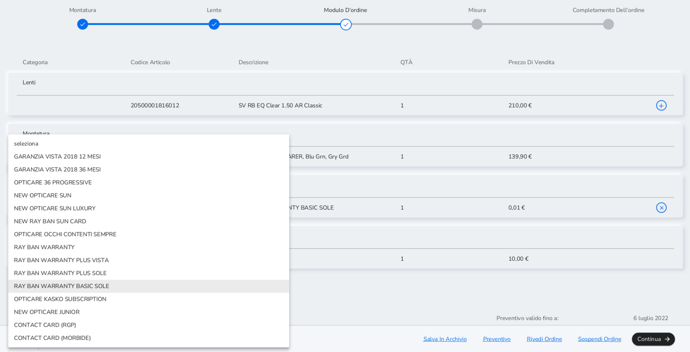

5.  Procedere con una nuova vendita come riportato nel *capitolo 5.*

> Su LPA non occorrerà procedere con alcuna operazione.

6.  Al termine dell'operazione di reso, il sistema dovrà erogare la
    seguente documentazione:

    -   Reso fiscale (nota di credito)

    -   Pratica di reso non fiscale in doppia copia, una che va fatta
        firmare al cliente e si tiene in negozio, l'altra che si
        consegna al cliente

    -   Garanzia

    -   Scontrino relativo alla nuova vendita

## 14.8 Scambio su Ciao! 

Tramite Ciao! È possibile effettuare scambi. È consigliabile utilizzare
il PC di cassa, in quanto l'iPad non ha cassetto contanti.

La modalità Scambio si può utilizzare solo per i seguenti prodotti:

-   Sole non graduato

-   Accessori

*Lo scambio non è utilizzabile per prodotti in deposito.*

Per tutti gli altri tipi di scambio, come per i prodotti vista,
procedere effettuando [un reso e una nuova vendita]{.underline}, in
quanto, con lo stesso non è possibile emettere la fattura.

Le modalità per effettuare lo scambio sono due:

1.  Attraverso il *Profilo Cliente*, cliccare su *Storico Ordini*. Tra
    gli ordini effettuati, cercare il prodotto e cliccare su *Scambio*.

2.  Da iPad è possibile selezionare *Cattura ID Scontrino* (da ricerca
    su Customer Order), per catturare il barcode.

> Il sistema mostra all'interno dei Risultati Ricerca il cliente
> desiderato. Dalla sezione *Storico Ordini* del profilo cliente,
> cliccare su *Scambio*, oppure, è anche possibile spuntare la check-box
> dell'ordine e successivamente cliccare su *Scambiare Ordini
> Selezionati.*

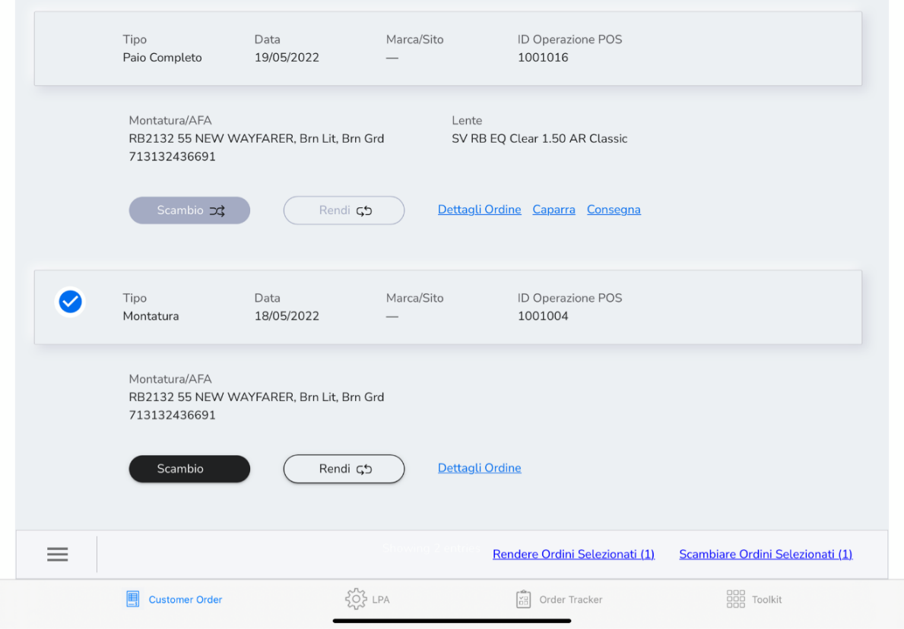

3.  Nella Richiesta Scambio:

    -   Selezionare nel primo campo Ragione Di Scambio la voce:
        *Scambio*

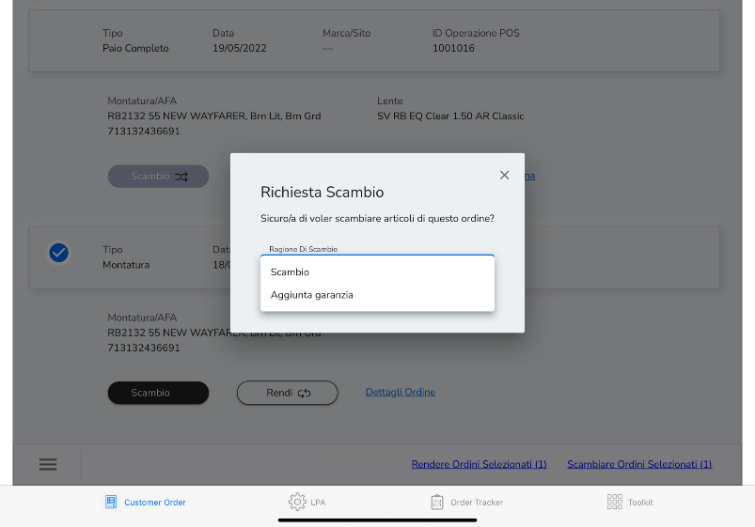

-   Selezionare nel secondo campo Ragione Di Scambio: Una delle
    motivazioni presenti in elenco.

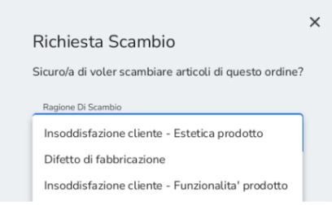

-   Cliccare *Conferma Richiesta* per procedere alla sostituzione.

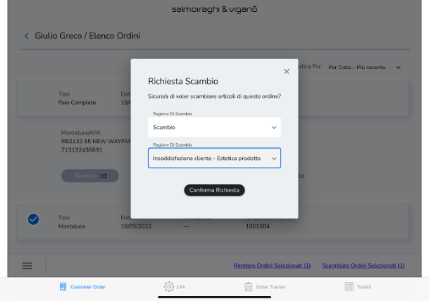

4.  Completare il flusso come se si stesse effettuando un nuovo ordine
    secondo le modalità viste nel *capitolo 5.*

> 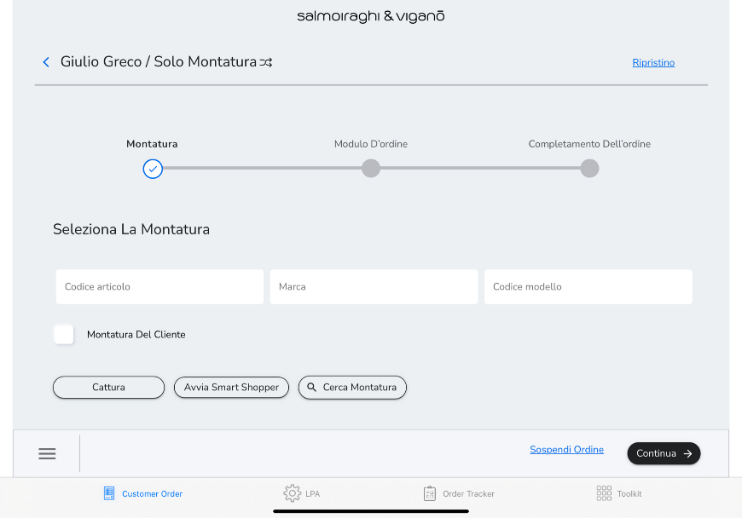

5.  Inserisco un nuovo codice articolo e *Vai A Pagamento*.

Il testo in rosso è relativo agli articoli che stiamo sostituendo, il
testo in blu a quello che stiamo acquistando. Se la differenza di
pagamento è dovuta dal negozio può avvenire in Contanti (non presente su
iPad) o tramite Bonifico Da Sede. Se invece è il cliente a dover pagare,
può scegliere tra le diverse modalità previste.

6.  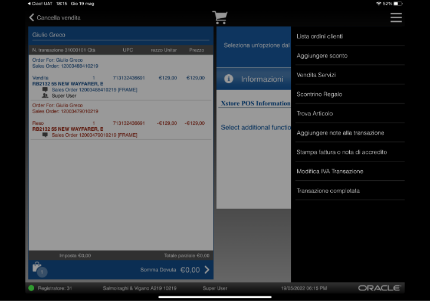Inserire un commento in Aggiungi Nota e
    cliccare *Transazione Completata*.

7.  Scegliere un metodo di ricezione dello scontrino, il sistema
    erogherà:

    -   Vendita fiscale

    -   Reso fiscale (nota di credito)

    -   Pratica di reso non fiscale: in doppia copia, una che va fatta
        firmare al cliente e si tiene in negozio, l'altra che si
        consegna al cliente

> *In caso di transazione pari a zero, il sistema restituisce solo gli
> scontrini non fiscali.*

##  

##  

##  

##  

## 14.9 Modulo Remake a Sedico 

All'interno della libreria di Store360, nella cartella Ciao! potrete
trovare il nuovo Modulo Remake da utilizzare per rendere a Sedico le
lenti (o CO) con "[Difetto di Fabbricazione]{.underline}" o "[Errore
costruzione lente]{.underline}".

Si tratta di un PDF modificabile da compilare inserendo:

-   Codice Sap del negozio -- es. A144 (nel modulo è preceduto da
    una "S" non modificabile perché serve a Sedico per recuperare lo
    store in SAP)

-   N. Ordine Ciao! (nuovo numero ordine che si genera se si
    effettua il reso in cassa post vendita oppure sempre lo stesso
    numero dell'ordine originario in caso di Remake pre-vendita
    effettuato attraverso LPA)

-   Tipo lavorazione -- scegliere tra le tre opzioni dei 3 job type
    (CO,LO,CJ)

Come da procedura attuale, è necessario SEMPRE COMPILARE E ALLEGARE IL
QUESTO MODULO AL PACCO DI RESO, altrimenti non sarà possibile
processare il reso a Sedico.

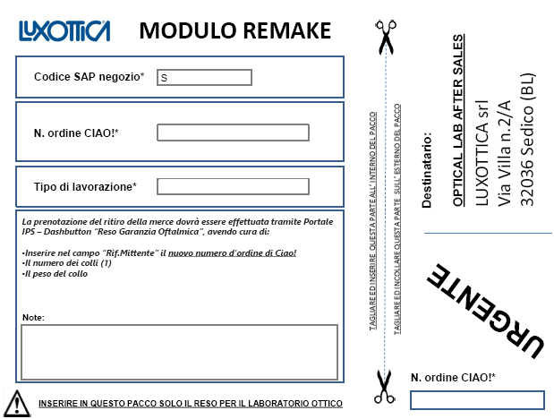

Questo è il modulo che troverete nella cartella Ciao! di Smarty
(exStore360).

##  

## 14.10 Remake pre-consegna ordine su LPA 

Nel caso in cui si rilevasse una problematica con l'ordine in fase di
ispezione (es: difetto di fabbricazione), e *prima di procedere alla
consegna* dell'ordine, sarà necessario inserire un nuovo ordine Remake a
sistema senza passare per il processo di scambio su Ciao!

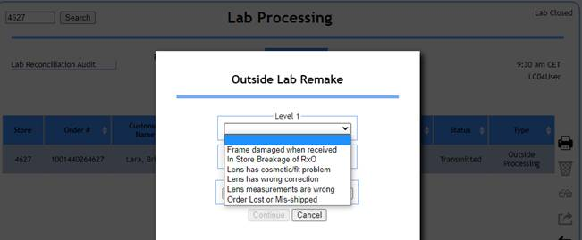Dopo aver effettuato il login su LPA
ricercare l'ordine per il remake tramite il numero di ordine.
Selezionare l'icona per il Remake sulla destra dell'ordine e indicare,
con diversi livelli di dettaglio, il motivo per cui si richiede un
remake (es: specifiche delle lenti non corrette).

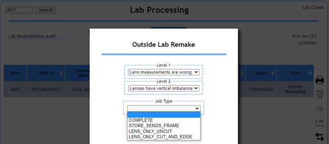Dopo aver indicato la causale per il remake nei
diversi livelli di dettaglio, scegliere il Job Type per il remake dal
menù a tendina e cliccare su *Continua*.

## 14.11 Remake post consegna 

Le modalità per le quali è possibile effettuare delle richieste di
Remake sono:

-   Prima della consegna: Se durante la procedura di ispezione (*vedere*
    *capitolo 0*), ci si accorge che l'ordine arrivato dal laboratorio
    presenta dei difetti, si procede con una richiesta di remake tramite
    LPA (*vedere* *capitolo 0*).

-   Dopo la consegna: Se il cliente si accorge che l'articolo presenta
    difetti o anomalie, in tal caso, si procede avviando una pratica di
    reso e successivamente ad una nuova vendita.

*Dal punto di vista della tracciabilità, una volta che si riceve
l\'occhiale in store il cliente riceve un'e-mail che l\'occhiale è
pronto per essere consegnato. Nel caso in cui dopo l'ispezione ci si
accorga che l\'occhiale necessita di un remake, è*

*necessario chiamare il cliente e avvisarlo.*[]
