# Reporting

I documenti di Reporting possono essere trovati o su XStore o, per
quelli generati da OneLRA sul ToolKit, selezionando l'icona *Reporting*

## 15.1 Report Fatturato 

Accedere al Back Office in XStore e selezionare *Report* e poi
*Cruscotto*.

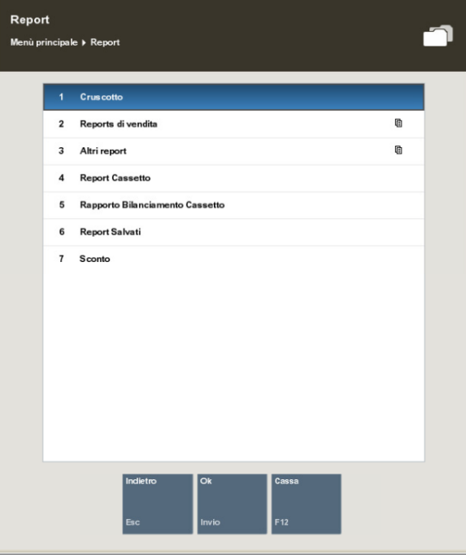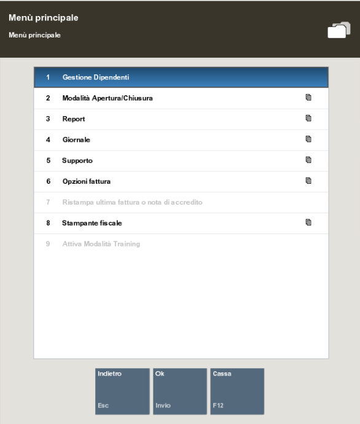

Seleziona *Vendite del Giorno*.

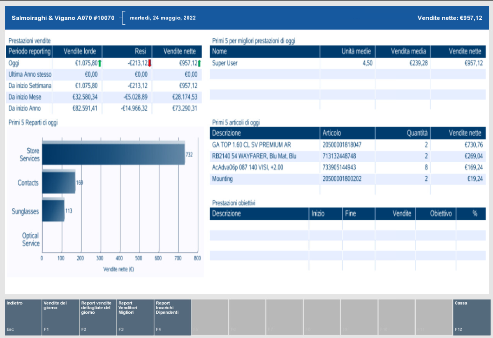

È possibile visualizzare il report filtrando per data, scegliere come
Opzione di visualizzazione *"In base a reparto"* e scegliere se si vuole
vedere anche il grafico. Successivamente selezionare *Genera Report*.

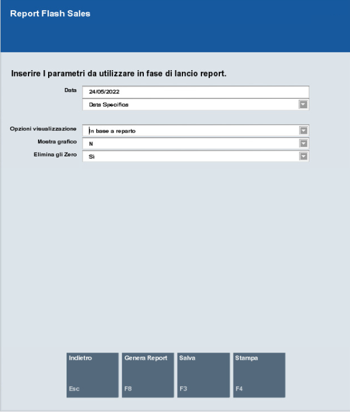

Le vendite sono rappresentate al netto dell'IVA.

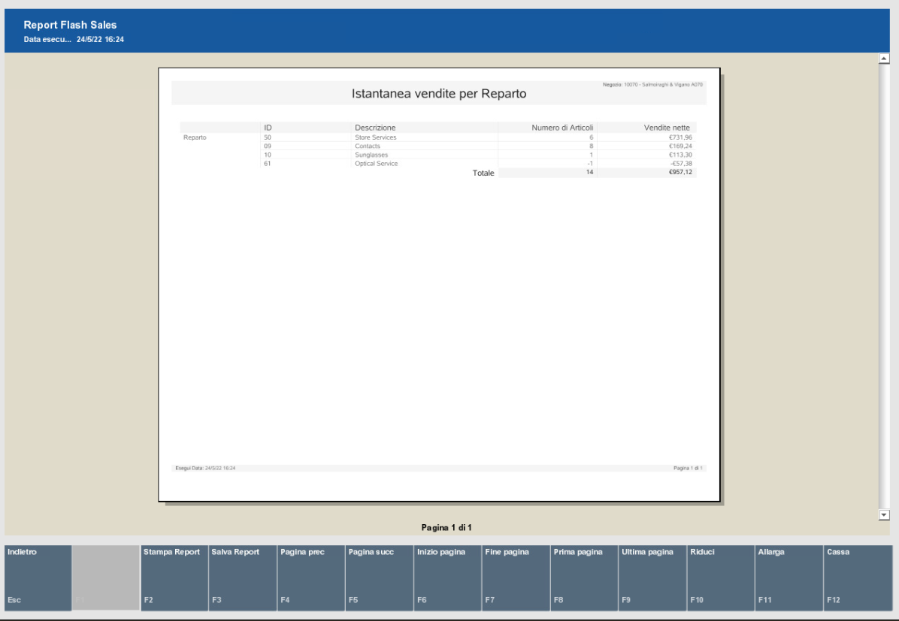

## 15.2 Registro Corrispettivi 

Questo report non è presente su XStore.

## 15.3 Riepilogo Giornaliero 

Il riepilogo giornaliero viene stampato ogni sera con il Closure Report
generato al momento della chiusura del Negozio. N.B. Nel caso in cui
per qualche problema non fosse stato possibile produrre il report di
Chiusura cassa in fase di chiusura, sarà possibile ristamparlo accedendo
a *Back office -- Report -- Report salvati*. Qui troverete l'elenco dei
Daily report prodotti con l'orario. Selezionando quello del giorno
d'interesse e dell'orario di chiusura, troverete quello corretto e lo
potrete ristampare

## 15.4 Scontrino Cassa e Giornale elettronico 

Il riepilogo degli scontrini cassa può essere scaricato da XStore,
selezionando *Giornale* dal menù principale e poi *Report Giornale*.

Il Giornale elettronico è uno strumento che vi permetterà di vedere
tutte le operazioni eseguite su Ciao!, vi sono diversi criteri per
filtrare i dati in modo da cercare la transazione che serve.

Molto utile è anche la possibilità di visualizzare tutti i dettagli
della transazione (scontrino, modalità di pagamento...), e di conoscere
anche lo stato in cui si è bloccata la transazione, o se è stata
eliminata.

Sempre all'interno del giornale si ha anche la possibilità di poter
[ristampare la ricevuta]{.underline}, sia via mail che tramite stampa.

Inoltre, è possibile anche trovare la fattura i caso fosse stata creata
e stamparla, ma anche crearla da zero, in caso non si fosse ancora
effettuata, naturalmente [sempre all'interno della stessa
giornata]{.underline}.

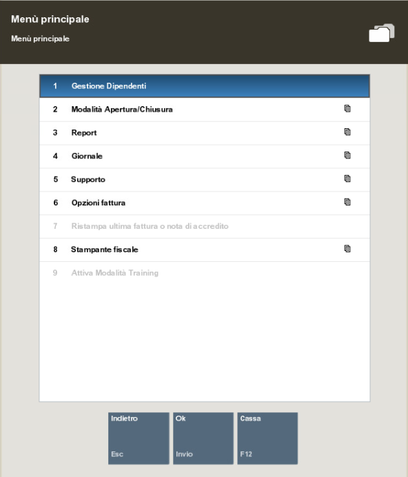

##  

## 15.5 TX Sconto Discrezionale 

È possibile accedere al report Tx Sconto Discrezionale accedendo a
XStore e selezionando *Report* e poi *Sconto*.

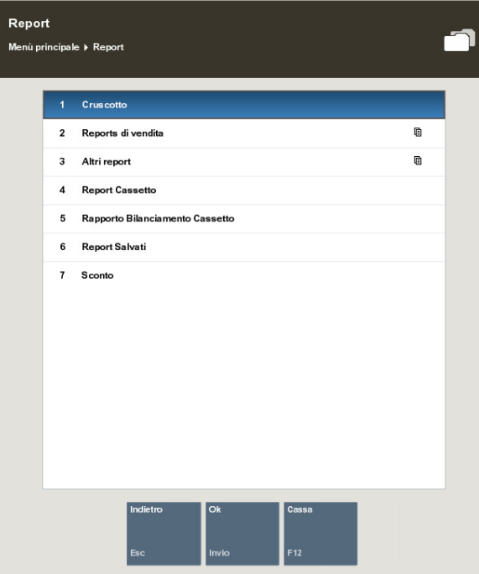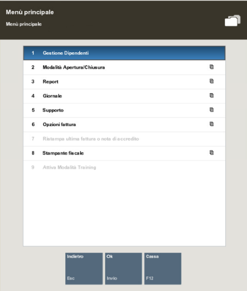

I report WO Aperti, Work Order, Work Order Annullati, Percorso cliente,
Dettaglio clienti vengono generati da OneLRA e sono accessibili dal
ToolKit nell'icona *Reporting*.[]

## 15.6 Reporting cassaforte 

Per tenere traccia di tutte le attività di spostamento tra le casse
durante la giornata è possibile andare nella sezione *Giornale*, poi
*Report giornale.*

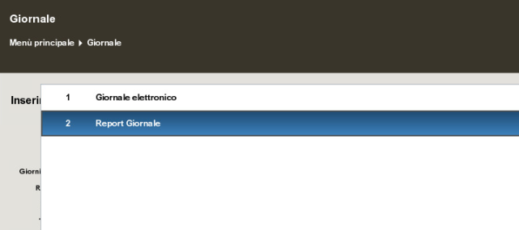

Qui si ha la possibilità di filtrare la transazione specifica, per
vedere quella relativa alla cassaforte bisogna selezionare: *Controlla
gara*

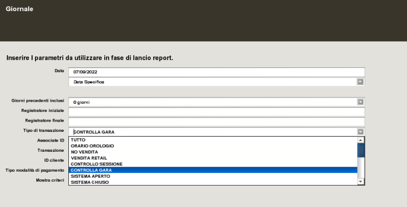

Una volta premuto, si creerà la pagina di giornale con tutte le attività
della giornata.

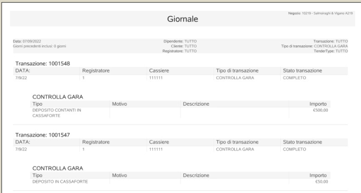
