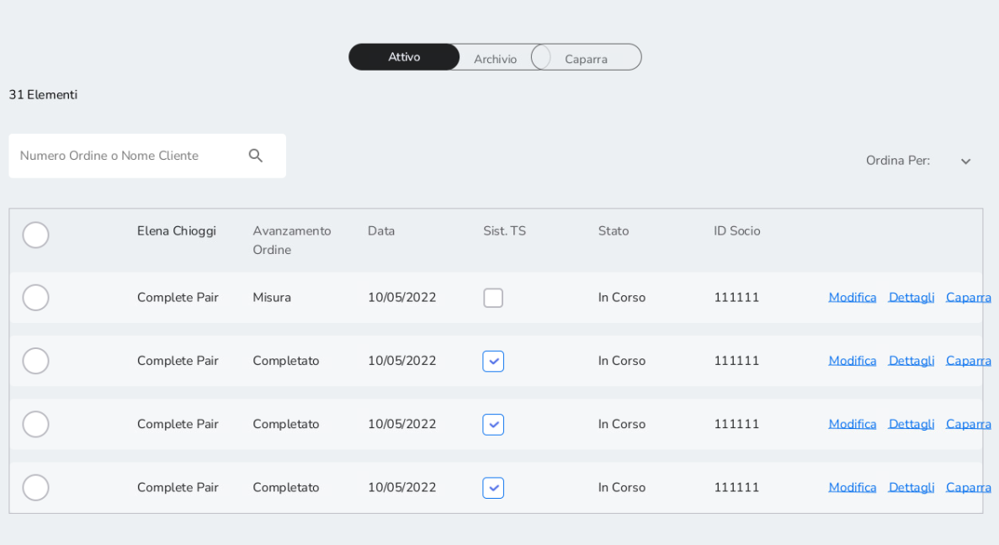
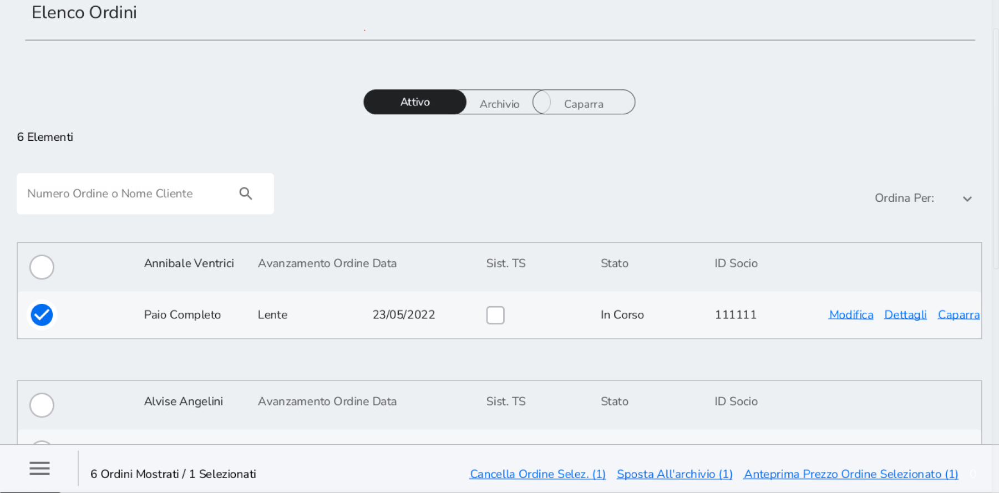
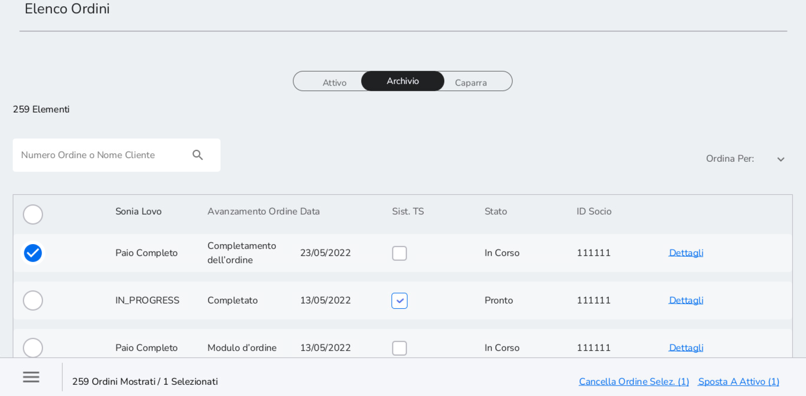
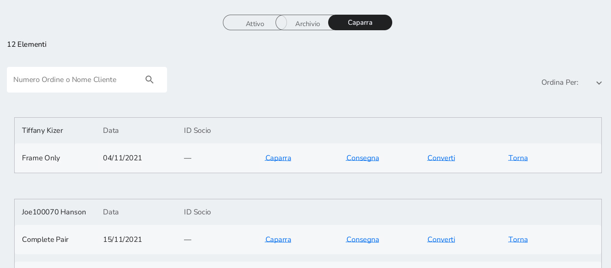

# Elenco Ordini: Attivo, Archivio e Caparra

## 16.1 Attivo 

Nella lista degli ordini attivi sono presenti gli ordini che sono stati
Salvati o Sospesi durante il flusso di creazione dell'ordine. Gli ordini
rimangono nell'elenco degli ordini attivi per tre giorni per poi passare
in Archivio.

A destra della schermata sono presenti i seguenti pulsanti:

-   *Modifica*: è possibile modificare l'ordine partendo dalla sezione
    di flusso d'ordine in cui era stato sospeso o salvato

-   *Dettagli:* è possibile visualizzare tutti i dettagli dell'ordine
    come ID Ordine, prescrizione e informazioni sugli item selezionati

-   *Caparra:* è possibile prendere caparra

Nella colonna *Avanzamento Ordine* è indicata la sezione del flusso
d'ordine nella quale l'ordine è stato salvato o sospeso. La voce
*Completato* appare invece quando il flusso dell'ordine è completamente
concluso con presa caparra o pagamento.

Nella colonna *Stato* è presente lo status dell'ordine. Gli stati che un
ordine può assumere sono:

-   In Corso: quando il flusso di creazione ordine non è stato ancora
    ultimato

-   Pronto: quando il flusso di creazione dell'ordine si è concluso ed è
    stata presa caparra o è stato effettuato il pagamento

Selezionando un ordine è possibile:

-   *Cancellare l'ordine* selezionare per cancellare l'ordine

-   *Sposta all'Archivio* per spostare l'ordine nell'Archivio

-   *Anteprima Prezzo Ordine Selezionato* per vedere dettagli e il
    prezzo dell'ordine

È possibile anche selezionare più ordini insieme e svolgere le azioni
precedenti anche con più ordini.

## 16.2 Archivio 

Nella lista degli ordini in Archivio sono presenti gli ordini che sono
stati Salvati in Archivio o quelli che, dopo tre giorni, sono passati
dalla lista degli ordini attivi all'archivio. Gli ordini rimangono
nell'archivio per 27 giorni.

La struttura della tabella è uguale a quella della lista degli ordini
attivi.

In aggiunta alla lista degli ordini attivi, selezionando un ordine è
possibile:

-   *Cancellare l'ordine* selezionare per cancellare l'ordine

-   *Sposta a Attivo* per spostare l'ordine nell'Attivo

-   *Anteprima Prezzo Ordine Selezionato* per vedere dettagli e il
    prezzo dell'ordine

È possibile anche selezionare più ordini insieme e svolgere le azioni
precedenti anche con più ordini.

## 16.3 Caparra 

Nella lista Caparra sono presenti gli ordini per i quali è stata presa
caparra. A destra della schermata sono presenti i seguenti pulsanti:

-   *Caparra* per poter prendere una seconda caparra e vedere il valore
    della caparra presa precedentemente

-   *Consegna* per consegnare il prodotto al cliente e completare il
    pagamento su Xstore

-   *Converti* per incassare la caparra se dopo due mesi dal versamento
    della stessa il cliente non ha più saldato l'ordine. Prima di
    procedere contattare il cliente (telefono, e-mail, etc)

-   *Torna* per rendere la caparra

