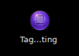
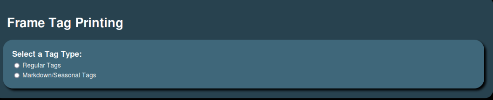
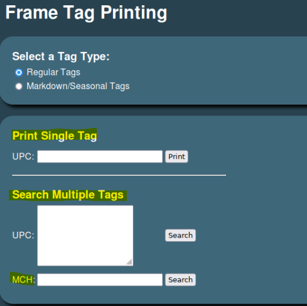
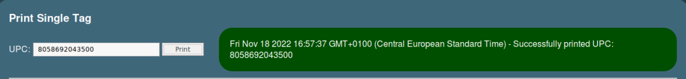
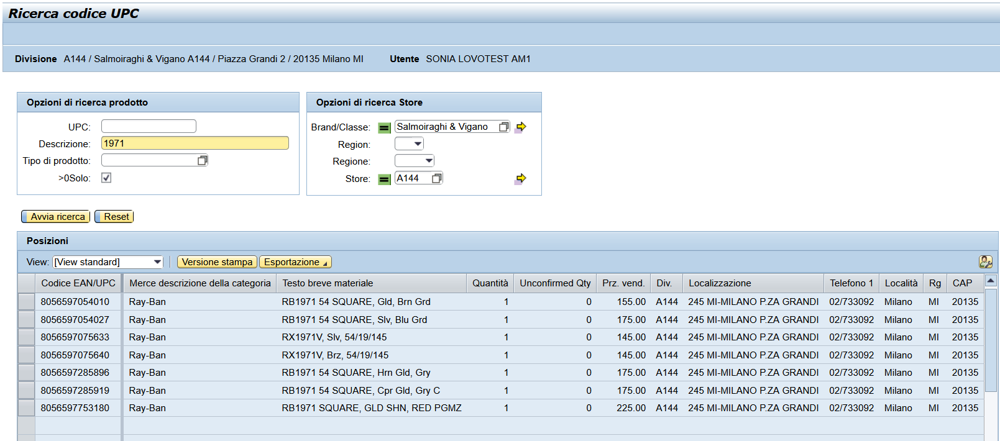
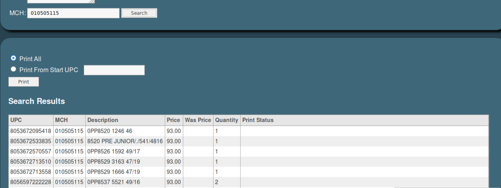
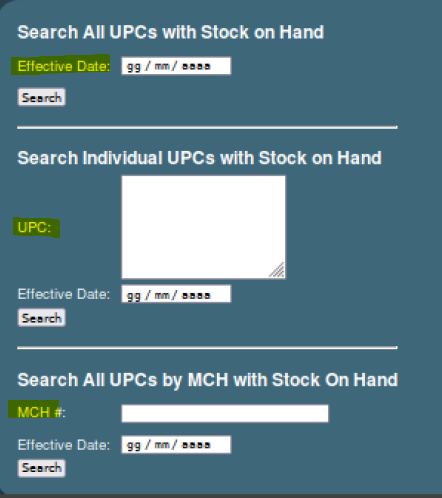

# Tag printing

Potete trovare l'applicazione Tag printing nel Desktop del PC di cassa
acanto alle icone di Ciao! e del Toolkit.

Una volta entrati all'interno dell'applicazione, la schermata che vi
appare è quella in figura.

Le opzioni tra cui scegliere sono due:

-   Regular Tags

-   Markdown/Seasonal Tags

L'opzione Regular Tags viene utilizzata in due casistiche:

-   Print Single Tag nel caso in cui si dovesse sostituire una [singola
    etichetta]{.underline} quando questa è danneggiata o staccata dalla
    montatura. È necessario inserire l'UPC dell'etichetta che si vuole
    stampare e il risultato sarà la stampa di un solo tag.

Per recuperare un UPC per il quale si vuole stampare l'etichetta, magari
perché danneggiata, sarà sufficiente effettuare la ricerca su MIM
premendo sul tasto Ricerca codice UPC, come riportato in figura.

-   Serach Multiple Tags nel caso in cui si abbia la necessità di
    stampare più etichette di UPC differenti (per esempio Price
    increase). Per ottenere le etichette si può:

-   Inserire una lista di UPC all'interno della sezione corrispondente

-   Cercare per Merch Cat, ovvero il codice assegnato a ciascun brand
    (vedi tabella sotto), in modo da avere l'elenco completo di tutti
    gli Upc presenti in Stock per quel determinato brand.

In entrambe le casistiche cliccando Search il sistema vi riporterà
l'elenco degli UPC per i quali stampare le etichette con relativo Stock.

È possibile modificare la quantità di etichette da stampare inserendo il
numero corretto nella colonna Quantity.

Per stampare le etichette è possibile scegliere due modalità:

-   Print all per stampare tutte le etichette delgi UPC in elenco

-   Print from Start UPC per stampare le etichette a partire dall'UPC
    selezionato

L'opzione di Markdown/Seasonal Tags è da utilizzare nel caso di Saldi, o
sconti stagionali (per esempio Saldi estivi e invernali), ci sono tre
opzioni:

-   Search All UPCs with Stock on Hand per stampare le etichette di
    tutti gli UPC soggetti a sconto a partire da una data specifica. È
    quindi necessario inserire nella barra di Effective data la data a
    partire dalla quale inizieranno gli sconti.

-   Search Individual UPCs with Stock on Hand in cui è possibile copiare
    ed incollare l'elenco di specifici UPC soggetti a cambio prezzi a
    partire dalla data indicata nella sezione Effective data.

-   Search All UPCs by MCH with Stock on Hand per ottenere tutti gli UPC
    della Merch Cat inserita, ovvero il codice assegnato a ciascun brand
    (vedi tabella sotto). Anche in questo caso è necessario inserire la
    data a partire dalla quale ci sarà il cambio prezzi nella sezione
    Effective data.

Una volta premuto Search il sistema vi mostrerà la lista degli UPC
disponibili come nella sezione descritta in precedenza.
